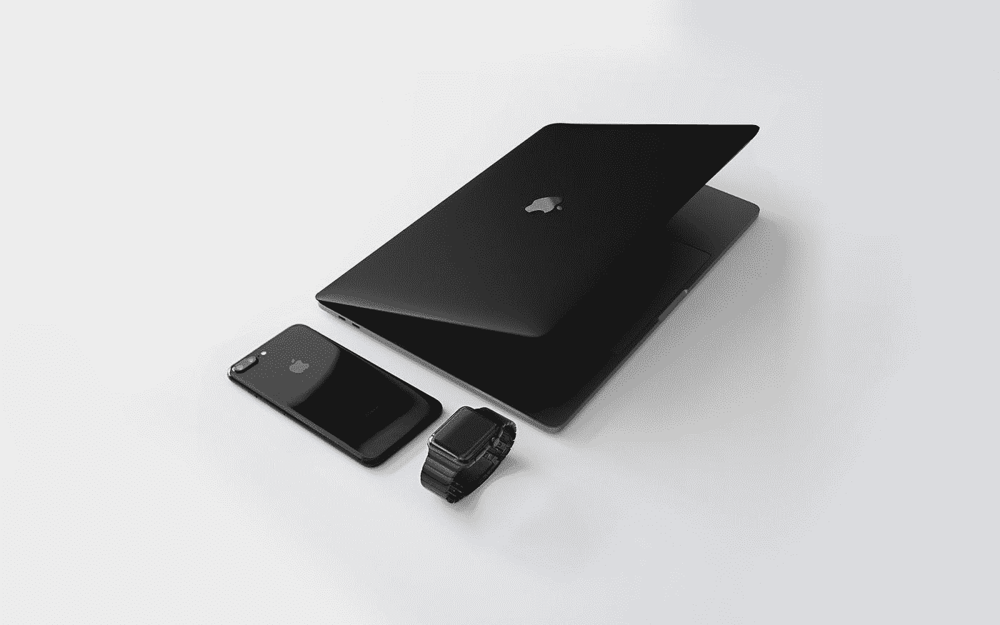

# 为什么苹果可以对一个支架收取 999 美元

> 原文：<https://medium.com/swlh/why-apples-allowed-to-charge-999-for-a-stand-60daddf0bb5d>

## 以及为什么不能。

Photo by [Julian O'hayon](https://unsplash.com/@anckor?utm_source=medium&utm_medium=referral) on [Unsplash](https://unsplash.com?utm_source=medium&utm_medium=referral)

嗯…我的意思是你可以。如果你是苹果。

苹果最近在开发者大会上宣布，在新的 Pro Display XDR 显示器(5000 美元)上，你可以选择购买 200 美元的 VESA 安装适配器或 999 美元的支架——这很荒谬。没有支架的显示器？除非你把它平放在桌子上…