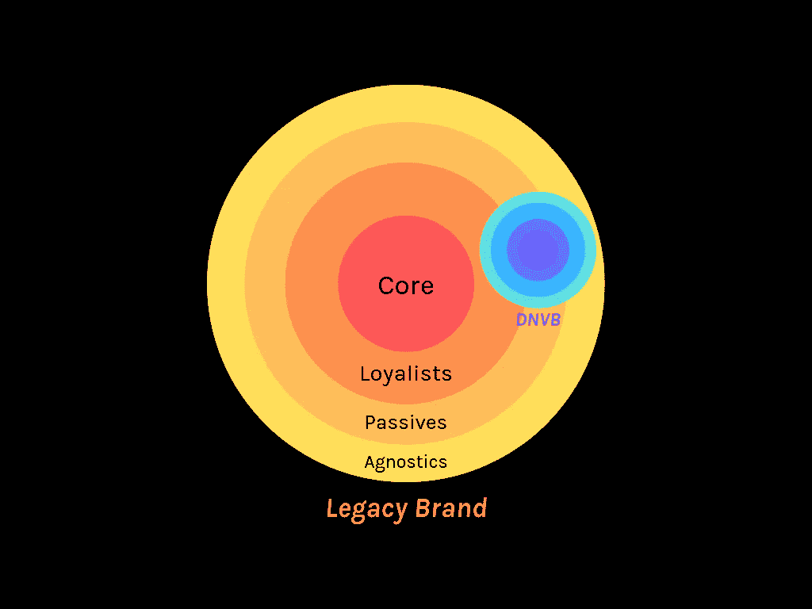

# 为什么数字化的本土品牌正在彻底改变零售业，为什么没有传统品牌是安全的

> 原文：<https://medium.com/swlh/why-are-digitally-native-brands-revolutionizing-retail-and-why-no-brand-is-safe-7e39e5eb061c>

# 摆桌子

在过去的 100 年里，零售和消费品牌领域一直由单体巨头主导，这些巨头利用巨大的规模、强大的分销网络和对有限广告媒体的严格控制来遏制竞争和占有市场份额。这些因素作为…