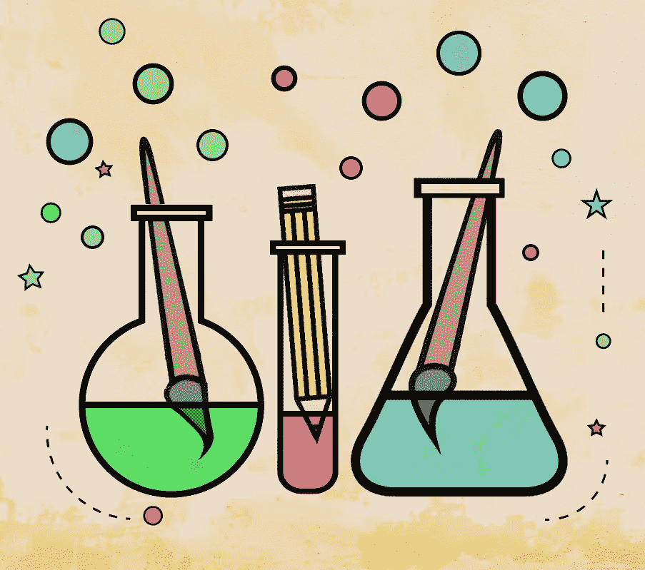

# 为什么艺术家必须实验

> 原文：<https://medium.com/swlh/why-artists-must-experiment-e9107f3abf1e>

## 活着的创意

## 艺术家和其他人能从实验中获得什么

Icons by Scribble.Liners. Illustration by the author.

T **何境界之内，一开始就是尔虞我诈。艺术创作和以前一样神秘。从来没有人回答过“你的想法来自哪里”这个问题，因为我们没有人真正知道。或者，公平地说，我们中的一些人知道，我们中的一些人非常清楚…**