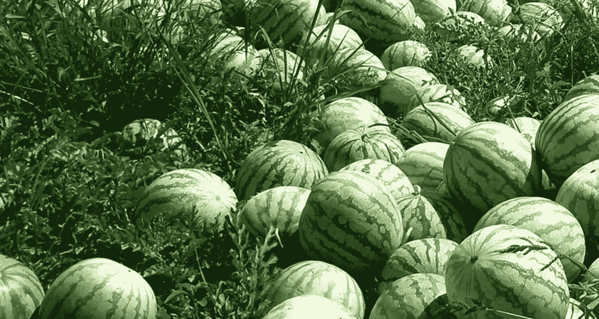

# 为什么最佳领导者需要投资培养下一代领导者

> 原文：<https://medium.com/swlh/why-best-leaders-need-to-invest-in-building-next-generation-of-leaders-c4ad49d7e18a>

## 最好的领导者是那些世卫组织创造更多领导者的人

Image Credit: [https://i1.wp.com/farmerstrend.co.ke/wp-content/uploads/2016/08/watermelon-farming-in-kenya.jpg?ssl=1](https://i1.wp.com/farmerstrend.co.ke/wp-content/uploads/2016/08/watermelon-farming-in-kenya.jpg?ssl=1)

## 西瓜的故事

印度已故国防部长兼果阿邦首席部长 Manohar Parrikar 分享了一个关于西瓜的故事，这对所有最好的领导人和有抱负的领导人来说都是一个巨大的鼓舞。