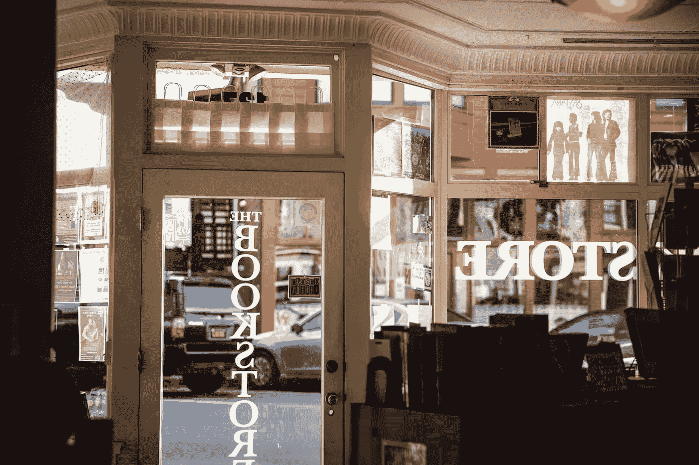

# 为什么书店很重要

> 原文：<https://medium.com/swlh/why-bookstores-matter-751053d474bb>

## 谢天谢地，他们卷土重来了。

Photo by [Jason Leung](https://unsplash.com/photos/89KfKyqh6dY?utm_source=unsplash&utm_medium=referral&utm_content=creditCopyText) on [Unsplash](https://unsplash.com/search/photos/bookstore?utm_source=unsplash&utm_medium=referral&utm_content=creditCopyText).

大多数商店的存在只是为了盈利:它们被设计成纯粹是一个买卖双方进行交易的空间。

书店——尤其是独立书店——是不同的。尽管销售很重要(盈利对他们的生存至关重要)，但这只是一个更崇高目标的副产品:成为一个宁静安全的避难所，让读者可以用文字和图片交流思想。

书店是想象力的机场——你的思想可以飞到其他世界的地方。它们是沉思、放松和逃避的空间——在大多数情况下，这里是积极鼓励逗留的地方。

虽然互联网、电子阅读器和大型连锁书店重创了世界各地小书店的命运，但很明显，在许多地方，实体店仍在生存——在某些情况下，还欣欣向荣。这种复兴的背后是什么？

我不能代表所有顾客，但我知道我为什么不断退货。从内心来说，我喜欢一家好书店给我的感觉——受欢迎、受保护、兴奋和联系。(Amazon.com 什么时候让你觉得温暖和模糊了？)我很欣赏聪明、真实、有血有肉的人类关于读什么的建议。我喜欢这些商店提供的神奇的意外收获:你可以很容易地通过浏览书架和随机挑选，或者通过选择有精美封面的东西，偶然发现一本新的最喜欢的书或作者。这是一种在网络领域没有对等物的发现方式。

由于许多国家的公共图书馆难以在采购和人员预算不足的情况下保持相关性，书店越来越成为这些珍贵场所的某种代理。而且，它们不仅仅是文化消费的场所，也是生产的场所:许多书店推出了自己的出版部门和文学节以及其他类型的活动，丰富了它们所在地区的文学景观。

无论我去哪个城市，我都会去至少一家书店。我最喜欢的是阅览室——几年前由伦敦的维多利亚和阿尔伯特博物馆创建，离它在南肯辛顿的家不远。这个高天花板、白墙的空间一部分是书店，一部分是酒吧——并且设法做到了既迷人又诱人。你可以大嚼小吃，啜饮一杯葡萄酒，仔细阅读成千上万待售的艺术和设计作品。虽然阅览室可悲地不复存在，但还有很多我喜欢的书店继续繁荣。

此外，尽管有亚马逊和其他网络巨头，独立图书销售还是经历了一次复兴。根据 NPR 的数据，从 2009 年到 2015 年，美国独立书店的数量增长了 35%。

你最喜欢的书店是什么？以下是我的一些想法:

> [**最后一家书店**](http://lastbookstorela.com) **—洛杉矶:**这个位于洛杉矶复兴市中心区的庞然大物拥有超过 25 万种新旧图书。
> 
> [**城市之光书店**](http://citylights.com)**——旧金山:**不仅仅是一家书店——它还是艾伦·金斯堡曾经被禁的*嚎叫*的先驱出版商，长期以来一直是争议观点和反文化的熔炉。我上次去的时候，花了很长时间浏览——从一个堆满书的舒适房间到另一个房间。
> 
> [**麦克纳利·杰克森**](http://mcnallyjackson.com)**——纽约:**索霍区这个明亮而温暖的印第拥有令人印象深刻的一系列文学期刊和大量精选的美国文学作品。
> 
> [**轩尼诗+英格尔斯**](http://hennesseyingalls.com) **—洛杉矶:**这家店靠近圣莫尼卡的海滩，提供令人垂涎的艺术书籍和美味的文具。
> 
> [**Kinokuniya**](https://uae.kinokuniya.com)**—迪拜**:这家日本连锁店在迪拜的巨大分店为周围浮华的消费主义提供了一个温馨、安静的休息场所。
> 
> ****(皮卡迪利大街旗舰店)——伦敦:**每次我来伦敦，都会特意去参观这家英国顶级图书连锁店的旗舰店。它大得惊人——六层楼的书和杂志几乎囊括了世界上的一切。**
> 
> **[**道特图书公司**](http://dauntbooks.co.uk) **(玛丽莱本分店)——伦敦:**坐落在玛丽莱本高街上一座华丽的爱德华式建筑里。不同类型的书籍根据地区或国家进行分类，因此对于旅行者来说，这是搜索关于他们要去的国家的书籍的理想选择，无论是小说、游记还是指南。**
> 
> **[**莎翁书店**](http://shakespeareandcompany.com) **—巴黎:**世界上最著名的独立书店之一，自 1951 年喬治·惠特曼开门迎客以来，这个历史悠久的地方接待过欧内斯特·海明威和许多其他文学名人。**
> 
> **[每年九月，它还会举办南非领先的文学节“开放图书”。](http://booklounge.co.za)**
> 
> **[**梅尔维尔的书商**](http://bookdealers.co.za) **—约堡:**有趣的、晦涩的和令人敬畏的挤满了天花板，我每次去都要在这里呆上几个小时。我发现了一些精彩的书名，在其他地方几乎不可能找到。**