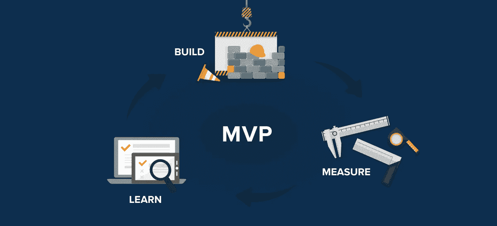

# 为什么把你的 MVP 发挥到极致是发布产品的糟糕方式

> 原文：<https://medium.com/swlh/why-bringing-your-mvp-to-perfection-is-a-lousy-way-to-release-a-product-40b82f1e6e96>

[为什么]试图制作一个理想的 MVP(或产品版本)而不是尽快推出它可能会把一切都搞砸。

你已经为你的产品或服务选择了一个想法，并且进入了另一个重要的阶段:创建和检查一个 MVP。但是你真的卡在那里了。

你在努力磨砺你的产品，改善设计和用户体验，并用小功能来修饰它，这让你筋疲力尽。因此，MVP 的发布会不时地被暂停。

问问自己:有那么重要吗？值得拖延吗？

答案显然是否定的。

客户可能甚至没有注意到你花了一周时间制作的漂亮按钮或惊人的下拉列表显示速度。与此同时，时间在流逝，当你神化一个 MVP 时，这是你脑海中出现的一个[杰出想法](/@linachka/choosing-your-lifes-business-how-to-find-an-idea-that-will-work-2895a5aee1da)的成果，这个想法可能会出现在其他人的脑海中，他们不会拐弯抹角，会在市场上推出类似的产品。

此外，一个 [MVP](https://en.wikipedia.org/wiki/Minimum_viable_product) 完全是关于极简主义的，所以利用所有的虚饰，你违背了一个具有最少足够有用功能的可销售产品版本的本质。

此外，MVP 是[精益创业](https://en.wikipedia.org/wiki/Lean_startup)方法的一个组成部分，该方法提倡发布 MVP 并收集客户反馈，以根据他们的特定需求定制产品或服务，并避免在不必要的功能上投入时间。

然而，总的来说，这个概念不仅适用于 MVP，也适用于定期更新的软件产品(例如，[数据安全解决方案](https://en.wikipedia.org/wiki/Data_loss_prevention_software)，其中每个新版本都有助于降低新出现的安全风险)。

让你的产品版本尽善尽美可能会让你一事无成。将时间浪费在多余的功能上，你就落后于那些根据客户需求和某个时间点的市场条件发布一个又一个版本的竞争对手。

更重要的是，你正在失去客户忠诚度:你已经承诺了几个月，而你的客户一直在支付订阅费。最后，你发布了一个令人难以置信的 MVP 或者一个完美的产品版本——突然间，你的客户不再需要这些花里胡哨的东西了。

有两种药丸:红色的*药丸和蓝色的*药丸。**

*   红色的是超级酷的产品版本，每样东西都考虑到了最后的细节。同时，大部分功能都是多余的，你的客户根本不需要它们，更不用说产品发布的延迟了。
*   *蓝色*药丸是一个高质量版本，其功能足以展示您产品的全部威力，并按时发布。

你会选择哪一个？

希望在前述的基础上，你会做出正确的选择。

最后一件重要的事情:当[在做](https://sumatosoft.com/solutions/startups-development)一个 MVP 或者产品版本的时候，看一下简短的指南。

1)将精力集中在构成产品基础的最重要的特性上。

2)当所有计划的功能开发完成后，请质量保证工程师参与。

3)一旦修复了所有的错误，就相应地向潜在客户或您的客户提供 MVP 或更新的产品版本。

4)收集客户对产品或其更新版本的反馈。

5)在以下情况下，对产品进行必要的更改:

*   批评的

或者

*   快速修复。

6)牢记客户的愿望，实现未来所需的功能。

祝你好运！

## 这篇文章发表在 [The Startup](https://medium.com/swlh) 上，这是 Medium 最大的创业刊物，有+412，714 人关注。

## 订阅接收[我们的头条新闻](http://growthsupply.com/the-startup-newsletter/)。

