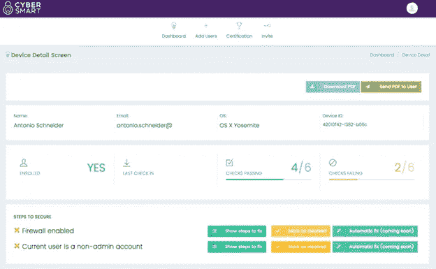
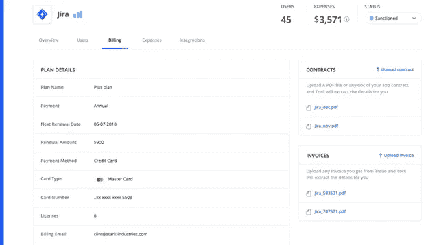
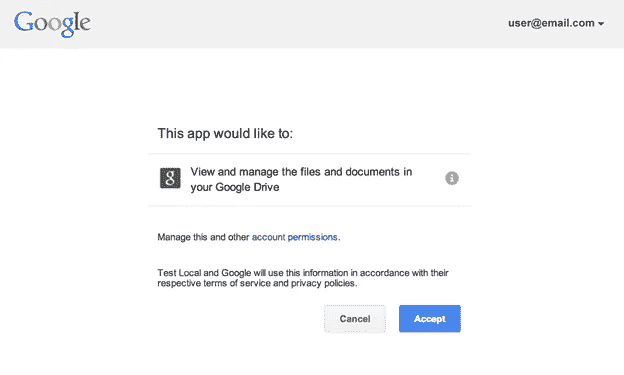

# 为什么建立正确的 IT 基础对初创公司至关重要

> 原文：<https://medium.com/swlh/why-building-the-right-it-foundation-is-crucial-for-startups-dab123c6ab8a>

随着软件经济逐渐转向基于订阅、云托管、浏览器交付的模式，企业满足其 IT 需求的方式也发生了变化。

就在三年前，IT 团队可能被视为商业生活中所有技术支持方面无处不在但又必不可少的存在，今天许多初创公司都愿意放弃这一投资。

潮流已经改变，我们中的许多人现在没有专门的内部 IT 团队，甚至没有考虑各种突发事件的明确的 IT 战略。

结果是，公司(尤其是小型创业公司)对他们的技术问题采取了观望的态度。新的工具被采用作为即时问题的临时补丁，这在很大程度上得益于软件即服务(SaaS)的新常态。

从小范围来看，这一趋势趋于积极。问题得到解决，员工可以继续正常工作，以他们认为合适的方式试验新的数字产品。对于员工较少的公司来说，这似乎是一个很好的权衡，这意味着他们可以在很大程度上忽视它。

从表面上看，这一切都有道理。毕竟，我们都在追求最大的灵活性。

不断涌现的新技术趋势和平台提供了可能的升级，使公司[兴奋地保持在前沿](/swlh/move-fast-and-break-things-is-not-dead-8260b0718d90)。然而，这可能会导致初创公司的一些问题思维——即如果他们可以自己做，为什么要有一个 it 计划呢？

但是，即使在当今即插即用的生态系统中，创业公司可以在没有 IT 战略的情况下轻松过关的想法[充其量也是有问题的](/karana/technology-doesnt-solve-problems-intent-does-65205c1c3e75)。原因如下。

**它不仅对初创公司有用，而且是必要的**

如果没有 IT 战略，初创公司就会面临猖獗的网络安全问题、工作站操作系统漏洞、服务器故障、遵守 GDPR、PCI DSS 和其他法规等诸多风险。

开发一个 IT 战略对初创公司来说可能听起来是一个诅咒，精益方法是游戏的名字，增加更多的管理和战略层是重要的，但反之则更糟。

企业公司拥有数百名员工和完整的 IT 团队，可以处理技术基础设施和规划。另一方面，初创公司必须在预算和痛苦与看起来多余的职位之间进行平衡。

然而，尽管初创公司可能不需要 IT 部门，甚至不需要团队，但他们肯定需要 IT 战略。为了适应科技世界不断发展的格局，这不一定是一个传统的战略，但它必须被定义，并被构建来解决当前的问题。

了解和应对日益普遍和突出的网络安全问题至关重要。2019 年，IT 战略需要包括如何管理 SaaS 工具(当涉及到在线安全时，这些工具很容易成为负债)以及如何应对紧急情况的明确指南。没有明确的网络安全战略，初创公司会发现自己在黑客、恶意软件和无数其他问题上落后了一步。

像 [CyberSmart](https://cybersmart.co.uk/) 这样的应用程序可以帮助最大限度地减少威胁，并提供简化技术基础设施的安全工具。

像 [Torii](https://toriihq.com/) 这样的解决方案让人们更容易看到哪些应用程序正在被使用，使用频率如何，以及了解 SaaS 的真实成本。该公司的多层面 IT 管理方法使公司能够全面了解每个应用程序的用户、使用方式，甚至每个应用程序可以访问哪些数据系统。

**科技在发展，但我们的科技问题也在发展**

当今的技术领域由“开箱即用”的应用程序和工具主导，几乎不需要技术专业知识。像 Google Analytics、Asana、Slack、Drip 和 Drip 这样的应用程序只需要打开自助服务帐户进行激活，即使充分利用它们也不需要太多集成——只需在 [OAuth 同意屏幕](https://stackoverflow.com/questions/52831417/what-is-google-oauth-consent-screen-values)上确认访问权限，就可以开始了。

这种模式似乎是为初创公司定制的，这些公司几乎没有时间或资源来规划定制软件或研究和采购复杂系统。

这种新的即插即用生态系统最容易看到的例子之一是云托管，亚马逊网络服务和谷歌云都很突出。公司可以数字化地“构建”自己的服务器，并根据需要扩大或缩小所需资源的配额。同样，有了 SaaS 工具，当出现需要新解决方案的情况时，初创公司[可以简单地添加一个应用](https://www.itbusinessedge.com/cm/blogs/all/ease-of-use-is-big-driver-of-saas-business-intelligence/?cs=43546)。

如果一个区域不起作用，只需在其上叠加一个新的 SaaS 工具就能使其发挥作用。

然而，尽管这种新模式对于需要快速、负担得起的解决方案的初创公司来说无疑是积极的，但它也带来了一系列全新的挑战。这种应用程序的大杂烩对小公司很有用，但是面临着可伸缩性、适用性和管理的问题。

对 SaaS 和其他工具的不断添加和草率处理导致了复杂和昂贵的混乱，而不是创建一个精简的基础架构。没有可靠的 IT 战略，您将无法保持控制力。

**它从未消失过**

事实是，它不仅仅是一个过时的时髦词。特别是对于创业公司来说，他们经常在流动的技术环境和不断变化的条件下工作，拥有一个战略可以最大限度地减少新的补充和平台的影响。它现在的角色不是专注于提供网络服务或管理，而是简化不断变化的生态系统，并为初创公司需要适应这一事实做好准备。

它让初创公司为这些变化制定计划，并在时机到来时更好地利用优势，而不是即兴应对这些变化。

## 这篇文章发表在[《创业](https://medium.com/swlh)》上，这是 Medium 最大的创业刊物，有+419，678 人关注。

## 订阅接收[我们的头条新闻](http://growthsupply.com/the-startup-newsletter/)。

