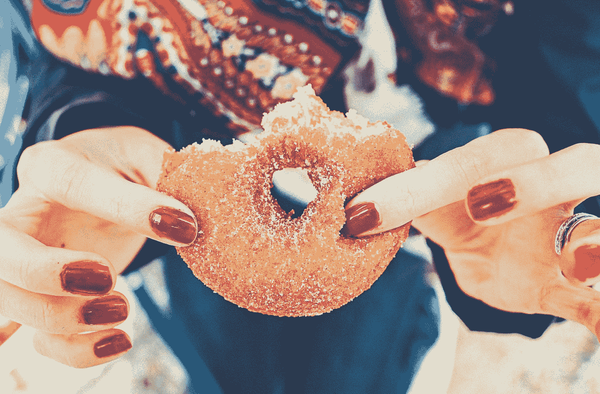

# 为什么我不能停止吃垃圾食品？

> 原文：<https://medium.com/swlh/why-cant-i-stop-eating-junk-food-92ee1b0853d>

## 最近对老鼠的研究显示了为什么我们倾向于过度消费垃圾食品。

Photo by [Thomas Kelley](https://unsplash.com/@thkelley?utm_source=medium&utm_medium=referral) on [Unsplash](https://unsplash.com?utm_source=medium&utm_medium=referral)

想象你面前有一罐巧克力饼干。你并不饿，但在你意识到之前，你已经设法把最后一点都吃光了。

几乎我们所有人都会有这种感觉，但是你会惊讶地发现暴饮暴食的意愿…