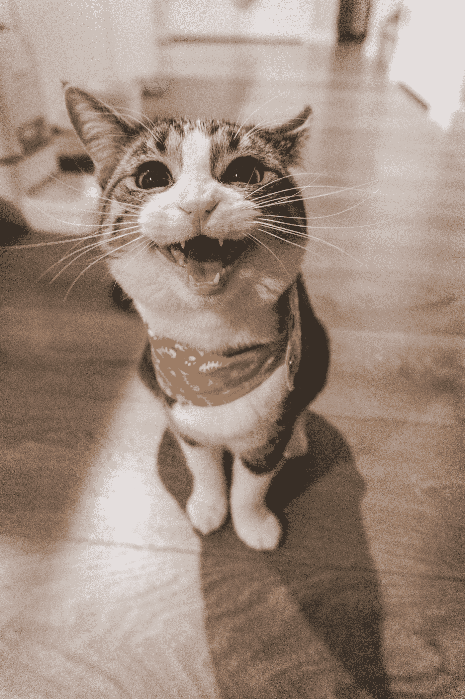

# 为什么创造力是一个消化过程

> 原文：<https://medium.com/swlh/why-creativity-is-a-digestive-process-32f1c8561238>

## 你需要吐出毛团，像穿靴子的猫一样，然后写作。

Photo by [Jae Park](https://unsplash.com/@jaehunpark?utm_source=medium&utm_medium=referral) on [Unsplash](https://unsplash.com?utm_source=medium&utm_medium=referral)

> “以前可能做过，但你没做过！”
> 
> 伊丽莎白·吉尔伯特

我不是运动型女生；我不健身，也不在健身房流汗。学习一项新的活动，它将…