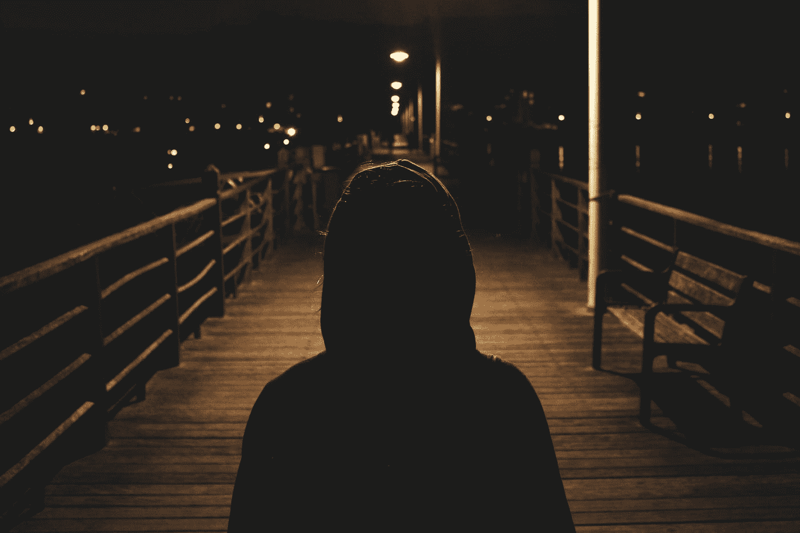

# 为什么创造者需要拥抱他们的恐惧，而不是满足他们

> 原文：<https://medium.com/swlh/why-creators-need-to-embrace-their-fears-instead-of-feed-them-79e873f52224>

没有一个创造者能免于恐惧，但我们如何面对恐惧决定了我们的命运

Photo by [Paul Garaizar](https://unsplash.com/@enjoythesilence?utm_source=medium&utm_medium=referral) on [Unsplash](https://unsplash.com?utm_source=medium&utm_medium=referral)

我敢打赌，我比大多数人更害怕。我讨厌冲突。我不擅长和不认识的人在社交场合相处。我很难自我宣传，还有无数其他问题困扰了我一生。