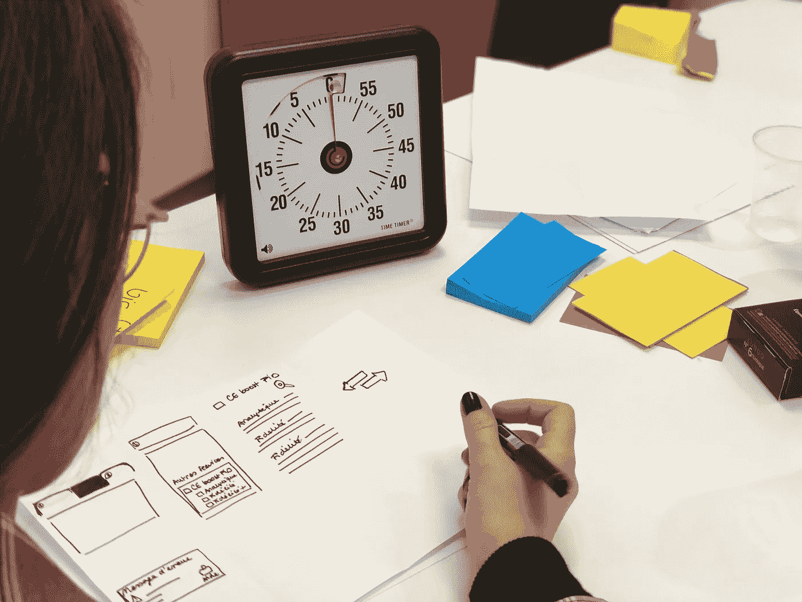

# 为什么快速增长、面向未来的公司使用设计冲刺

> 原文：<https://medium.com/swlh/why-design-sprints-are-used-by-fast-growing-future-ready-companies-8435dde8b999>

你可能听说过 design sprints，这是由谷歌发明的为期一周的解决方案设计和快速原型制作研讨会，现在被 Airbnb、Slack、KLM、Prudential 和大英博物馆等公司使用。你可能想知道有什么大惊小怪的。

答案，一句话，就是*值*。在[再次问候](https://www.helloagain.com.au/design-sprints/)，我们已经进行了几年的设计冲刺…