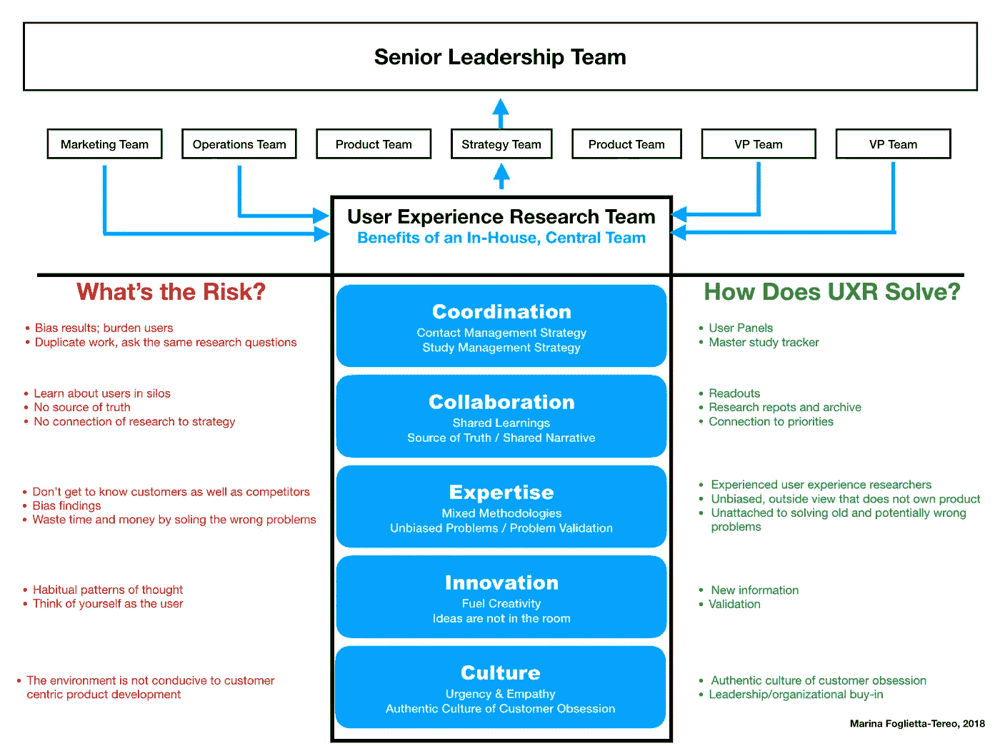
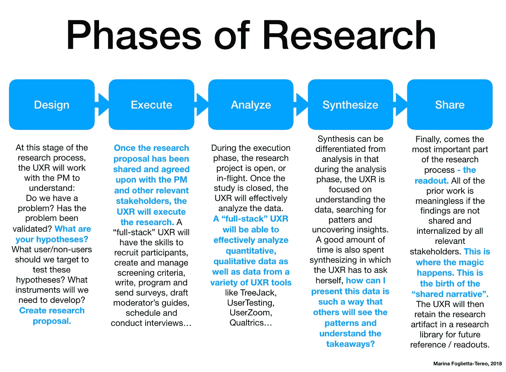
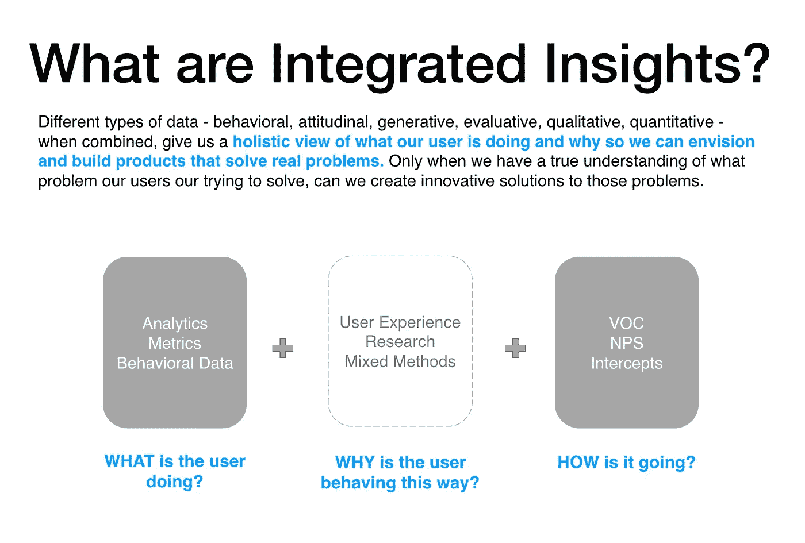
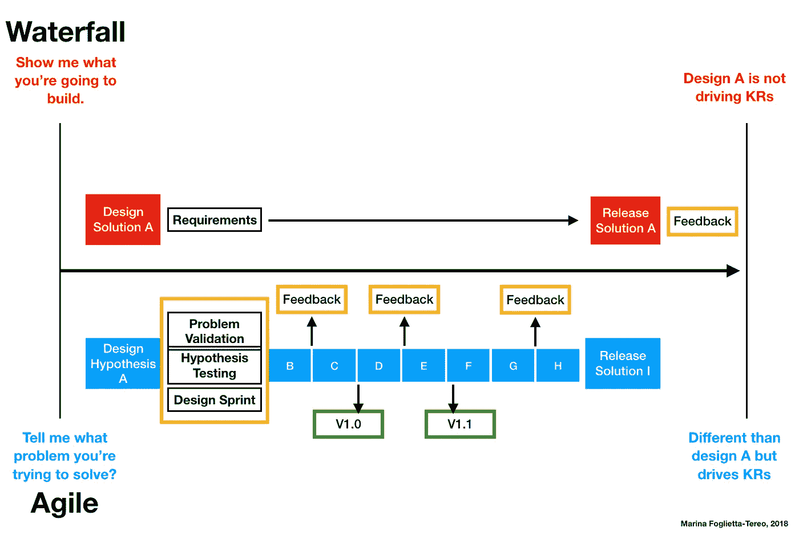

# 《为什么数字化转型需要用户体验研究》

> 原文：<https://medium.com/swlh/why-digital-transformation-needs-user-experience-research-6fd98af031ea>

## 内部专门的中央 UXR 团队如何帮助大型传统服务组织发展并取得成功

随着各公司努力在日益自动化、个性化和数字化的世界中保持相关性，它们制定了专注于客户体验的雄心勃勃的使命宣言。

> “我们尽可能为顾客提供最具吸引力的购物体验。”
> 
> “我们提供世界上最好的客户体验。”
> 
> “我们坚持不懈地提供对我们的生活方式至关重要的平台和技术进步，以此来取悦我们的客户。”

对于大型传统服务机构来说，从销售优秀客户服务转变为销售优秀客户 T2 体验需要的不仅仅是雄心。这些公司必须认识到，伟大的技术产品，或者说“无缝和全渠道的数字体验”，是由伟大的技术公司打造的。

我不是唯一一个断言每个公司都是科技公司的人。无论技术是产品——苹果、戴尔、思科——还是产品的关键推动者——脸书、谷歌、亚马逊——在资源、流程和公司成功所需的优先事项方面都没有什么区别。[埃里克 P.M 维穆伦](https://medium.com/u/9eaa7a0096d3?source=post_page-----6fd98af031ea--------------------------------)将“智能平台公司”定义为那些为创新而组织的公司。他警告说，

> “…在全球市场竞争异常激烈的时代，每个公司都需要将自己重塑为一家智能平台公司。”

他说，从亚马逊、脸书、网飞、谷歌和其他令人钦佩的智能平台公司学到的真正教训是:如果一家公司希望打造伟大的技术产品，它需要像一家技术公司一样思考和行动。

我并不是说“成为一家伟大的技术公司”或一家受人钦佩的“智能平台公司”很容易。当然，我并不是说我知道、理解或者甚至能清楚地说出成就伟大的所有必要因素。但我所知道的事实是:

*   客户体验团队应该有协调的、成熟的和严格的与实际客户交谈的流程。
*   全面的数据策略不仅应该包括行为数据或分析(什么)，还应该包括用户体验数据(为什么)。
*   想要通过创建满足真实用户需求的相关且吸引人的产品来取得成功的组织，必须确保他们真正了解这些需求是什么。

我不需要说服任何人伟大的用户体验在竞争差异化中的重要性。用户体验现在通常跨越数字和物理接触点，需要深思熟虑的体验设计和以用户为中心的产品管理。然而，似乎需要令人信服的是，从客户服务到客户体验的公司需要致力于成为技术产品主导的组织。这些公司必须授权产品团队——以及产品的设想、设计和开发——拥有和定义客户体验。

发现自己走在通往数字未来的进化道路上的公司可以帮助增强其产品团队的能力，并执行其雄心勃勃的以客户为中心的战略，部分是通过发展内部、专门和集中的用户体验研究团队。

上面的组织 UXR 成熟度模型将“研究成熟度”描述为组织发展这样一个团队的最佳时机。

**虽然将 UXR 纳入产品开发确实为组织提供了价值，因为其产品将更好地满足用户需求，而没有集中和引进内部专业知识，但这不仅限制了战略附加值，而且最终会对组织产生负面影响。**

该模型还描绘了一个“每个人都做研究”的场景。当每个人都以不同程度的严格性和协调性进行研究时，没有一个团队被信任来解释研究结果——因此，毫不奇怪，他们会得到不同的解释。一位经理对客户互动、访谈或其他研究数据的看法可能与另一位经理(或领导团队成员)的看法不同。从本质上讲，当“每个人都做研究”时，企业就获得了等同于“没有人做研究”的战略价值。

请注意:我并不是建议产品经理不应该和用户交谈。他们应该。我并不是说公司的高层领导和/或其他成员不应该和用户交谈。他们应该。

> 我的意思是，这种非正式的、特别的、不协调的研究不应该取代一个以建立世界最佳客户体验为目标的公司的成熟、严格和专注的 UXR 实践。

然而，如果一个组织有根深蒂固的、真正的以客户为中心的文化和强大的技术产品开发学科，用户需求是其中的一部分，工作流可以受益于嵌入 UX 研究人员和/或授权产品经理进行用户研究。

**如果该公司正处于数字化转型的最开始阶段，产品经理自身也在从以业务为中心向以用户为中心转变，UXR 团队可以成为转型的催化剂。**

# 协调

**联系管理策略:**重要的是不要在每次研究中与相同的用户交谈，这样研究结果就不会有偏差。然而，与同样的用户交谈也是对他们时间的不尊重。UXR 团队要做的最重要的事情之一就是创建和管理用户面板。这些用户小组由选择参与研究或“塑造未来”的客户(内部和外部，参与和未参与)组成。小组成员标记有相关的行为、细分和人物角色数据。

**这不仅允许公司管理联系规则，还允许公司*持续*测试假设，验证产品想法，并告知实际客户路线图。**

**研究管理策略:**UXR 团队还将提供一种跟踪机制，以确保企业不会通过询问相同的问题(重复相同的研究)而不是协调和优先考虑学习来重复工作。没有专门团队的公司面临着许多团队向许多相同的用户问许多相同问题的风险。业务不仅会给用户带来偏见和负担，还会在团队间重复工作。

**有了研究管理策略，企业就能在工作流和计划中优先考虑研究工作，将研究目标整理成文，并与“正在解决的问题”保持一致。**

The research process has clearly defined phases — each of which is critical to ensuring effective and unbiased problem validation and findings.

# 合作

**共享学习:**研究过程的最后一个阶段，即读出，可能是最重要的。没有它，所有的前期工作都没有意义。

**整理研究目标和假设，然后与所有相关利益方分享研究结果，确保学习产生最大影响。**

房间里跨工作流的每个人都出席了读出并分享了相同的理解。

> UXR 团队还负责将这种理解转化为领导力，以便与战略优先事项和故事讲述保持一致并为其提供信息，通过创建“共享故事”有效地弥合战略和产品管理之间的差距。

许多数据策略要求集中和标准化分析，最终目标是更好地了解客户。当一家公司集中其分析时，它将对其客户正在做的事情有一个更可靠的看法。但是公司也需要理解顾客行为背后的原因。理解为什么能让公司制造出解决客户问题的产品，设计出真正改善客户生活的体验。

然而，没有 UXR 团队的公司很可能在解决“为什么”这个问题上远远落后。UXR 团队可以使用许多方法和工具来更好地了解公司的用户——背景调查、1:1 深度访谈、定量假设测试、顶级任务分析、设计冲刺、远程可用性测试、现场可用性测试、信息架构研究、卡片分类等等。

当各公司都在为谁最了解客户而战，不顾一切地让用户参与长期对话而不是单笔交易时，将会赢得这场战斗的公司将会采用这些方法来告知他们复杂的多渠道客户关系。

**真相来源:**虽然集中数据肯定是创建权威真相来源的一个步骤，但除非公司也集中其数据团队，否则这一有价值的目标将难以实现。数据不是洞察力。没有洞察力的数据是没有用的。数据是用来解释的。不同的人，尤其是在不同的团队中，有着不同的动机和目标的人，会以不同的方式解读数据，讲述不同的故事。行为数据和定量数据(可能有不同的定义)如此，定性数据更是如此。

**为了获得权威的事实来源和理解客户动机的最终目标，公司不仅必须组合当前不同的数据，还必须组合当前不同的数据角色，并添加当前未开发的数据源。通过这样做，公司将获得“整合的洞察力”。**

# 专业知识

混合方法学:米兰·米贾托维奇是一位经验丰富的 UX 研究员，也是我的前任老板，他用“全栈”UX 研究员一词来形容这样一位研究员，他不仅会带来研究过程每个阶段的知识——如何设计、执行、分析、综合和分享研究项目——还会带来研究项目和方法的工具包。

**为正确的(经验证的)问题选择正确的方法对于揭示洞察力至关重要。正如问错误的问题会让你 100%得到错误的答案一样，*你如何*问问题(用什么方法)也同样重要。**

一个公司拥有的揭示洞察力的工具和方法越多，它就越能了解用户真正想用它的产品完成什么。

**无偏见的发现:**每一个新想法，无论是业务、产品还是功能，都是建立在假设之上的。测试这些假设是以客户为中心的开发过程的重要部分。但是产品经理，就像他们产品业务的迷你 CEO 一样，倾向于推销他们的想法，让用户相信他们的愿景。即使意识到他们有偏见的倾向，产品经理也更可能寻找证实而不是否认他们假设的模式。我当然和那些寻求真理的产品经理一起工作过——他们在问题验证和测试的方法上没有偏见。

**然而，大型非科技组织中的绝大多数产品经理，要么作为科技产品经理太新，缺乏经验，无法避免他们的偏见，要么是外部动机，不是寻求真相，而是通过推翻长期持有的假设，赶上发布日期和实现业务目标，以打破时间表和传统智慧。**

**问题验证:**可以说，产品开发周期中最重要的部分就是问题验证。

当产品经理和企业多年来一直试图解决特定的问题，分配时间、投入资本和精力时，他们不太可能用这些问题的解决方案来换取全新的问题。

此外，采用“要做的工作”框架来理解用户需求需要培训和经验。在这种情况下，拥有一个公正的 UXR 团队会非常有帮助。

**进行阶段性研究的时间:**最后，因为有效的研究必须经过深思熟虑的设计、执行、综合和社会化，所以需要时间。每个研究项目都有不同的阶段。我很幸运成为了一个敏捷的“全栈”研究团队的一员，这个团队每年能够完成大约 80 个不同规模、范围和方法的项目。产品经理在平衡用户需求与业务目标和约束以向市场交付产品的同时，根本不应该有时间来有效地设计、执行、综合和社会化研究成果。

# 创新ˌ革新

除了开发内部 UXR 团队所带来的协调、协作和专业知识之外，增加的用户数据也成为有洞察力的创新的燃料。从 Adam Bradenburger 极具启发性的战略框架*战略需要创造力*，到*与人类对话 Giff Constanble 的*断言，“想法不在房间里”，一个公司必须打破习惯性思维模式，或通过不同的思维方式来击败竞争对手。

用户体验研究提供了“各种形状和大小的彩色块”，公司可以用它来建立创造性的策略。 [玛利亚·波波娃](https://medium.com/u/f7ad0f3e1f37?source=post_page-----6fd98af031ea--------------------------------)解释道:

> 我们越是有意识地纠结于一个需要创新解决方案的问题，我们就越有可能把自己困在熟悉的角落里，陷入习惯性思维模式，而这种思维模式总是会把我们引向正确的方向。
> 
> 然而，我们可以优化我们的思维进行组合创造——通过用不同的、折衷的、跨学科的片段来丰富我们的智力资源库，将它们融合成新的组合。毕竟，创造力很像乐高——如果我们只有几块形状、大小和颜色相同的砖块，我们建造的东西最终会非常单调和一致；但是，如果我们用一袋各种形状和大小的彩色砖块来装备自己，我们建造的富有想象力的寺庙在旁观者看来可能是受到了“一丝恩典”的启发，然而我们只需要看看我们的乐高积木袋就能想起它们是从哪里来的。

**新产品创新本质上是解决客户痛点的体现。真正理解这些痛点，并采用灵活的框架来解决问题，而不是构建一套固定的解决方案的公司，将是赢家。**

# 文化

当一家公司从服务发展到技术，从以业务为中心发展到以用户为中心时，它的产品经理可能会感到痛苦，因为他们试图在一个不是以用户为中心的组织中采用以用户为中心的思维方式。当公司自上而下启动其转型议程时，很可能会发生自下而上的转型。参与数字产品管理培训的产品经理正在从以业务为中心的思维模式——关注业务目标、发布日期和输出——转变为以用户为中心的思维模式——关注问题验证、假设形成和结果。

**然而，虽然项目经理正在接受验证问题、MVP 解决方案原型和测试假设的培训，但他们缺乏资源、时间、结构、协调和组织认同，无法真正采用假设驱动的方法来解决问题。**

将用户研究纳入产品开发模型，正如大多数大型非技术公司开始做的那样(如果他们还没有这样做的话)，是朝着设想和建立最佳体验迈出的一步。然而，如上所述，不仅有额外的好处，还有与没有专用于此功能的资源相关的痛点。

具体来说，产品经理提到在用户研究和构思方面缺乏协调和流程，在急于找到解决方案的文化中缺乏对问题验证和发现的组织认同，缺乏关于工具和方法的专业知识，缺乏进行分阶段研究的时间，以及缺乏所有权。我采访过产品经理，听到了以下难题:

*   “当你有一个想法或解决方案时，没有流程、时间或支持来与利益相关者/领导者分享。”
*   “我们如何创造一个有耐心的环境，让每个人都花时间充分理解问题？”
*   “考虑到团队规模，我们如何确保产品管理的所有领域都得到足够的重视。是时候执行发现/用户反馈/访谈了？”
*   “我们希望在不同的产品中解决相同的问题，造成重复劳动。”
*   “作为一个 BAU 过程，我们如何让利益相关者/最终用户参与到产品规程(人物角色/访谈)中？”
*   “我们如何获取客户数据？”
*   "当我们获得客户数据时，谁在分析和链接优先级？"

缺乏对问题验证的组织认同的一种方式可能会迫使公司和产品经理从他们向敏捷的演进倒退到瀑布，如下所述:

那么，实践中的“综合见解”是什么样的呢？以下内容改编自[杰夫·高瑟夫](https://medium.com/u/94a2a063be85?source=post_page-----6fd98af031ea--------------------------------)将 UX 与敏捷和 scrum [结合在一起](/swlh/here-is-how-ux-design-integrates-with-agile-and-scrum-4f3cf8c10e24):

如果您同意、不同意、有关于在大型组织中建立用户体验最佳实践的经验和/或意见，请发表评论！

## 这篇文章发表在[《创业](https://medium.com/swlh)》上，这是 Medium 最大的创业刊物，有+412，714 人关注。

## 在这里订阅接收[我们的头条新闻](http://growthsupply.com/the-startup-newsletter/)。

