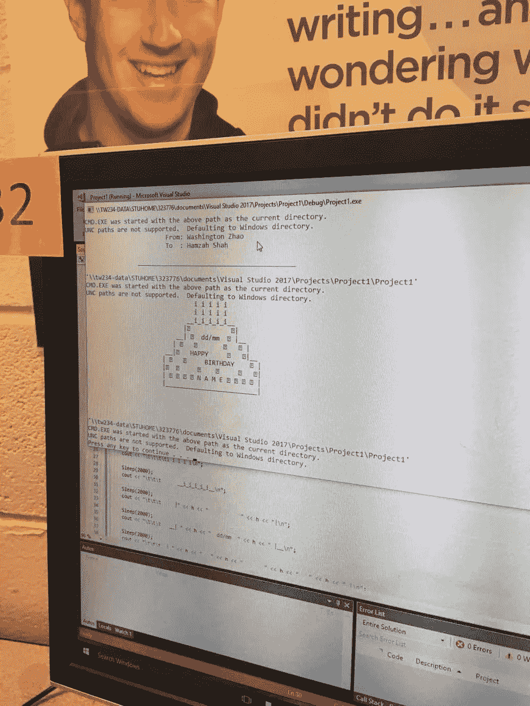
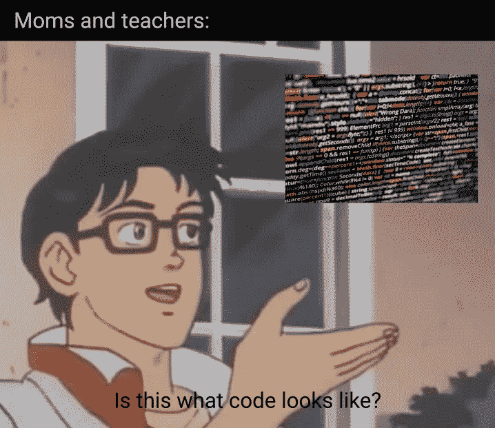

# 为什么 CS 入门课程会忽略激情？

> 原文：<https://medium.com/swlh/why-do-introductory-cs-courses-overlook-nurturing-passion-7894b69da751>

`cout <<"Hello world!" <<endl;`

神圣的狗屎。我做到了，我现在是程序员了！

我在高中的第一堂编程课包括 if/else 语句(通常一次 5 或 6 个 else ifs)，嵌套 for 循环(不是一个..不是两个..而不是三个…)，并打印出带有 ASCII 字符的“ROFLcopters”和生日蛋糕。

All we did was provide our names as input to the program…AND we forgot to put in the day.

我们的项目是程序性的，几乎不需要分析性的思考。这些要求使得到处使用神奇数字的强力解决方案成为可能的最佳解决方案。

不管我们的程序是在 O(n ⁰)上运行，还是在一个文件中写了 1000 行代码。(不过，郑重声明，我们中没有人这么做过)

从局外人的角度来看，除了纯粹的 C++语言的准系统语法之外，我们对 CS 几乎一无所知——实际上，我们对语法的了解最多也就是微乎其微。

但是没关系，因为我们很享受。我们认为“你好，世界”可以如此容易地在电脑上播放是不可思议的。

在南加州大学的上学期，我参加了臭名昭著的计算机科学淘汰班，据说该班有 50%的退学率，弯曲了 15%。课堂上的项目持续超过 15 个小时，考试的平均分数在 60%左右。

熟悉的“T1”变成了“T2”，“T3”变成了“T4”，事实证明，运行程序可能比仅仅按下亚马逊网络服务在线 IDE C9.io 上的“运行”按钮更复杂

尽管这学期经历了一些坎坷，但我最终以高于平均水平的成绩毕业，并保持了对计算机科学的热爱——不幸的是，许多其他人却不能这么说。

我把这一成功很大程度上归功于我在高年级时上的编程入门课，更确切地说，是它带给我的激情。

也许，那门课并没有像我们学校的其他入门课那样教给我很多关于 CS 的知识——我的许多同龄人跳过了这门特定的课，直接去上更高级别的 OOP 课程。可能那门课连 CS 课都算不上。但是，有一点是肯定的:它让我爱上了编程。这种热情远远超过了任何一堂更难的第一堂课可能教给我的行话。

区分那些在这些艰苦的计算机科学课程中成功的人，并不一定是关于这个主题的知识。不，做得好的人是那些一有机会就打开课堂视频做作业的人，那些在办公时间问与课程无关的问题的人，那些用问题淹没广场的人，等等。

这似乎是常识——这是一句老生常谈的话,“天才不努力，努力就能打败天才”。但是特别是在 CS 中，激情对于在这个领域走得更远是非常重要的。

在美国，计算机科学一直是本科辍学人数最多的专业——那些在毕业前转专业的人。自 2013 年以来，计算机科学已经成为排名第四的最受欢迎的 STEM 专业，同时也是增长速度最快的专业。然而，只有 [8%的 STEM 毕业生是计算机科学专业的](https://docs.google.com/document/d/1gySkItxiJn_vwb8HIIKNXqen184mRtzDX12cux0ZgZk/pub#h.hr944as2kqbg)。随着对该领域的需求不断增加，快速诊断问题的根源非常重要。

和其他研究领域一样，计算机科学需要课外的工作。虽然你可能在大学毕业后仅仅通过课程学习和实习就能找到一份好工作，但最成功的学生往往是那些有兼职项目的人——参加黑客马拉松，建立个人网站，chrome 扩展，等等。

Quality real life code /s (Taken from r/programmerhumor)

随着越来越多的学生选择学习计算机科学，有时是出于误导的原因，例如[对流行文化中信息学的描述](https://www.reddit.com/r/ProgrammerHumor/comments/aer00s/programmers_portrayal_in_movies/)，也许只是对编程的热爱，而不是科学背后的数学，许多学生只是对这门学科本身不够热爱，无法在课外完成必要的工作。

这个问题的解决方案不是阻止那些可能不了解自己所学内容的学生决定学习计算机科学，而是改进入门课程，以便更好地描述学习的实际情况，同时更加重视培养学生的热情。

我的编程入门课在前者上可能做得不好，但至少对我和我的同学来说，它在后者上是成功的。

我目前正在转学到南加州大学维特比工程学院，成为一名计算机科学专业的学生，我的许多同班同学都选择了增加计算机科学的双学位，这在很大程度上是受到了我们将无声图像输出到屏幕上的经历的启发。

我的朋友 Jennings 写了一篇令人信服的文章，**，*，他在文章中讨论了东北部的编程入门课程如何未能培养出对 CS 的热爱，更重要的是，这种缺乏热情如何导致学生在课外构建辅助项目时失败。*

*如果你和詹宁斯第一次约会，一个肯定会出现的话题就是他做的项目。(这一点，以及他对动物的热爱和关于它们的有趣事实)*

*当我请他给我发一个我之前制作的视频，发给他，但找不到，他没有简单地通过 Google Drive 分享给我，而是上传到他的自托管服务器上测试它的功能——因为他对它太有热情了。没有效果，但是带给他的快乐是真实的。他有一个下载在他的手机**上的终端**，唯一的目的是当他外出时，他可以 SSH 到他的服务器并编码。他花了一个周末的空闲时间和他刚接触 CS 的朋友一起去参加黑客马拉松，帮助她构建一个简单的 chrome 扩展，阻止人们在泡沫茶上浪费金钱——不是因为这个扩展会赢得黑客马拉松，而是因为教授`manifest.json` s 的主题对他来说是一种享受。*

*今年夏天，他接受了一份完全无偿的工作，利用计算机科学通过神经成像帮助波士顿的一家儿童医院。*

*詹宁斯是我见过的最有激情的个人，他在计算机科学方面也令人惊叹。然而，尽管他可能理解[安全问题](https://github.com/twlinux/lets-talk)，他经常告诉我他如何花大量时间在谷歌上搜索简单的 JS 语法。*

*学习编程语言的语法或新 API 的文档并不难。毕竟，为什么堆栈溢出会是一件事呢？*

*但是，很难找到内在的动力去花几个小时寻找一个错误的解决方案，花你的空闲时间去开发一个新的应用程序，而不是在 App Store 上搜索现有的应用程序，去热爱计算机科学，而不是为了荣誉。*

*如果没有这样的动力，完成高水平的课程是非常困难的。如果不是因为你喜欢用计算机解决问题，当你看起来没有学到任何关于创建真正的软件的东西时，你为什么要花几个小时试图创建一个 AVL 树呢？*

*在我看来，我们的教育系统有责任帮助培养学生对这门学科的热情。显然，有些人会发现计算机科学可能不适合他们——但是给学生布置枯燥的项目和过于抽象的术语的入门课不是解决办法。*

*显然，没有简单的解决方案——学校需要通过教授他们未来成功所需的知识来确保他们的学位完整性。*

*以下是我从经验中得到的一些小的初步想法:*

1.  *主持项目展示/让高年级学生在入门课上演示他们的项目*

*南加州大学的电子游戏博览会在过去的一个学期里，真的让我大吃一惊，有这么多令人惊叹的项目。看到其他年长学生的作品会给人一种感觉:“他们能做到，为什么我不能。我想做那个。”甚至在线例子也能很好地工作——你可以访问 bl.ocks.org 的来获得漂亮的数据可视化，或者甚至访问[的产品搜索](https://www.producthunt.com)来看看人们如何用代码构建真实的东西。代码还不重要，结果才重要。*

*2.在课堂上布置互动项目，而不是老一套的“僵尸”程序*

*并非所有的项目都是一样的。如果您正在教授数组，您可以创建一个虚构的商店库存故事(出于某种原因，只有 5 件商品)，但坦白地说，这对学生来说很无聊，而且会误导商店在现实生活中如何利用代码。调味吧！构建一个 [lights out 游戏](http://www.logicgamesonline.com/lightsout/)，或者任何学生完成代码后可以玩的互动游戏。工作完成后，我非常喜欢和我的朋友在课堂上玩 UNO 的印刷游戏。*

*3.更好地解释行话——或者最好留到以后的课上再说*

*是的，我知道这是一门 CS 课程，学生们还能从哪里学到程序员们热衷于使用的行话？(说真的，为什么程序员如此喜欢行话，甚至在工作之外)但在入门课上，行话令人倒胃口:当你的老师用完全不同的语言说话时，你怎么能兴奋地学习这些材料呢？如果你要介绍术语，请更好地解释它们——不要给出一个基本的堆栈溢出定义，就此打住。*

*我热爱 CS，尽管我可能还不太擅长，但我知道我愿意投入必要的工作来改进，因为我的代码运行和解决问题的快感值得我投入任何时间。*

*所以，与其马上一头扎进枯燥的语法课、链表和数据结构，为什么不把更多的注意力放在培养激情的练习上呢？毕竟，也许你的学生不会知道他们在课堂上与老师交谈的聊天应用程序是如何用 sockets 和 MEAN stack 构建的，但他们不会喜欢用老师自己用代码制作的东西与他们最好的朋友交谈吗？*

*没有激情，即使在这个领域取得了成功也不再觉得是成功。*