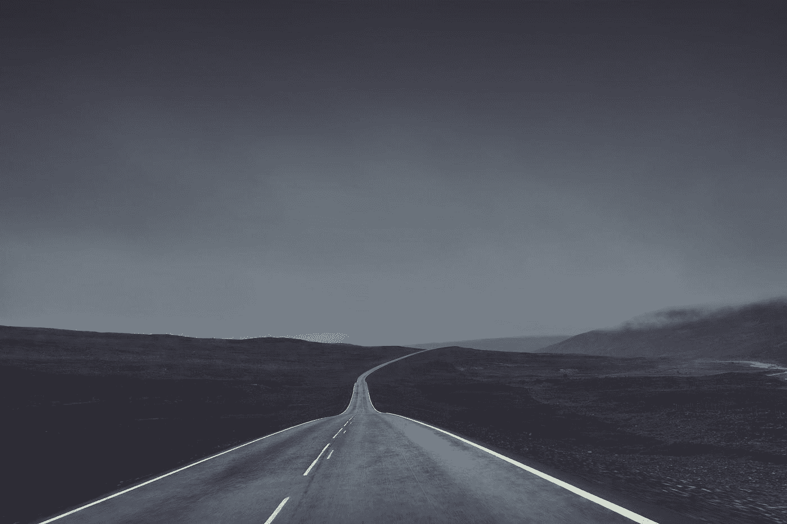

# 为什么我们害怕未知？

> 原文：<https://medium.com/swlh/why-do-we-fear-the-unknown-571fa35e6255>

Photo by [Olivier Guillard](https://unsplash.com/@olivier_twwli?utm_source=medium&utm_medium=referral) on [Unsplash](https://unsplash.com?utm_source=medium&utm_medium=referral)

几周来，这一直是我的世界里一个亟待解决的问题。

害怕我们看不见的东西有什么意义？为什么恐惧会起作用？

当我们面临人生的十字路口或冲突时，我们要么战斗，要么冻结，要么逃跑。但是，通常我们也会害怕，即使我们不承认。当我们面对未知时，肾上腺素在我们体内积聚，我们用…