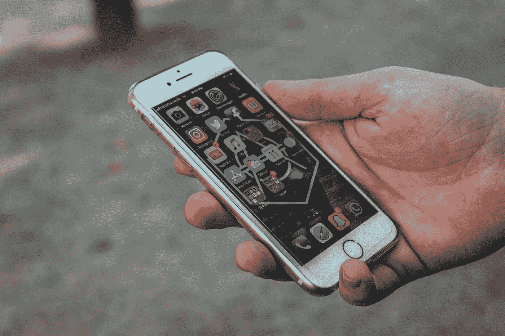

# 当我们讨厌脸书的时候，为什么还要相信 Whatsapp？

> 原文：<https://medium.com/swlh/why-do-we-trust-whatsapp-when-we-hate-facebook-f43730a64b97>

Photo by [Sara Kurfeß](https://unsplash.com/@stereophototyp?utm_source=unsplash&utm_medium=referral&utm_content=creditCopyText) on [Unsplash](https://unsplash.com/search/photos/whatsapp?utm_source=unsplash&utm_medium=referral&utm_content=creditCopyText)

## WhatsApp vs 脸书

## 一个由企业恶棍拥有的受人喜爱的品牌的演变

我是脸书一代的一员。在我十几岁的时候，我收拾好我那些令人畏缩的照片，离开了 Bebo，去了脸书明亮的灯光和闪亮的新鲜感。这也意味着在我 25 岁左右的时候，公司和社会…