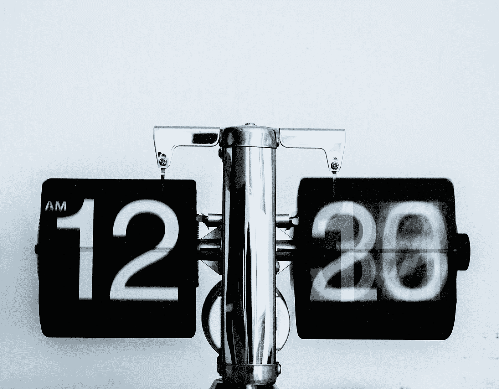

# 为什么需要营销自动化？

> 原文：<https://medium.com/swlh/why-do-you-need-marketing-automation-2fde2e0e58f8>

如果你问一个企业主或营销经理，他们的工作时间通常是怎样的，他们会告诉你一个接一个的会议(所有这些都是为了确保团队在实现季度目标的轨道上)。此外，你还需要仔细检查社交网络上的活动进展如何等等。

很难找到一个平衡点，同时确保你所有的营销行为在正确的时间针对正确的受众，同时传递正确的信息。这就是许多公司转向营销自动化的原因。 [NinjaPromo](http://ninjapromo.io/?utm_source=medium&utm_medium=organic&utm_campaign=promo) 收集主要原因，使您的促销活动自动化。

**我们所说的“营销自动化”是什么意思？**

这一术语指的是以开展营销活动为目的的软件(在社交媒体上发布帖子、发送电子邮件等。).在这种情况下，不需要手工劳动。这种软件，如果应用得当，可以在个性化内容的帮助下增加潜在买家的数量，将他们转化为忠诚的客户。

让我们从 5 个方面来解释为什么营销自动化对营销人员和企业主至关重要。

# **节省时间**

显而易见，但这里有一些值得注意的事实:

*   社交网络中帖子和广告的自动化可以让你每周节省 6 个多小时。
*   随着旨在建立初步联系和后续跟进的邮件自动化，信件回复率(回复率)增加了 250%。
*   自动化工具为您节省了 80%的预约时间。

你不再需要每天早上进入程序，在社交网络上安排你的帖子，或者一个接一个地发送电子邮件。由于自动化，你可以提前计划好一切，并且可以自由地从事其他活动。

此外，与产品中各种自动化工具的集成避免了平台之间的切换，从而节省了您的时间。

Photo by [Djim Loic](https://unsplash.com/photos/ft0-Xu4nTvA?utm_source=unsplash&utm_medium=referral&utm_content=creditCopyText) on [Unsplash](https://unsplash.com/search/photos/time?utm_source=unsplash&utm_medium=referral&utm_content=creditCopyText)

# **它有助于从 CRM 系统中获取更多信息**

首先，让我们提醒你注意这样一个事实，CRM 系统和自动化程序不是一回事。

客户关系管理系统，或 CRM(客户关系管理)，更面向联系，主要由销售部门使用。这类程序允许你保存联系信息(姓名、地址、电话号码，有时——客户行为特征或上次谈话的细节)。

事实上，营销自动化软件是为营销而设计的。除了保存重要的联系信息，它还可以显示用户在漏斗中的位置，他们下载了什么资源，他们与哪些页面进行了交互，最重要的是，它们允许他们自动执行基于这些交互分配的任务。

CRM 和自动化软件本身都很好，但结合起来，它们变得更加有益。使用集成 CRM 系统的自动化工具，您可以在一个地方看到销售经理的联系人和首选广告活动。这让你对个人消费者与你的品牌之间的关系有了更深入的了解，让你选择建立联系的最佳方式。

例如，与 CRM 集成的营销自动化可用于向您系统中的联系人直接发送有针对性的电子邮件。如果没有这种集成，您将不得不从 CRM 数据库中手动下载所有联系人，既浪费时间和金钱，又有采取错误用户操作的风险。因此，如果有人不准确地输入了电子邮件地址，个人将不会收到信件，销售也不会发生。

Photo by [QuickOrder](https://unsplash.com/photos/LbInNgbm_Ts?utm_source=unsplash&utm_medium=referral&utm_content=creditCopyText) on [Unsplash](https://unsplash.com/search/photos/customer?utm_source=unsplash&utm_medium=referral&utm_content=creditCopyText)

# **它提供绘制“总图”的数据**

您需要直接访问最重要的 KPI。但是，如果您使用 2-3 种不同的工具，那么您将不得不从一个平台切换到另一个平台，这将使将指数和费率与营销活动联系起来的过程变得复杂和漫长。

当使用一个专门设计的工具来追踪广告对销售的影响时，你有足够的机会来更新你的策略。不理想的结果不会让你感到意外。

# **它系统化**

自动化工具让你的在线观众拥有相同的、一致的体验，并根据他们的行为进行规划。

例如，当一个用户订阅你的博客时，你可以设置一个算法，自动发送一封欢迎信，信中会提供文章，可能还会提供后续内容。您还可以在关注者的文章发布后自动发送给他们。

Photo by [Samuel Zeller](https://unsplash.com/photos/JuFcQxgCXwA?utm_source=unsplash&utm_medium=referral&utm_content=creditCopyText) on [Unsplash](https://unsplash.com/search/photos/filing-system?utm_source=unsplash&utm_medium=referral&utm_content=creditCopyText)

# **自动化让你创造个性化的内容**

个性化内容将交易率提高了 6 倍，然而 70%的公司忽视了这一点！

想一想，你希望收到什么样的邮件——一份时事通讯，其中的信息是一般性的，标准的文字或一封信，就好像它是专门为你创建的一样？用你的名字发邮件，上面写着:“我们认为你对 X、Y 和 Z 感兴趣，因为你已经加载了 N1 报价”。很有可能，你关注的是第二个选项。

# 事后的想法

你只需要意识到你到底需要什么，你的目标是什么(好吧，任何策略都是从这个开始的)，做你自己的小小研究，找到最好的自动化工具，进行一段时间的试验，然后继续前进！有问题就问 [NinjaPromo](http://ninjapromo.io/?utm_source=medium&utm_medium=organic&utm_campaign=promo) ！

*感谢您阅读本文！如果你喜欢它，请分享它，并告诉我们你对营销自动化工具的使用有何看法。另外，你可能会喜欢我们的其他故事:*

> — [如何衡量一个移动应用的有效性？](/swlh/how-to-measure-the-effectiveness-of-a-mobile-application-23c29c6722cd?utm_source=medium&utm_medium=organic&utm_campaign=promo)
> 
> — [你想知道的关于社区管理的一切](https://hackernoon.com/how-to-move-crowds-or-all-about-community-management-27e56cceb7dc)
> 
> — [电子邮件营销已死吗？](http://blog.markgrowth.com/is-e-mail-marketing-dead-72f5eebce2fc?utm_source=medium&utm_medium=organic&utm_campaign=promo)
> 
> — [内容营销推动销售吗？](/swlh/do-content-marketing-drive-sales-dfa1a9beb2b3)

## 这篇文章发表在 [The Startup](https://medium.com/swlh) 上，这是 Medium 最大的创业刊物，拥有+443，678 读者。

## 在这里订阅接收[我们的头条新闻](https://growthsupply.com/the-startup-newsletter/)。

