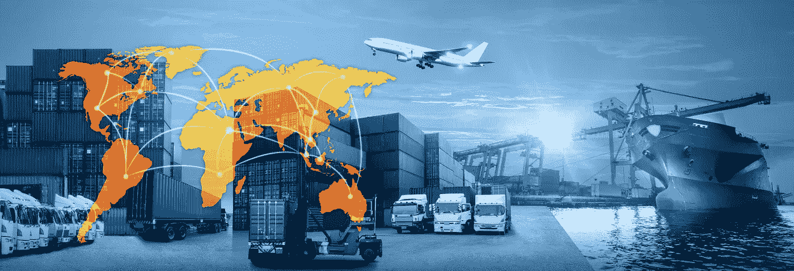

# 为什么埃隆·马斯克需要蒂姆·库克:两种不同技术领导风格的比较

> 原文：<https://medium.com/swlh/why-elon-musk-needs-a-tim-cook-a-comparison-between-two-differing-tech-leadership-styles-352b458e358c>

Logistics

> 抱歉，我们已经从生产地狱进入了物流地狱——埃隆·马斯克

2018 年，埃隆·马斯克受到了考验。他需要生产出创纪录数量的 3 型汽车。为了做到这一点，他在最后一刻决定在他的大型工厂附近的一个帐篷里建造另一条生产线。然而，现在他需要…