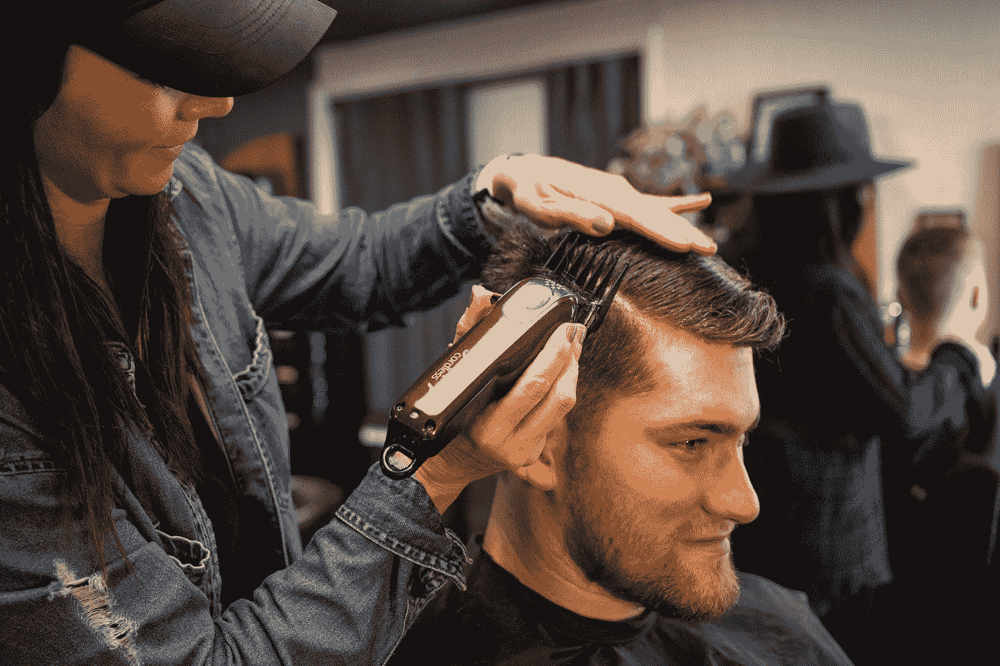

# 为什么电子邮件会拯救你的创意产业免于灭绝

> 原文：<https://medium.com/swlh/why-email-will-save-your-creative-business-from-extinction-6712857183a9>

社交媒体还不够。我们必须拥有自己的客户名单

Photo by [ANDI WHISKEY](https://unsplash.com/@andiwhiskey?utm_source=medium&utm_medium=referral) on [Unsplash](https://unsplash.com?utm_source=medium&utm_medium=referral)

我表姐的妻子开了一家美容店有几年了。他们对理发一无所知(也没有美容店)，但生意看起来很有前景，所以他们依靠租来的椅子和一定比例的销售额来维持生意。