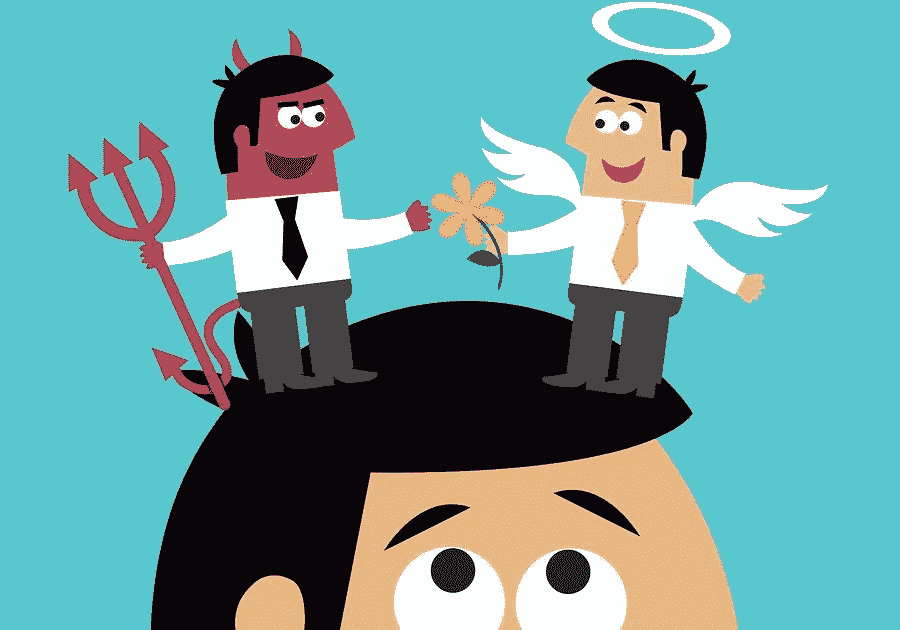

# 为什么道德有回报:对当前营销实践的反思

> 原文：<https://medium.com/swlh/why-ethics-pays-a-reflection-on-current-marketing-practises-d39554ca8538>

随着自觉消费主义的兴起，道德营销实践的重要性空前提高。因此，当代营销的实践正在经历一个根本性的转变。今天的消费者见多识广，联系更好，对营销比以往任何时候都更愤世嫉俗(Ottley，2016)。因此，营销人员受到比以往任何时候都多得多的审查，不能再指望他们在实践中“道德懒惰”或粗心大意(SAGE，2011)。此外，公司利用敷衍塞责的社会项目来进行绿色清洗或转移公众对其不道德行为的注意力的欺骗性营销尝试正日益暴露出来。

因此，每家公司都应该坚持更高的道德营销实践标准，这通常符合它们的最佳利益。目前的研究表明，被认为经营不道德的品牌会被特定的消费者群体所回避(Rindell、Strandvik 和 Wilen，2014 年)，而道德形象可以建立资产(Sierra 等人，2015 年)，影响忠诚度和正面口碑(Markovic 等人，2015 年)。

本文的目的是阐明道德直接营销和数字营销对投资回报率和品牌形象的潜在影响，以及公司可能面临的不道德营销行为的负面影响。本文还将探讨该行业内预期道德标准的一些最新变化。将使用离散行业实践的具体案例来突出公司的成功和错误以及它们所产生的影响。

# 不道德的定位

目标定位通常被用作一种有效的营销方法，通过这种方法可以更好地识别潜在的消费者群体并向其进行营销。当关注社会中的弱势群体时，就会出现伦理问题。弱势消费者被定义为“由于其个人情况，特别是当公司没有以适当的谨慎水平行事时，特别容易受到损害的人”(Coppack，2015)。考虑到这一定义，特别容易受到社会压力的儿童和青少年属于这一类别。然而，伦理往往被忽视，经常是有害的，由公司在过去和现在(Brenkert，1998；Sulaiman & Syahrivar，2018)。

由于西方销售额下降，英美烟草(BAT)等大型烟草公司在过去 20 年中加大了在非洲的营销力度(Gilmore et al .，2015)。最近，越来越多的证据表明，他们的营销范围包括，甚至专注于针对儿童(Boseley，2017)。许多非洲国家更宽松的营销法规和不太知情的消费者使得市场，特别是弱势儿童消费者的市场，很容易被利用(贝茨和罗威尔，2004)。

向儿童营销是一个特别有争议的想法，因为他们仍然争论他们是否意识到他们被营销，以及他们如何理性地判断他们所呈现的营销内容(Brenkert，1998)。虽然一些批评者认为在某些情况下向儿童营销是可以接受的(Koley，2017)，但考虑到烟草消费带来的风险，这种做法变得完全不道德和不可接受。

尽管烟草行业的秘密营销计划在技术上并不总是非法的，但由于越来越巧妙的监管规避方法(Davis 等人，2018 年)，有人认为这种做法是极其不道德的，这是正确的。英美烟草公司公开否认对儿童进行任何形式的营销(BAT.com，2019 年)，但是贝茨和罗威尔(2004 年)令人信服地认为，向儿童和青少年销售的市场逻辑是“压倒性的”,并继续解释这样一个悖论，即尽管在道德和法律上直接向儿童做广告是不可接受的，但对这个年龄组做广告以确保业务成功是至关重要的。

有人可能会争辩说，这些做法确实提供了短期的经济利益，很容易理解为什么衰落的烟草业急于增加他们的销售，尽管不道德的营销已经并将继续损害这个行业。例如，尼日利亚政府对三家主要的卷烟制造商采取了法律行动，要求对他们在促进未成年人吸烟方面的所谓作用进行 400 亿美元的赔偿(BBC，2007)。伴随着经济影响，该行业正遭受着日益令人厌恶的品牌形象，通常被视为“邪恶”或“死亡商人”(Daube，2012)。

雀巢是另一个臭名昭著的跨国公司，以其经常不道德的商业行为而闻名。人们可以清楚地看到，对儿童的烟草营销是非常不道德的，而食品营销的道德界限变得更加模糊。

雀巢公司经常被指控向儿童推销不健康的产品(Galalae & George，2017；戴维，2014)。批评者认为，这是一个公司的言论自由权，机会主义，这是对商业有益的(Shugan，2006 年)，但美国医学研究所(IOM)认为，目标儿童太小，无法理解营销的真相，这可能会说服他们消费不健康，但高利润的产品。

考虑到营销的影响，尤其是对易受影响的儿童的影响，一家公司将这些受众作为不健康产品的目标，这尤其令人震惊。像雀巢这样的公司，完全知道他们的营销和肥胖增加之间的因果关系，但为了利润继续这样做。

与烟草业一样，通过不道德营销获得的任何短期利润都会被负面影响抵消。例如，在墨西哥，雀巢公司因在儿童电视节目中宣传高热量产品而被罚款(Davey，2014)。更有害的是，公众认为不道德的营销行为对公司的声誉和品牌形象造成了长期损害(Brunk 2010Hegner 等人，2017)。考虑到他们是世界上最受抵制的公司之一，他们日益受损的品牌形象的直接影响显而易见(Sasson，2016)。

# 大数据的使用

另一个越来越流行的营销话题是关于大数据使用的道德影响的持续辩论。被发现滥用数据的公司，无论是无意的还是更糟的是故意的，都在承受后果。

大数据是指最近“从个人消费者处获得的前所未有的数量、速度和种类的原始数据”(Erevelles 等人。2016).数据可以说是营销人员可以拥有的最有价值的资源(McAfee & Brynjolfsson，2012)，为公司提供了一个强有力的工具，借此获得对竞争对手的优势(Stroud，2018)。然而，大数据的潜在价值已经让许多人寻求利用它，通常是通过可以说是不道德的手段。

大数据分析的婴儿期意味着这一新领域的道德规范高度未经检验和监管。Shilton & Sayles (2016)在采访了 20 名数据研究人员后发现，在道德最佳实践方面存在相当大的分歧，包括忽视服务条款和获得知情同意。人们普遍认为，尤其是在营销领域，道德法规施加的限制将阻碍大数据的潜在价值(Park and Skoric，2015)。事实上，Leetaru (2017 年)认为，大数据伦理可能已经为时过晚，他解释说，对于公司、学术界和联邦资助机构来说，驳回外部伦理审查通常符合他们的最佳利益。

然而，许多批评者认为，必须就大数据使用的道德准则达成一致。Zwitter (2014 年)指出，建立上述准则是我们的道德责任，以防止大数据被滥用为“新发现的信息和权力来源”(Zwitter，2014 年，第 5 页)。批评者强调，隐私问题和歧视的危险是大数据的两个最大危险，保护这些是一项基本人权(Sloot 和 Schendel，2016 年)。然而，2018 年欧洲 GDPR 的建立希望作为公司必须遵守的第一个实施的道德结构，减少(但不是消除)什么是或不是道德实践的不确定性(Chase-Borthwick，2018)。

尽管他们对大数据实践仍然存在道德模糊，甚至对 GDPR 框架内的道德使用有不准确的认识，但有证据表明，公司需要提高使用消费者数据的透明度，并确保隐私始终得到维护。如果公司在如何使用数据方面尽可能诚实和坦率，它们将赢得消费者的信任，保证它们不仅合法行事，而且实现了消费者更看重的道德实践特征。

当审视行业实例时，人们只需看看最近的脸书-剑桥分析公司丑闻，以及它所激起的正当愤怒，就足以证明不道德行为可能造成的损害。处理大数据时，粗心、冷漠和/或贪婪的后果显而易见。2018 年 YouGov 的一项调查表明，69%的消费者会抵制滥用他们数据的品牌(Tan，2018)，根据 RSA 的另一项调查，78%的消费者不愿意从以错误处理消费者数据而闻名的公司购买产品(RSA，2019)。

# 道德营销

虽然不道德营销行为的影响已经被探究过了，但是一个公司通过道德经营，或者高于预期的行业规范，可以获得什么呢？根据定义，道德营销不仅需要考虑经济问题，还需要考虑它可能对社会和环境产生的益处(Powell，2011)。消费者越来越意识到道德问题，因此被寻求更大利益的品牌所吸引，而不仅仅是他们自己(Sudbury-Riley 和 Kohlbacher，2016 年)。采用这种方法的公司见证了品牌亲和力和收入的显著增加。

尼尔森 2014 年的一项研究表明，55%的全球消费者愿意为对社会和环境负责的公司提供的产品和服务支付更多费用(尼尔森，2014 年)。此外，根据 2015 年 Aflac 的一份报告(Aflac，2015)，92%的千禧一代消费者和 81%的所有消费者更有可能从道德认知公司购买产品。坦率地说，这些数字本身就有助于消除道德营销过于昂贵且成本效率低下的陈旧印象(Parker，2015)。

社会和环境积极运动的成功证明了其有效性。例如，吉尼斯的“打造更多”活动强调了个性和毅力的重要性，投资回报率几乎是同类活动的两倍，同时价格敏感度下降，品牌知名度提高(Gallery and Sor，2016)。多芬的“追求真正的美丽运动”是历史上最成功的营销策略之一。多芬致力于促进真正积极的社会信息，传达真正的美丽存在于而不是基于不切实际的社会标准。因此，他们看到销售额在短短十年内从 25 亿美元增加到 40 多亿美元(Libert and Tynski，2013)。显然，培养与消费者的情感共鸣，创造一个对购买你的产品感觉良好的受众，是一个非常有效的营销策略。

schaltegger & Burritt(2015)**评论说，许多公司的道德行为纯粹是出于自身利益，而不是对事业的真正信仰。然而，这似乎是题外话。公司行为合乎道德背后的动机并不重要，因为不管怎样，公司仍然会合乎道德地运营。如果道德营销本身可以被宣传为在经济上和名誉上有益，那么也许即使是道德上最不敏感的公司也可能倾向于做好事。**

# **结论**

**营销道德，实际上是商业道德，一直被认为与短期利润不相容。批评者认为，道德营销成本高，耗时，效率低，在品牌没有击中目标的情况下，是有害的(奥兰斯基，2018；普里巴尼奇，2018)。**

**然而，正如这篇文章所阐明的，道德实践，尤其是在今天的市场营销中，不仅是一项非常有利可图的投资，而且对一个公司的长期可持续性至关重要。鉴于，不道德的运营，除了潜在的法律问题泛滥之外，还会造成不可挽回的声誉损害。**

**事实证明，尤其是在千禧一代中，道德行为非常受欢迎，并且在做出购买决定时经常受到青睐。2018 年，随着有意识和有联系的消费者的崛起，人们不再容忍不道德的行为，即使是以前不受影响的企业巨头。如果公司不愿意适应这种新的道德标准，那么他们会发现今天的消费者不愿意从他们那里购买。**

# **参考**

**非洲法律援助中心(2015 年)。*调查显示，有效的企业责任是一场马拉松，而不是短跑。如果你想影响消费者，对一项事业的长期承诺是关键。[在线] Aflac。可从以下网址获得:https://www . aflac . com/about-aflac/news room/press-release-story . aspx？rid = 741[访问日期:2019 年 3 月 18 日]。***

**Bat.com。(2019).英美烟草——负责任地营销我们的产品。[在线]见:https://www . bat . com/group/sites/UK _ _ 9d 9 kcy . NSF/vwPagesWebLive/do 9 ebfuz[2019 年 3 月 14 日访问]。**

**贝茨和罗威尔(2004 年)。烟草用它自己的话解释了…烟草业的真相。UCSF:烟草控制研究和教育中心。从 https://escholarship.org/uc/item/9fp6566b 取回**

**Boseley，S. (2017 年)。威胁、欺凌、诉讼:烟草业争夺非洲市场的肮脏战争。[在线]卫报。可从以下网址获取:https://www . the guardian . com/world/2017/jul/12/big-tobacco-dirty-war-Africa-market[2019 年 3 月 14 日获取]。**

**布伦克特，g . g .(1998 年)。营销与弱势群体。*经济伦理学会鲁芬系列*， *1* ，第 7-20 页。**

**k .布伦克(2010 年)。探索道德公司/品牌认知的起源——企业道德的消费者视角。商业研究期刊，63(3)，第 255-262 页。**

**s . chase-Borthwick(2018 年)。*GDPR 的数据伦理正在改变——GDPR。报告*。[在线] GDPR.Report .可从 https://gdpr . report/news/2018/09/12/the-data-ethics-of-gdpr-are-changing/[2019 年 3 月 17 日获取]。**

**m .科帕克(2015 年)。消费者脆弱性。[在线]Iosco.org。可从以下网址获得:https://www . iosco . org/library/annual _ conferences/pdf/40/Martin % 20 coppack % 20-% 20 iosco % 20 consumer % 20 vulnerability % 20 presentation . pdf[2019 年 3 月 13 日访问]。**

**道贝，M. (2012 年)。酒精和烟草。澳大利亚和新西兰公共卫生杂志，36(2)，第 108-110 页。**

**戴维，M. (2014 年)。研究表明，食品公司向儿童推销“不健康”食品。[在线]卫报。可从以下网址获取:https://www . the guardian . com/world/2014/aug/07/food-companies-health-too-low-child-marketing-study[2019 年 3 月 15 日获取]。**

**罗纳德·戴维斯；伊丽莎白·吉尔平；芭芭拉·洛肯；维斯瓦纳特，k。梅拉妮·韦克菲尔德(2018)。媒体在促进和减少烟草使用中的作用。国家癌症研究所烟草控制专论系列。美国卫生与公众服务部、国家卫生研究院、国家癌症研究所。第 684 页。**

**Erevelles，s .，Fukawa，n .和 Swayne，L. (2016 年)。大数据消费者分析和营销转型。*《商业研究杂志*》，69 卷 2 期，第 897–904 页。**

**Galalae C .，George S. (2017)教学笔记:案例 1:雀巢在墨西哥:美食与美好生活的困境。载于:阿迪卡里 a .，罗伊 s .(编辑)新兴市场战略营销案例教师手册。查姆·施普林格**

**Gallery，R 和 Sor，l .(2016)吉尼斯:一个由更多[在线] WARC 组成的有效性故事，可在以下网址查阅:https://www . warc . com/content/pay wall/article/IPA/Guinness _ An _ effectiveness _ story _ Made _ Of _ More/107991 #关于作者[2019 年 3 月 18 日查阅]。**

**Gilmore，a .，Fooks，g .，Drope，j .，Bialous，s .和 Jackson，R. (2015 年)。揭露和解决低收入和中等收入国家的烟草行业行为。*《柳叶刀》*，385(9972)，第 1029–1043 页。**

**科里博士(2017)。作为细分市场的儿童消费者。国际工程技术、管理和应用科学杂志，[在线] 5(5)。可查阅:http://www . ijet MAS . com/admin/resources/project/paper/f 201705191495168304 . pdf[2019 年 3 月 15 日查阅]。**

**Leetaru，K. (2017 年)。*大数据伦理为时已晚吗？*。[在线]Forbes.com。可从以下网址获得:https://www . Forbes . com/sites/kalevleetaru/2017/10/16/is-it-that-a-late-to-big-data-ethics/# 852 eed 23 a6 d 1[访问日期:2019 年 3 月 16 日]。**

**李柏特和廷斯基(2013 年)。让营销活动像病毒一样传播的情感。哈佛商业评论，1(1)。**

**马尔科维奇、伊格莱西亚斯、辛格和谢拉(2015 年)。企业服务品牌的道德认知如何影响忠诚度和正面口碑？分析共情、情感承诺和感知质量的作用。《商业伦理杂志》，第 148 卷第 4 期，第 721-740 页。**

**News.bbc.co.uk(2007 年)。BBC 新闻|世界|非洲|尼日利亚起诉儿童吸烟者。[在线]网址:http://news.bbc.co.uk/1/hi/world/africa/7083202.stm[访问日期:2019 年 3 月 14 日]。**

**尼尔森(2014)。*当涉及到致力于社会责任的公司提供的商品和服务时，全球消费者愿意把钱花在他们想花的地方。[在线]Nielsen.com。可在以下网址查阅:https://www . Nielsen . com/us/en/press-room/2014/global-consumers-are-willy-put-their-heart-is . html[2019 年 3 月 15 日查阅]。***

**奥兰斯基，S. (2018)。社会意识营销的承诺和陷阱。[在线]Forbes.com。可从以下网址获得:https://www . Forbes . com/sites/steveolenski/2018/01/03/the-promises-and-nickets-of-social-conscious-marketing/# 29813 ada 38 ef[访问日期:2019 年 3 月 18 日]。**

**Ottley，G. (2016 年)。有意识的资本主义向营销世界的扩张:营销经理实践“有意识的”营销吗？。本特利大学商学院。**

**y . park 和 m . sko ric(2015 年)。你谷歌眼镜里的个性化广告？可穿戴技术，自动数据收集和新政策的必要性。*商业伦理杂志*，142(1)，第 71–82 页。**

**帕克，L. (2015)。研究发现道德购买的障碍。[在线]Phys.org。发布地点:https://phys.org/news/2015-02-barriers-ethical.html[2019 年 3 月 13 日发布]。**

**波莱，理查德 W (1994 年)。《承诺，承诺:20 世纪 60 年代美国香烟广播广告的自律》。烟草控制。3 (2): 134–44**

**鲍威尔，S. (2011)。道德企业营销、道德企业身份和企业社会责任之间的关系。《欧洲市场营销杂志》，第 45 期(2010 年 9 月)，第 1365-1379 页。**

**普里巴尼奇，E. (2018)。 *6 道德营销的利与弊| tech 漏斗*。[在线]tech 漏斗。可从以下网址获取:https://www . tech 漏斗. com/martech/6-pros-and-cons-of-ethical-marketing/[2019 年 3 月 18 日获取]。**

**林德尔，a .，斯特兰德维克，t .和威廉，K. (2014 年)。道德消费者的品牌回避。产品与品牌管理杂志，23(2)，第 114-120 页。**

**Sabrina M. Hegner，Marc Fetscherin，Marianne van Delzen，(2017)“品牌仇恨的决定因素和结果”，《产品和品牌管理杂志》，第 26 卷第 1 期，第 13-25 页，https://doi.org/10.1108/JPBM-01-2016-1070**

**SAGE 出版物(2011 年)。营销伦理简明指南。千橡出版社。**

**t . sasson(2016 年)。压榨第三世界？人道主义、资本主义和抵制雀巢的道德经济。*《美国历史评论》*，121 卷 4 期，第 1196–1224 页。**

**Schaltegger 和 r . Burritt(2015 年)。商业案例和企业参与可持续发展:不同的伦理动机。*商业伦理杂志*，147 卷 2 期，第 241–259 页。**

**Shilton 和 s . say les(2016 年)。“我们不会在伦理问题上意见一致:”数字和社交媒体研究中的伦理实践和挑战。《第 49 届夏威夷系统科学国际会议论文集》(HICSS 2016)。考爱岛，嗨:IEEE。**

**Shugan，S. (2006 年)。社论:谁害怕给营销乡亲言论自由？。营销科学，第 25 卷第 5 期，第 403-410 页。**

**Sierra，v .，Iglesias，o .，Markovic，s .和 Singh，J. (2015 年)。道德形象是否能为企业服务品牌建立资产？顾客感知伦理对情感、感知质量和公平的影响。商业伦理杂志，144(3)，第 661-676 页。**

**斯特劳德，C. (2018)。关于使用和滥用消费者数据的斗争将如何展开。[在线]Forbes.com。可从以下网址获得:https://www . Forbes . com/sites/courts roud/2018/04/29/how-the-fight-over-the-use-and-abuse-of-consumers-data-can-play-out/# f6b 364d 45 bcc[访问日期:2019 年 3 月 15 日]。**

**萨德伯里-莱利和科尔巴赫(2016 年)。有道德意识的消费者行为:量表审查、开发和验证。*商业研究杂志*，69(8)，第 2697–2710 页。**

**Sulaiman，j .和 Syahrivar，j .(2018 年)。营销组合 4A 和伦理意识对伦理消费的影响。**

**谭，E. (2018)。十个顾客中有七个会抵制一个错误处理他们数据的品牌。[在线]Campaignlive.co.uk。可从以下网址获得:https://www . campaign live . co . uk/article/seven-ten-customers-boycit-brand-mishandled-data/1456749[2019 年 3 月 17 日访问]。**

**van der Sloot，b .和 van Schendel，S. (2016 年)。*大数据未来监管的十个问题:比较和实证法律研究*。[在线] Jipitec.eu。可在 https://www.jipitec.eu/issues/jipitec-7-2-2016/4438 查阅[2019 年 3 月 16 日查阅]。**

**两性公司(2014 年)。大数据伦理。*大数据&社会*，1(2)。**