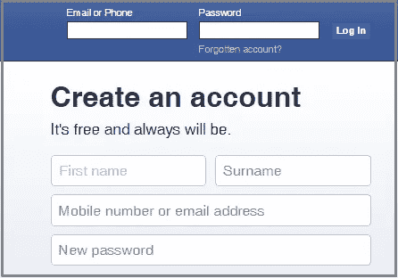
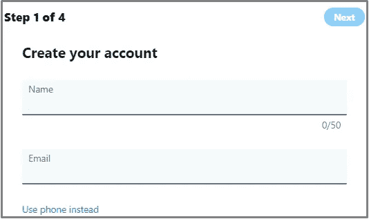
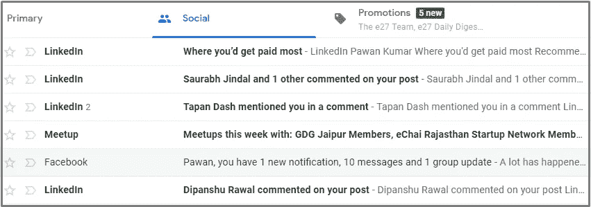

# 为什么每个作家都需要电子邮件列表

> 原文：<https://medium.com/swlh/why-every-writer-needs-an-email-list-21b753129d92>

我需要电子邮件列表吗？

我最长的回答:**每个作家都需要建立一个。简单。**

你想和你的观众建立关系吗？还是想传播你的信息？或者你想写一本畅销的书。

你需要建立一个电子邮件列表。

在本文中，您将发现:

-为什么一个作家(你)需要一个电子邮件列表。

-如何立即开始建立您的清单。

但首先，让我和你们分享一个故事。我相信你会理解的

# 一个没有得到应有关注的作家

上个月，我和我的一个同事聊天，她问我，“帕万，你能看看我的博客吗？”

我做到了。相信我，她写得很好。她讲故事的技巧令人惊叹，我喜欢她传递信息的方式。

我看了她的一些博客帖子。但是我注意到一件事:她博客上没有电子邮件订阅表格。

这让我很不舒服。

我也给她发了同样的短信。但她对此并不关心。她只关心写作部分。

我说你[写得有效](http://prepawan.com/7-writing-behaviors/)继续写。但是你也需要专注于建立你的邮件列表。

有一点让我很沮丧:很多有才华的作家没有得到应有的关注。为什么？

因为他们完全忽略了建立电子邮件列表。他们不明白它的重要性。

作为一名作家，当我向我的订户发送电子邮件简讯时，我会收到许多回复和良好的参与度。

无论你是作家、营销人员还是电子商务人士，你都需要一份电子邮件列表。

如果你没有。然后，我的朋友，你将努力获得你应得的牵引力。

# 什么是电子邮件列表？

用简单的语言:

"一群选择接收您的更新的人."

你需要他们的许可才能发送电子邮件。

什么邮件列表不是— **从第三方购买或下载的邮件联系人。千万别这么做。**

"帕万，我需要什么来建立一个电子邮件列表？"—你问。

你只需要三样东西就可以开始:

1.博客或网站。

2.请求许可——在网站上放置一个注册表单，邀请人们选择加入。

3.一个合适的电子邮件营销工具——收集人们的电子邮件并与他们交流。

# 为什么每个作家都需要一个邮件列表？

让我们想象一个场景:

你发表了一篇有深度、内容丰富的文章，有人访问你的博客阅读你的文章。

她喜欢你的帖子，因为它回答了她的问题。下一步是什么？

她退出你的博客是因为她不知道下一步该做什么。

你可能永远没有机会和她交流。或许她也会忘记你的博客。

永别了。🙁

这里有一个解决方案:将你的网站访客转化为你的订户。

以下是你需要电子邮件列表的一些原因:

## 1.世界上最大的社交网络

电子邮件是世界上最大的社交网络，2019 年拥有近 56 亿个电子邮件账户(根据 [Statista 研究](https://www.statista.com/statistics/456519/forecast-number-of-active-email-accounts-worldwide/)

而现在的世界人口是 77 亿。这意味着，在这个星球上几乎每个人都有一个电子邮件地址。

因此，如果你没有利用电子邮件的力量，那么你就错过了一个很好的机会。

## 2.电子邮件是私人的和个人的

当您的订户在收件箱中看到您的电子邮件并阅读您的有用内容时。它建立信任。电子邮件允许你和你的读者进行私人对话。

人们对电子邮件感到更舒服，因为它是私人的。而且他们可以和你分享他们的问题和痛点。

## 3.你拥有你的电子邮件列表

你没有社交媒体频道。如果这些平台关闭或改变政策，你的努力将会白费。但是你拥有你的邮件列表，这是你的资产。你不需要任何第三方来接触你的读者。

看看尼尔·帕特尔是怎么说的:

> “在我作为营销人员测试过的所有渠道中，电子邮件的表现一直优于大多数渠道。”

# “等等，我有社交媒体”

我相信有些人会问，“帕万，我明白你的意思。但是社交媒体呢？不就是超越一切吗？”

我不给你答案，我给你看。脸书和 Twitter(或任何其他社交媒体渠道)在创建账户时会询问你哪些信息？

是电子邮件地址吧？

甚至，所有这些社交媒体渠道都明白电子邮件与用户联系的重要性。

Gmail 用户的收件箱里有一个“社交”标签。这是我的 Gmail 的截图。

社交媒体对于接触你的受众并与他们互动很重要。但是有许多社交媒体渠道，人们更喜欢使用不同的渠道。

但 91%的消费者每天都会查看电子邮件。([来源](https://blog.hubspot.com/marketing/email-marketing-stats-list)

电子邮件保证你更高的结果。所以你应该花时间和精力来建立你的电子邮件列表。

# 如何建立和扩大你的电子邮件列表

我希望你现在已经明白了电子邮件列表的重要性。你必须将你的博客访问者转化为你的订阅者，这样你才能向他们发送信息。

“帕万，我现在需要做什么？”

以下是一些入门技巧:

**1。找到一个好的电子邮件营销服务提供商。**我推荐用 MailChimp 或者 Convertkit。两者都简单、实惠、易用。

**2。在你的网站上放置一个简单明了的注册表格。Convertkit 和 MailChimp 帮助您创建高转化率的选择加入表单。**

**3。提供免费资源。创建有趣且信息丰富的电子书、pdf 和其他资源。将这些有价值的资源提供给你的访问者，作为对他们电子邮件地址的回报。**

**4。向新订户发送欢迎电子邮件。**当有人加入你的名单。说声谢谢，欢迎来到你的家庭。别忘了介绍你自己。

**5。开始向您的订户发送消息**。与你的电子邮件频率保持一致。从小处着手。每周一次很好。发送有价值和有帮助的信息。

**额外提示:**不要把你的订户视为你的联系人。将他们视为你的社区成员。这都是关于分享想法和信息。永远不要给他们发邮件。

*原载于*[*http://prepawan.com*](http://prepawan.com/build-email-list/)

## 这篇文章发表在 [The Startup](https://medium.com/swlh) 上，这是 Medium 最大的创业刊物，拥有+445，678 名读者。

## 在此订阅接收[我们的头条新闻](https://growthsupply.com/the-startup-newsletter/)。

