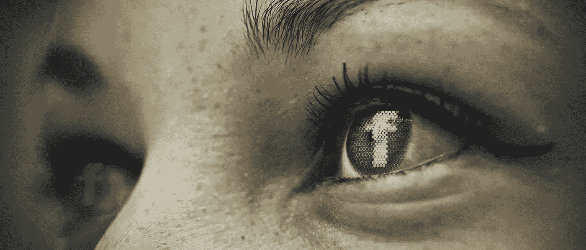

# 为什么脸书是我最喜欢谈论政治的地方

> 原文：<https://medium.com/swlh/why-facebook-is-my-favorite-place-to-talk-politics-707354d3237>

## 为什么它也应该是你的。

Image by [Gerd Altmann](https://pixabay.com/users/geralt-9301/?utm_source=link-attribution&utm_medium=referral&utm_campaign=image&utm_content=1553789) from [Pixabay](https://pixabay.com/?utm_source=link-attribution&utm_medium=referral&utm_campaign=image&utm_content=1553789)

我教进步人士如何更有说服力地与他们不同意的人沟通。

当我主持一个研讨会时，总是有人说，“嗯，当你和人们面对面交谈时，这一切都很好，但社交媒体是一个失败的事业。”