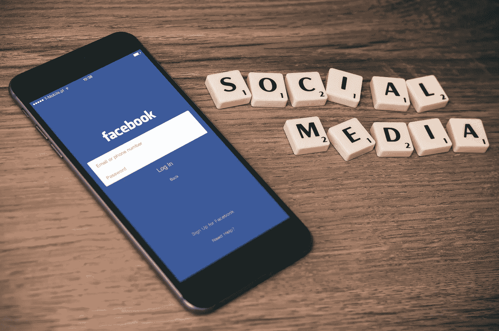

# 为什么脸书的新货币天秤对世界有益？

> 原文：<https://medium.com/swlh/why-facebooks-new-currency-libra-is-good-for-the-world-99486f42629>

Photo by [William Iven](https://unsplash.com/@firmbee?utm_source=unsplash&utm_medium=referral&utm_content=creditCopyText) on [Unsplash](https://unsplash.com/search/photos/facebook?utm_source=unsplash&utm_medium=referral&utm_content=creditCopyText)

脸书正试图创造自己的货币“天秤”。

天秤座有几层意思。在古罗马，它是一个重量单位，并在最终创造的英镑中发挥了作用。

然而，在黄道历中，天秤座通常与平衡联系在一起。

我相信这就是新货币所能实现的，而不仅仅是一个计量单位。

如果脸书雄心勃勃的计划奏效，那么所有没有银行账户、但有手机的人都将能够交易和工作。更多的人将能够挣钱和生存。

它还将使网上购物变得非常非常容易，而不必使用信用卡或其他金融中介。这会减少我们面临的麻烦。

但是有一个更大的原因让我相信天秤座对这个世界有好处，会让我们前进。

长期以来，经济学家和金融分析师一直在讨论引入一种全球货币的好处。

比特币的支持者曾辩称，比特币将是实现这一目标的工具。但正如我们所看到的，它太不可预测了。比特币数量有限，这使得它更像是一种类似极端赌博的投机性投资。几乎没有什么能给世界带来平衡。

另一方面，天秤座有潜力。最初的印象是它比比特币更稳定。它似乎没有困扰比特币的缺陷。

现在还为时尚早，我们对天秤座的了解还不足以得出任何可靠的结论。还是有疑问。

尽管如此，我个人还是希望它能成为世界的美元。脸书每月有 23 亿用户，完全有能力发行一种全球货币。

如果有足够多的人使用它，它可以取代/消除世界上所有的其他货币。我可以想象一个不同国家的人都用天秤座的未来。一条面包或在同一职业中工作一定时间，在不同的国家可以得到相同数量的这种货币。这样可以给世界带来更多的平等。

此外，汇率波动还会导致许多艰难时期和金融不稳定。当某个国家的美元价值下降时，该国居民购买急需商品的成本就会变得更高。当通货膨胀猖獗时，会有人提着一篮子钱去换一条面包。如果操作得当，一种全球货币有可能通过阻止这种情况发生来拯救人们。

如果引入全球货币，也将大幅减少外包。如果世界各地的人都使用同一种货币，从海外雇人不会更便宜。

许多人认为外包是好的。我个人不这么认为，因为我认为这是在剥削穷人。

天秤座唯一的潜在不利因素，实际上从商业角度来看对脸书是有利的。那就是它将使脸书成为世界上永久的社交媒体。没有脸书，你将无法使用天秤座。

我最近读了一篇文章，讲的是由于所有的广告和剑桥数据丑闻，越来越少的人想使用脸书。这篇文章声称，现在是另一家社交媒体公司试图取代脸书的最佳时机，人们希望离开这个社交媒体巨头。

但如果脸书的这一举措奏效，没有人会离开。从商业角度来看，这是一个绝妙的策略。

我不得不称赞扎克伯格，他是一个将被历史铭记的天才，可能就像我们铭记古罗马人一样。他创造了第一个真正的全球性社交媒体，足够多的人使用它来连接世界。现在，他可能会成功创造出第一种全球货币。而他才 35 岁！！！

不管人们喜欢他还是讨厌他，都很难不尊重他的 p̶l̶a̶n̶s̶̶f̶o̶r̶̶w̶o̶r̶l̶d̶̶d̶o̶m̶i̶n̶a̶t̶i̶o̶̶n 智慧。

但对我个人来说，我不介意脸书保持世界头号社交媒体，以换取我们拥有一个稳定的全球货币，可以带来平等和平衡。

关于天秤座，我们还有很多不了解的地方。仅仅四个小时前才宣布，随着时间的推移，我们无疑会了解更多。

就我而言，我是乐观和充满希望的。

扎克伯格可能有宏伟的愿景，要把世界团结在脸书周围。但我很高兴他这样做，如果这能给我们的全球经济带来平衡。