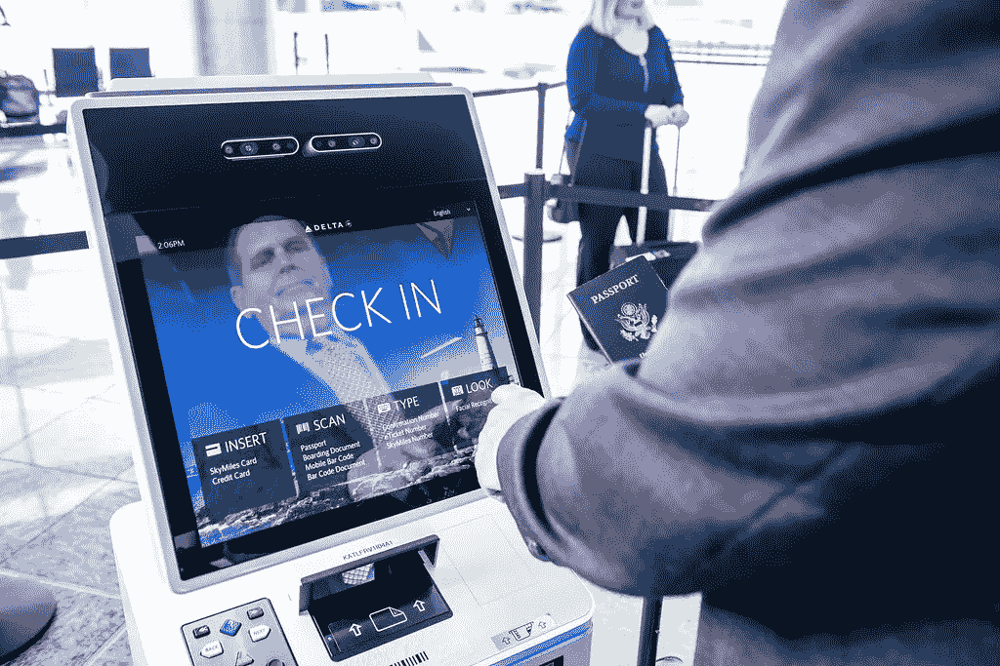

# 为什么登机时的面部识别应该是你最不担心的

> 原文：<https://medium.com/swlh/why-facial-recognition-for-aircraft-boarding-should-be-the-least-of-your-worries-e09ded2628c8>

Facial Recognition as identification is becoming more common, but it is only a small piece of a much bigger issue

在过去的几个月里，已经有[无数](https://www.zdnet.com/article/facial-recognition-creeps-up-on-a-jetblue-passenger-and-she-hates-it/) [的文章](https://www.washingtonpost.com/technology/2019/06/10/your-face-is-now-your-boarding-pass-thats-problem/?utm_term=.53f1480b5c4e) [发表](https://lifehacker.com/you-can-opt-out-of-facial-recognition-screening-at-an-a-1834222718)关于面部识别在机场越来越多的使用，其中一个具体的担忧与使用生物特征数据登机有关。这些文章往往忽略了现代航空旅行的现实(当你注册护照时，大量的数据已经被收集了…