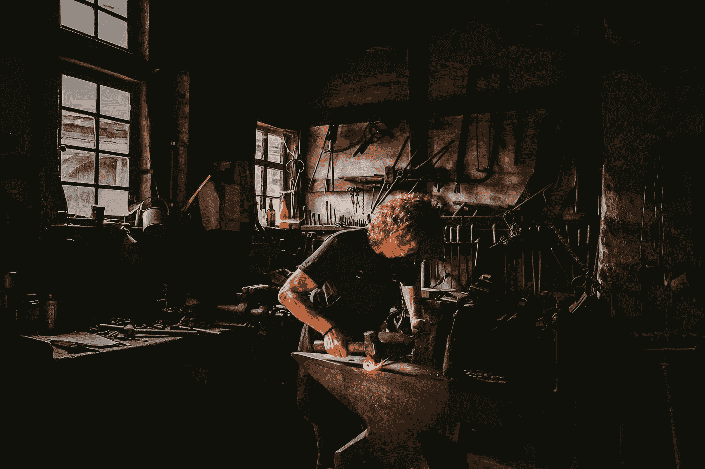

# 为什么找到你热爱的爱好可以拯救你的职业生涯

> 原文：<https://medium.com/swlh/why-finding-a-hobby-you-love-could-save-your-career-c12550749a04>

Originally published on [**JOTFORM.COM**](https://www.jotform.com/blog/art-of-hobbies/)

注意力和功能增强。更好的睡眠。更明亮的心情。更快的学习。更深的创造力和更敏锐的记忆力。

这些不是特效药的效果。它们是我和家人在土耳其采摘橄榄一周的自然结果。

这是一个我从未错过的承诺——我用目标换油布，用生产率换平底锅。我…