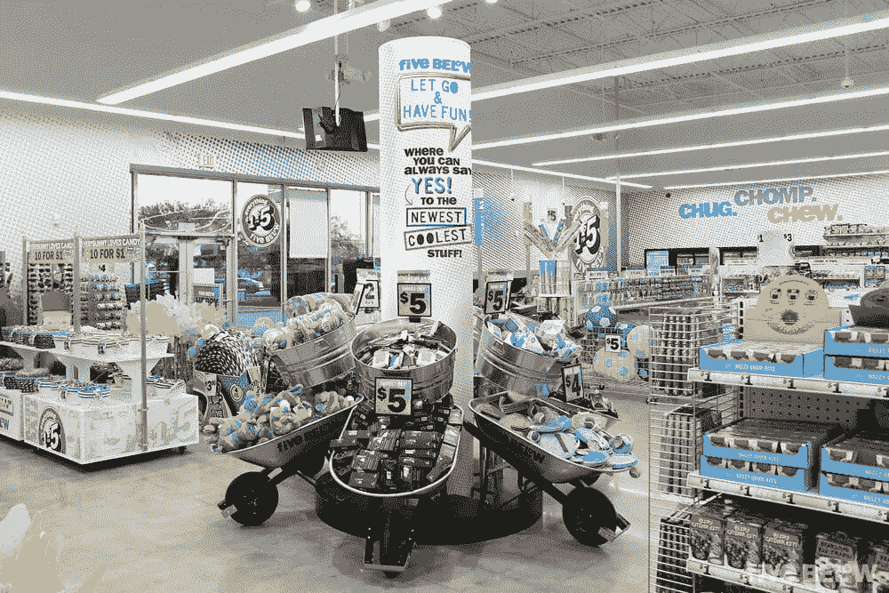

# 为什么 Five Below 在零售游戏中击败了其他折扣店

> 原文：<https://medium.com/swlh/why-five-below-is-beating-other-discount-stores-at-the-retail-game-6c0857cbbe3f>

## 这家专注于青少年的零售商在 Z 世代中很受欢迎，预计今年的销售额将达到 18 亿美元

Photo: [Five Below](https://www.fivebelow.com/press-kit)

过去几年，传统实体零售商的日子并不好过，有大量前购物中心和主要街道的支柱——如玩具反斗城、Gap、Payless ShoeSource、J . C……