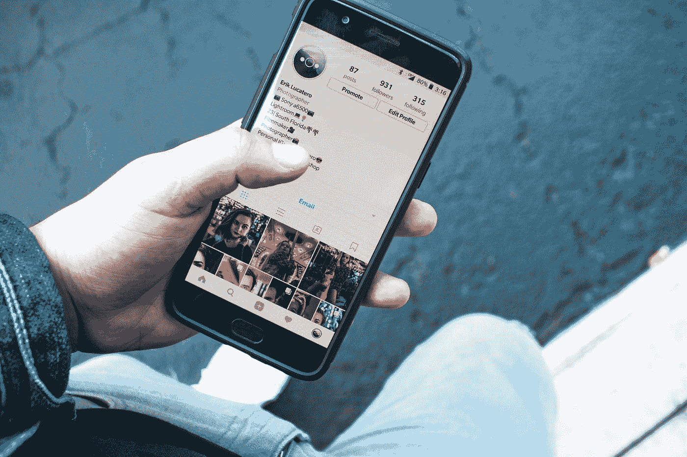

# 为什么免费增值是最受欢迎的移动应用货币化方式

> 原文：<https://medium.com/swlh/why-freemium-is-the-most-popular-way-of-mobile-app-monetization-691de28943f4>

## 所以，你已经开发了你的应用程序，并准备进入市场。

Photo by [Erik Lucatero](https://unsplash.com/@erik_lucatero?utm_source=medium&utm_medium=referral) on [Unsplash](https://unsplash.com?utm_source=medium&utm_medium=referral)

你已经制定了营销策略，现在是时候决定如何从你的应用程序中获得收入了。如果你在谷歌上搜索“应用程序赚钱策略”，你会发现几十种可靠的赚钱方法…