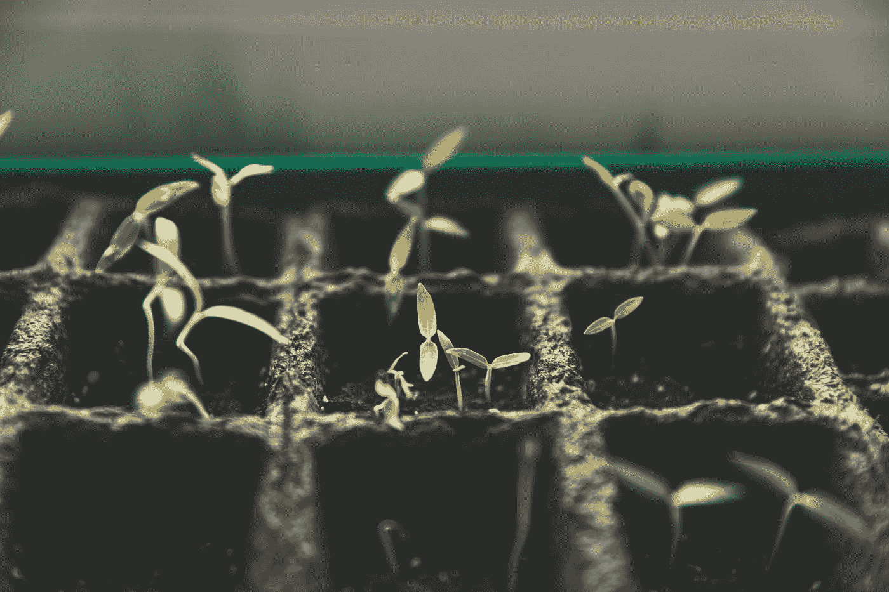

# 为什么园艺有益于你的心理健康

> 原文：<https://medium.com/swlh/why-gardening-is-good-for-your-mental-health-c3642d48f4e4>

Photo by [Markus Spiske](https://unsplash.com/@markusspiske?utm_source=medium&utm_medium=referral) on [Unsplash](https://unsplash.com?utm_source=medium&utm_medium=referral)

## 我女儿如何发现种植东西让她快乐。

## 种植东西和在泥土中玩耍会有意想不到的好处。

我 23 岁的女儿，在她还是个小女孩的时候就被诊断患有多动症，她也是一名有天赋/学习障碍的学生…