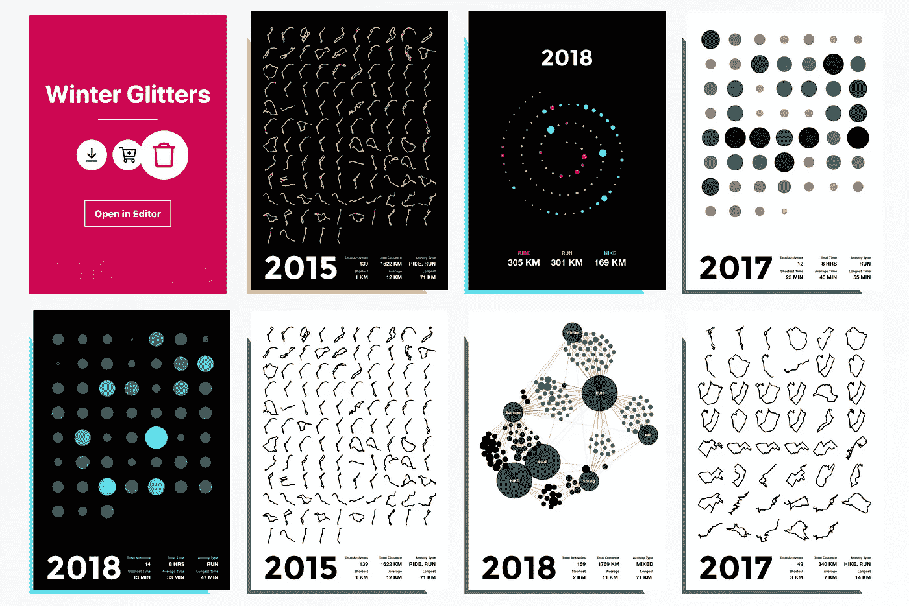

# 为什么 GraphQL 连接类型不适合 Apollo 缓存

> 原文：<https://medium.com/swlh/why-graphql-connection-types-dont-work-well-with-apollo-cache-c1858a897e12>

剧透一下——这篇文章不会提供一个完美的解决方案——因为(目前)真的没有。它将概述在查询和变更 GraphQL 连接类型时，试图使 Apollo 缓存与服务器上的内容保持同步可能会遇到的风险和问题。

为了完全理解本文的内容，您应该熟悉 GraphQL 连接和 Apollo。

The users dashboard where they can add, edit and delete posters.