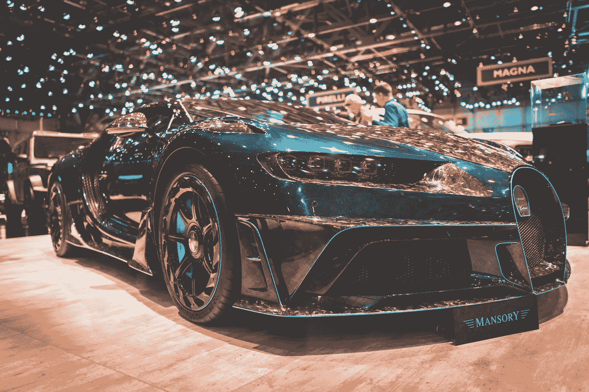

# 为什么伟大的设计师往往是糟糕的推销员

> 原文：<https://medium.com/swlh/why-great-designers-are-often-bad-salesmen-a5dd9ade0e8f>

## 以及为什么一个好的推销员很少是一个伟大的设计师

销售东西是一门艺术。不管你是在卖廉价的基本服装、豪华跑车、无麸质早餐吧还是热带岛屿。这一切都可以归结为同样的模糊基础，有些人似乎神奇地拥有这些基础，而我们大多数人却痛苦地缺乏这些基础。

Look at that thing, shiny, high-tech — just perfect. (Photo by [Marvin Meyer](https://unsplash.com/@marvelous?utm_source=unsplash&utm_medium=referral&utm_content=creditCopyText))