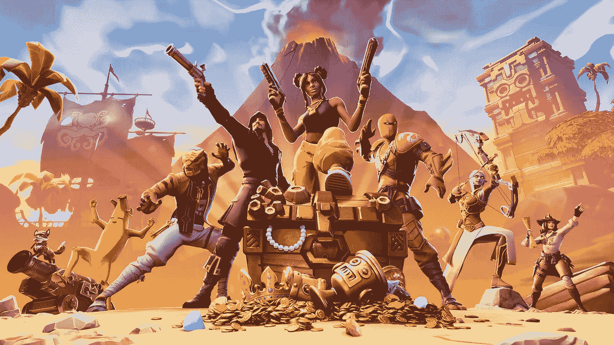

# 为什么堡垒之夜如此伟大？

> 原文：<https://medium.com/swlh/why-has-fortnite-been-so-epic-f5c97dc745ee>

## 一款似乎每两周发布一次新内容的视频游戏是如何变得如此受欢迎的

[Source](https://www.epicgames.com/fortnite/en-US/home)

如果你玩过《堡垒之夜》很长时间，你就会知道,《堡垒之夜》的创作者 Epic Games 经常为游戏发布新内容。它通常是以一个新项目的形式，一个他们添加回来的拱形项目，表情，皮肤…