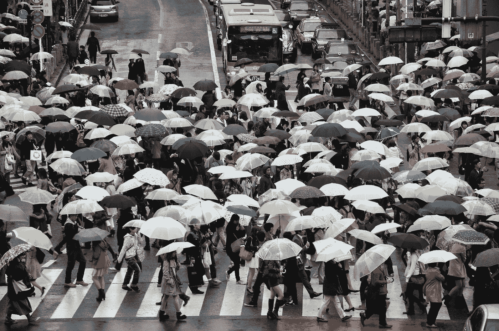

# 为什么没有人成功地重新发明雨伞？

> 原文：<https://medium.com/swlh/why-has-no-one-successfully-reinvented-the-umbrella-155d21f77ab>

Photo by [Alex Block](https://unsplash.com/photos/0FTASntRc2M?utm_source=unsplash&utm_medium=referral&utm_content=creditCopyText) on [Unsplash](https://unsplash.com/?utm_source=unsplash&utm_medium=referral&utm_content=creditCopyText)

我们在 1969 年把一个人送上了月球，在 2001 年把一千首歌曲放进了我们的口袋，见证了一个能够回答自然语言提问的人工智能计算机系统[在 2011 年赢得了《危险边缘》](https://www.techrepublic.com/article/ibm-watson-the-inside-story-of-how-the-jeopardy-winning-supercomputer-was-born-and-what-it-wants-to-do-next/)，在今年早些时候观看了第一位女性化的[人工智能新闻主播](https://qz.com/1554471/chinas-xinhua-launches-worlds-first-ai-female-news-anchor/)，然而……尽管网上、一元店和超市里有太多“酷”和“有创意”的雨伞设计，我们……