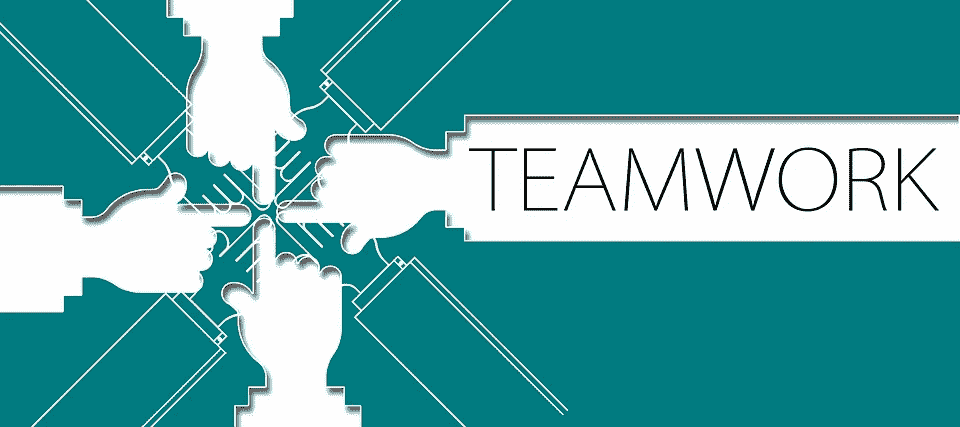
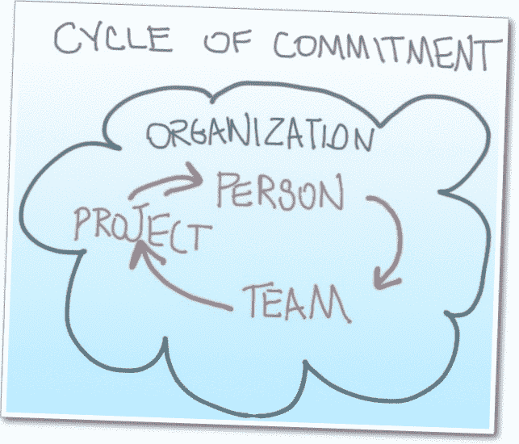
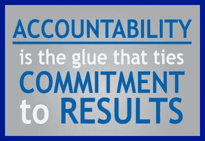

# 为什么高绩效团队是成功的？

> 原文：<https://medium.com/swlh/why-high-performance-teams-are-successful-4db5b4bfa4c>

***“Talent wins games, but teamwork and intelligence win championships.” — Michael Jordan***

让人们一起工作并保持同步是一个严峻的挑战。作为一名商业顾问、高管教练和从业者，我可以直接向你证实——创建一个高绩效团队有多困难(HPT)。在这篇文章中，我希望分享我认为高绩效团队共有的五个关键属性。我并不是说拥有这些品质就能保证一个伟大的团队，因为还有许多其他因素需要考虑，比如领导力、管理和某些政策。

创造一个团队成员“和谐相处”的环境的能力来源于两件事，一是“自上而下的管理”角色模型，二是团队领导的坚实的领导技能。这些年来，我发现，当与那些在公司内部遇到问题的公司合作时，他们通常认为一定是运营上出了问题，比如成本、物流、技术等。，但很少看公司的人事“兜帽”下面。作为一名管理顾问，我关注问题和管理的预期目标，首先与人调查，然后用数据(数字等)跟进。).我相信商业并不十分复杂，但正是人让商业变得十分复杂，如果管理层能够更多地关注个人和群体的需求，工作场所就有可能成为一个更快乐、更高效的环境。

# **成功团队属性**

**1-** **信任**

“Teamwork begins by building trust. And the only way to do that is to overcome our need for invulnerability.” — Patrick Lencioni

团队成员之间缺乏信任会导致很多功能障碍，尤其是当有人对团队中的一个或一些成员缺乏信心时。创建一个团队框架是很重要的，在这个框架中，所有成员都真正相信团队结构是一个开放和安全的地方，在这里每个人都感到可以安全地敞开心扉，而不必为坦诚付出代价。有各种各样的方法可以做到这一点，为了简洁起见，我就不赘述了，但归根结底，信任是一切的根源。请相信，如果团队领导和/或管理层声称这是一个安全的地方，那么它必须信守诺言。此外，如果成员国开放，它们不应为此付出负面代价。我知道这可能是一个被过度使用的术语，但创造一个“*家庭*”的环境，每个人都互相支持，而不是总是专注于保护自己，这是一个主要的贡献者，也是一个竞争优势。在公司里，成员们摒弃个人自我，渴望为自己赢得胜利，而不是为了团队及其预期的目标和目的，这样的公司是非常有效和富有成效的——同样，这一切都是建立在信任的基础上的。一个练习是让团队成员互相了解他们如何思考、学习、吸收信息，并更好地了解每个人的个人心理，例如但不限于让团队成员了解某些疾病，如注意力缺陷多动症、自闭症、焦虑、听力有问题，或可能有处理信息的限制，等等。

有一个团队建设的异地静修可能不是它自己的答案。不是说场外活动无效，它们可以有效，但它们不是现有团队问题的快速解决方案。场外活动可能是一个有效的工具，尤其是在从起点建立团队时。

**2-** **对峙&沟通**

避免冲突是许多人共有的，也是完全合乎逻辑的，因为一般人会倾向于避免冲突，这是可以理解的——特别是如果这意味着个人不得不将自己置于*之外*，使这个人处于弱势地位。

*“Customers will never love a company until the employees love it first.”* — Simon Sinek, author, Start with Why

良好的工作环境包括深思熟虑的企业文化。与找到拥有相同价值观、信仰或企业文化的人相比，很容易找到有技能和经验的员工，所以在一个人成为员工之前，一定要雇佣与企业文化有尽可能多共同点的人。通过这样做，你可能会减少对抗的次数，提高沟通的效率。

***说出来***

在这种情况下，企业文化必须创建一个奖励和/或认可计划，以鼓励员工为了实现团队和企业目标而敞开心扉，畅所欲言。

在团队中，不善于相互沟通的个人可能会将沟通视为一种"*对抗*"的形式，因为在公开提出建议或评论后，他们可能会觉得他们必须"*捍卫或支持*他们的想法或立场，这种行为他们可能在过去已经学到，但仍然留在他们的脑海中。当然，一个人应该解释他们如何以及为什么想出一个想法或建议，但是期望这个人支持他们想法的方式可能是一个值得关注的问题。同样，一个温暖和支持的环境，一个人说的每一句话都受到重视和考虑，而不是一个人在没有尊重地给一个人机会舒适地谈论他们的想法的情况下讽刺或否定一些东西的环境。这个想法并不是要保护一个人的想法或建议，而是要将信息呈现给团队进行公开讨论，在讨论中每个人都可以充实信息的优点，从而为项目增加价值。

你可能有这个问题的一些迹象可能包括:会议很无聊，几乎没有创造性的投入，人们在内部(肥皂剧般的)政治发生的地方互相指责，人们总是抄送给每个人，而没有太多理由掩盖他们的屁股，或者当某些人进入房间时，每个人都停止说话。

另一方面，经历良好动态的团队倾向于经历较少的政治游戏，能够毫无顾虑地处理大多数话题，产生更高水平的创造力，从而更快地完成任务，并倾向于更快地解决问题。有趣的是，这些团队能够进行真正热烈的讨论，这实际上是令人愉快和富有成效的会议，而不会冒犯团队中的任何人。

**3-** **个人买入&承诺**

“Most people fail not because of a lack of desire but because of a lack of commitment.” Vince Lombardi

从我的经验来看，绩效团队在工作场所内外都能建立真正持久的友谊，甚至在成员离开团队或公司后也是如此。当团队运作良好时，你通常会发现所有成员对情况都有清晰的理解，他们都(100%)参与其中，因为他们对想法很感兴趣，并接受倡议、概念或你所拥有的一切。但是，我们也希望个人也做出承诺，在他们感到自豪的地方做出个人承诺，并通过他们自己的选择“*希望*也参与其中——如果你正在寻求建立一个高绩效的团队，这是一个强大的组合。这意味着他们致力于这个项目，他们都在。经历成员没有 100%投入的团队可能会经历失败恐惧的增加，因为他们可能对彼此缺乏信心，无法在他们认为更高质量的水平上完成项目或任务。他们还倾向于在决定任务优先级时遇到困难，并因过度讨论和事后批评而浪费不必要的时间而陷入分析瘫痪——几乎就像“*”一样。*

*忠诚的团队与上述情况正好相反，因为他们对失败或错误的想法非常坦然(并不是说他们不小心)，当这种情况发生时，他们认为这是一个学习的时刻。另一个关键点是，团队完全专注于团队和公司的目标，因为他们非常清楚什么是重要的。在这种情况下，团队受益于非常高水平的个人承诺，更少的决策犹豫，也更有能力适应变化，创造非常"*敏捷*"的工作风格。*

***4-** **缺乏问责***

**

*It can be said that the most **important** result of **accountability** is trust, which is an essential ingredient to the success of a high-performance team.*

*" *Mia culpa* "是一个拉丁短语，意思是个人对自己的行为负责，并公开声明对自己的错误行为负责。可悲的事实是，很大一部分人倾向于不承担责任，而是倾向于“捍卫和转移”所有权和责任——这是我们许多人从童年学到的，成年后实践，然后在工作场所使用。这种行为在团队环境中尤其具有腐蚀性，因为它会导致对以这种方式行事的人的沮丧、愤怒和怨恨——不对自己的行为负责或负责。这也会导致团队表现不佳。*

*帮助防止这个问题的一个有效策略是创建一个定义良好的工作描述，它包括各种 KPI，也包括一组团队 KPI。在这个过程中，团队的每个成员都有自己定义的角色、贡献/可交付成果、期望以及给定项目中每个任务的时间表。这使得团队中的每个人从一开始就完全知道谁、什么、哪里、何时、如何、为什么等等。此外，在会议中，分配任务的个人必须清楚所有可交付成果和期望，接收者必须确认对此的理解，然后将责任和义务赋予所述个人团队成员。还应该预先了解当个人未能满足期望和交付成果时会有什么样的后果。*

*另一种预防方法是在团队中创建迷你团队。一般来说，由两三个人组成的团队取决于整个团队的规模、项目可交付成果的数量以及时间表。通过创建迷你团队，将有一个人来领导一项任务，并且至少有一个人充当其“*副驾驶员*”。这对于防止未满足的时间表以及更高质量的可交付成果特别有效，因为有一个合作伙伴有助于后续跟进—“*两个脑袋比一个*”更好。项目完成后，迷你团队成员在迷你团队中互相评价，作为一种学习和发展工具，也作为一种责任和“人力资源”工具。出于同样的目的，项目完成后，整个团队也要进行同样的评估。*

***5-** **考虑他人***

*我们永远不希望团队成员忘记他们也要对他们的团队成员负责，每个人都是链条中的一环——如果一个环节被打破，整个环节可能无法正常运作。在一个团队中，每个成员的水平都是一样的，因此要求每个人都尽可能以最高的标准工作。请注意，一个人有能力降低整个团队的绩效。实质上，除了团队领导和管理层之外，每个成员实际上也对团队成员负责。*

*通过考虑他人，每个成员都应该练习留意自己的行为和不行为，对自己和团队负责。这意味着个人的工作质量应该是高标准的。如果不用心，只是完成工作而不骄傲、不用心、不注意细节、不为团队着想，将会导致工作质量下降，从而拖垮整个团队。*

*团队成员提供的工作质量或贡献也不是唯一的焦点，这也是关于相互支持。如果一个人丧失了能力，无法完成给定的任务或项目，你不能把他推到一边。如果这个人愿意并且有能力以不同于平常的方式参与，给这个人以任何他们可以参与的方式。如果这个人完全不能做出贡献，不被要求就替他们打掩护，因为有一天这也可能发生在团队的任何成员身上。团队成员需要像他们希望自己被对待一样对待彼此，这本身就充分说明了高水平的诚信行为。*

***6-** **组织***

*不言而喻，组织技能是一个团队成为 HPT 的基本要素，因为没有混乱将确保目标不太可能实现。*

*除了个人对自己的工作量承担组织责任之外，管理层和团队领导还必须建立一个系统来监控每周甚至每天的进度，以确保一切都按计划进行。这也为个人提供了讨论团队其他成员的任何绩效问题以及个人对自己的可交付成果可能存在的任何问题的场所。举行(简短的)例会可以防止截止日期被打破，并有助于确保每个人都在同一页上。*

***7-** **焦点***

*HPT 敏锐地注意到团队同意的优先顺序和重点，目标是基于结果和结果而不是工作的数量。有效的团队规划利用来自所有人的输入，结合技术来帮助沟通和规划，以及描述他们打算如何实现所有可交付成果以达到其目标和目的的清晰策略。这包括自始至终的个人贡献，因此没有沟通失误。这为团队提供了清晰的方向和集体目标。*

***8-** **多样性***

*一些团体严重忽视了这一点。人们更倾向于根据相似性、兼容性和忠诚度来选择人，而不是互补的技能，甚至是相反的观点，这是一种非常普遍的习惯——这实际上提供了不同的视角，有助于减少某些偏见。需要多样性，不仅是为了考虑到所有需要的技能和经验，根据他们的优势和技能发挥特定的作用。各种各样的个性、年龄组和文化也可以通过给团队和项目带来创造性和广泛的想法和观点来增加价值。*

***9-** **趣味系数***

**

*Create “happiness-boosting traditions” with your coworkers*

*这可能看起来显而易见或老生常谈，但对团队成员来说，真正享受他们的工作和工作环境并从中获得乐趣是非常重要的。有一句老话说，如果一个人真的热爱他们所做的事情，他们永远不会觉得自己在工作。将这一点融入到团队文化中，即使没有出现在企业文化中，也是非常重要的，但不管怎样，拥有自己的团队娱乐文化也是非常“有趣”的。此外，只工作不娱乐也会导致倦怠和团队士气低落——我们不希望这样！*

*除了嬉闹室、视频游戏互动、娱乐室暂停、郊游和场外活动等典型创意之外，几乎在任何工作环境中都可以实施其他创意，例如但不限于:*

*   *每周传统，如周五披萨(或一般的食物和/或饮料)。*
*   *每天的挑战，例如团队绕街区比赛，第一个赢的人会得到某种奖励或认可。*
*   *一个真正酷的想法是让团队成员有一个团队标志和品牌调色板，每个成员可以用反映这一点的颜色装饰他们的办公室。*
*   *一个简单的方法是建立一个共识框架来鼓励无害的玩笑。我仍然认为座位上偶尔放个屁能让人们开怀大笑…*
*   *出于与业务无关的原因，鼓励团队成员相互交流。营造一个关心和友好的环境，这样才能发展真正的友谊。当你查看数据时，工作场所的友谊可以合理解释为什么一些员工会留在一家公司——这是值得思考的事情。*
*   *慷慨地给予赞美或认可人们的贡献、牺牲、辛勤工作、成就、创造力等等。*
*   *永远不要忽视幽默。一个良好的笑的环境(承担生产力问题)创造巨大的士气和友情。它还对身体有好处，如增强免疫力，降低压力荷尔蒙，减少疼痛，放松肌肉，并有助于预防心脏病。它还对精神健康有好处，例如它给生活增添了欢乐和热情，缓解焦虑和紧张，减轻压力，改善情绪，增强复原力。此外，笑的社会益处还包括能够**加强关系**，吸引他人加入我们的行列**，增强团队合作**，帮助**化解冲突**，以及**促进团队凝聚力**——这些点对团队尤其有益，所以试着将幽默和笑声融入你的团队文化。*

***总结***

*团队成员之间的有效沟通是所有高绩效团队的核心。当团队寻求真正理解彼此的关注点、感受、顾虑、需求和挑战时，尊重和信任就会增长和繁荣。但同样重要的是要注意，如果不尊重和考虑他人的价值观和观点，就无法建立信任。作为企业文化和团队价值观的一部分，组织中良好的沟通是将人和整个组织结合在一起的粘合剂。说到底，一个团队和旁边的人一样优秀。这对懒惰、不满足、自私的人来说是好事，但对那些真正关心团队、为自己和团队感到自豪的人来说却是坏事。选择合适的人确实是招聘过程的第一步，这就是为什么你必须从坚实的企业文化开始，然后是以身作则的管理层。拥有能够激励和管理团队的强有力的领导者是下一个难题。*

*无论公司中的团队或个人如何，拥有一种鼓励和奖励人们公开说出他们的建设性批评或想法的企业文化通常会与行业领导者的公司联系在一起。*

*我希望我的见解能为现有的公司和初创公司提供知识，让他们能够快速使用和实施，从而看到可衡量的结果。*

*我是 Avy-Loren，我提供战略业务咨询、执行咨询服务，并为全球各行业的公司提供咨询和董事会服务。我与初创公司和创始人一起工作，与上市公司的首席执行官一起工作，当我们一起克服障碍时，我帮助公司和高管带着尊重和自豪实现他们的个人和职业目标。在过去的 10 年里，我共同创立了三家公司，目前是一家科技公司的联合创始人和首席运营官/首席市场官，作为天使投资人投资了一些早期初创公司，担任了一家美国风险投资公司的顾问，并指导了数百名个人和初创公司。欲了解更多信息，请访问[www.avylorencohen.com](http://www.avylorencohen.com)*

*我感谢您花时间阅读我的文章，并非常欢迎您的评论，您自己的经验，等等。我们都生活在这个创业和初创企业的世界里——它就像一个大家庭，所以结识新朋友总是一件令人愉快的事情。*

**

*Please CLAP & Share this :)*

****我也鼓励你把这篇文章分享给你认为能从中受益的每一个人，因为它可能会对很多人非常有用。****

***请关注我:***

*推特[https://twitter.com/AvyLorenCohen](https://twitter.com/AvyLorenCohen)*

*领英[https://www.linkedin.com/in/avyloren-cohen/](https://www.linkedin.com/in/avyloren-cohen/)*

**

## *这篇文章发表在[《创业](https://medium.com/swlh)》上，这是 Medium 最大的创业刊物，有+440，678 人关注。*

## *订阅接收[我们的头条新闻](https://growthsupply.com/the-startup-newsletter/)。*

**