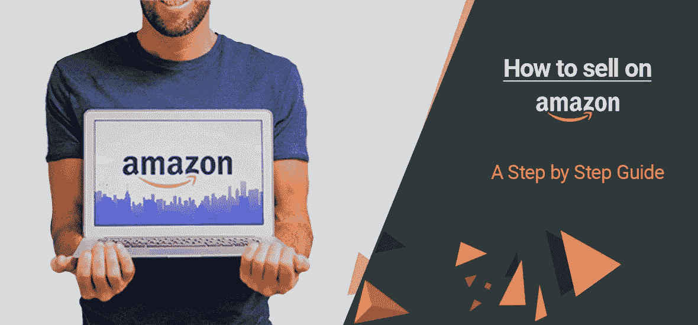
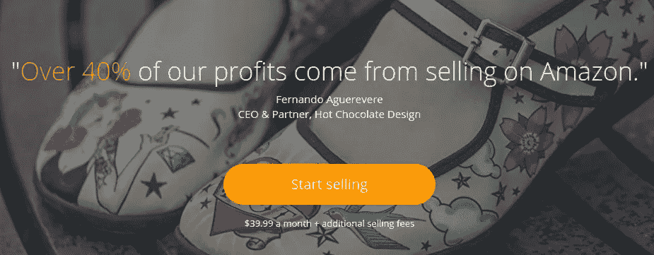
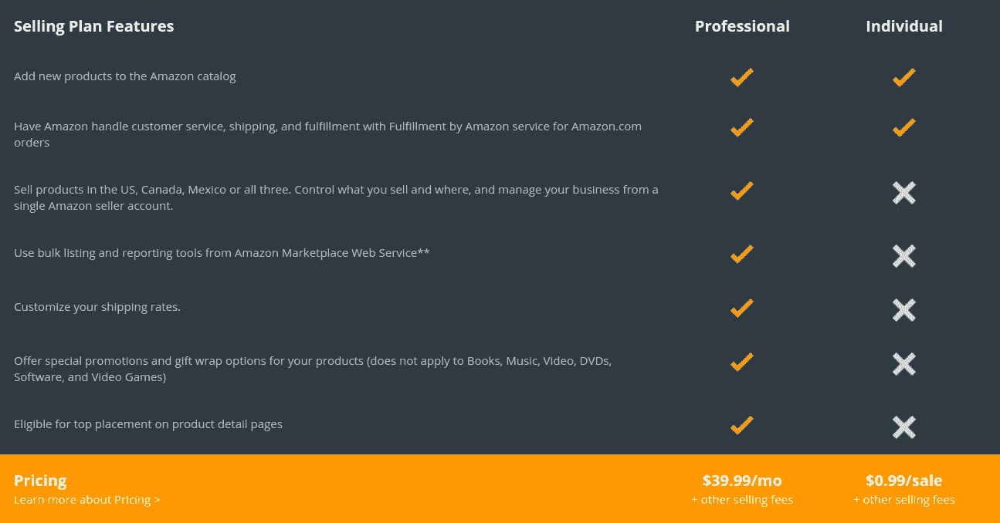
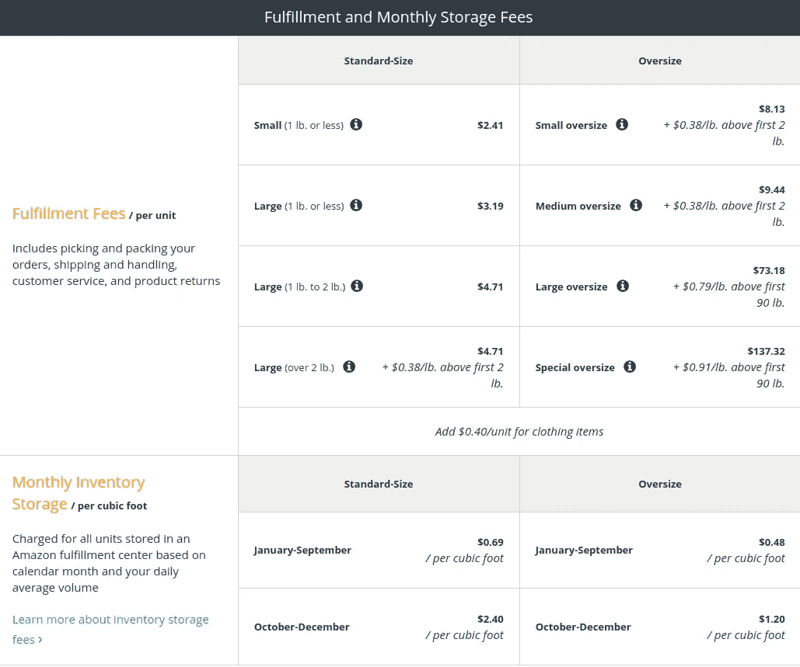

# 为什么&如何在亚马逊上销售——分步指南

> 原文：<https://medium.com/swlh/why-how-to-sell-on-amazon-step-by-step-guide-a6d12daf3529>

在亚马逊上销售是让你的产品接触到数亿顾客的最简单有效的方法。几乎所有的企业都在向网上转移，以利用庞大的在线客户群。

在线销售每年都在增加，事实上，Amazon.com 在 2018 年 6 月几乎有[26.4 亿次观看](https://www.statista.com/statistics/623566/web-visits-to-amazoncom/)，而且这个数字还在增加。不在像亚马逊这样的知名平台上开展业务，最终可能是一个错误。

这里有一个分步指南，涵盖了你在亚马逊上销售所需要知道的一切。

*   [在亚马逊上销售的一些突出原因](https://www.codilar.com/blog/why-how-to-sell-on-amazon-step-by-step-guide/#pointn1)
*   [计划](https://www.codilar.com/blog/why-how-to-sell-on-amazon-step-by-step-guide/#pointn2)
*   [工作原理](https://www.codilar.com/blog/why-how-to-sell-on-amazon-step-by-step-guide/#pointn3)
*   [在亚马逊上销售](https://www.codilar.com/blog/why-how-to-sell-on-amazon-step-by-step-guide/#pointn4)
*   [如何使用亚马逊的 Fulfillment？](https://www.codilar.com/blog/why-how-to-sell-on-amazon-step-by-step-guide/#pointn5)
*   [定价](https://www.codilar.com/blog/why-how-to-sell-on-amazon-step-by-step-guide/#pointn6)
*   [类别](https://www.codilar.com/blog/why-how-to-sell-on-amazon-step-by-step-guide/#pointn7)
*   [如何将我的 Magento 网站与亚马逊整合？](https://www.codilar.com/blog/why-how-to-sell-on-amazon-step-by-step-guide/#pointn8)

**本指南的内容**

来源:[https://services.amazon.com/](https://services.amazon.com/)

# 1.下面列出了在亚马逊上销售的一些主要原因

*   更低的创业成本——在亚马逊上创业的成本远低于线下创业。经营企业的成本相对较低，因为不需要员工成本、电费、租金等运营成本。
*   在任何地方经营你的业务——你不必在某个特定的地方经营你的业务。你甚至可以用手机远程操作你的业务。
*   **可扩展性** —网上销售可以帮助企业主了解他们最畅销的产品。此外，可以随时添加产品，从而创造了立即扩大规模的机会。
*   **没有时间限制**——通过在亚马逊上列出你的产品，顾客可以随时查看和订购你的产品。这可以显著增加你的销售额。
*   **易于衡量** —使用卖家中心和应用程序，企业主可以轻松跟踪您的业务。“分析你的销售”功能有助于提供更好的见解。
*   **无需等待** —由于大部分流程都是自动化的，你不必在操作上花费太多时间。相反，你可以集中精力改进你的产品。

# 2.计划

亚马逊上有两种基本的销售方式——**作为专业人员销售**和**作为个人销售**。

亚马逊的所有卖家都可以在 20 多个类别中列出他们的产品。而专业卖家可以将他们的产品列在另外 10 个类别中。

# 我应该选择哪个计划？

如果你计划一个月销售超过 40 件商品，那么“专业销售”将是正确的选择。该计划每月花费 39.99 美元，也可以收取其他销售费用。

如果你计划每月销售少于 40 件商品，那么“单独销售”将是正确的选择。该计划每笔销售费用为 0.99 美元，也可以收取其他销售费用。

来源:[https://services . Amazon . com/selling/benefits . htm/ref = ASUS _ SOA _ snav _ Ben](https://services.amazon.com/selling/benefits.htm/ref=asus_soa_snav_ben)

# 3.它是如何工作的

# 决定卖什么

首先，你要决定你要在亚马逊上卖什么产品。所有类别都属于两个部分——开放类别和需要批准的类别。

超过 20 个产品类别对所有卖家开放，有些类别只对专业卖家开放。我们稍后将讨论这一点。

# 选择销售计划

必须从两个销售计划中选择一个。专业计划给你销售更多产品的自由。在个人计划中，没有月费，应该为每件售出的产品付费。根据您的需求和偏好选择计划。

# 注册您的帐户

要在亚马逊上销售产品，你必须先在卖家中心创建一个账户。这是你管理销售帐户的地方。

# 4.在亚马逊上销售

在亚马逊上销售你的产品是一个简单的过程，可以分为四个简单的步骤。

# 列出你的产品

如果您选择了个人计划，您可以将产品一个接一个地添加到 Amazon Marketplace 目录。如果您有专业计划，那么可以使用批量工具添加大批量产品。如果你打算在亚马逊上销售大量产品，这可以节省很多精力和时间。

# 销售你的产品没有任何麻烦

一旦你在亚马逊上列出你的产品，顾客就能看到并购买它们。对亚马逊品牌形象的信任和一键式购买等功能的可用性可以增加你的销售额。你必须添加重要的产品细节和吸引人的图片，很好地展示产品。

# 自己发货还是用 FBA

客户下订单后，有两种方式运送您的产品。你可以自己或通过“亚马逊履行”(FBA)完成运输，并将运输过程留给亚马逊。

**商家选择 FBA 的一个突出原因是，列出的产品将有资格享受亚马逊 Prime 免费 2 天送货服务。**这意味着产品将在客户订购之日起两天内交付。企业成功的重要因素之一是客户满意度，通过 2 天发货，这一点可以实现。

此外，如果您订阅了 FBA，亚马逊将处理这些产品的包装、交付、客户服务和退货。所以几乎所有的烦心事都去掉了，你可以专注于其他流程。

来源:[https://services . Amazon . com/fulfillment-by-Amazon/pricing . htm/](https://services.amazon.com/fulfillment-by-amazon/pricing.htm/)

# 5.如何使用亚马逊的订单履行？

# 创建您的 FBA 帐户

如果你没有亚马逊销售账户，那么[现在就创建一个](https://sellercentral.amazon.com/ap/signin)，然后继续下一步。如果你有的话，[将 FBA 添加到你的账户](https://sellercentral.amazon.com/ap/signin)。

# 创建您的产品列表

你可以将你的库存管理系统与亚马逊 API 集成在一起，并且可以批量或逐个地将产品添加到亚马逊目录中。

# 准备好你的产品

以一种安全可靠的方式准备您的产品，直到它们到达客户手中。这一部分很重要，直到最后一步都要小心。

# 将您的产品运送到亚马逊

一旦你准备好产品，下一步就是把它送到亚马逊履行中心。您还可以使用打折的[合作承运商](https://sellercentral.amazon.com/gp/help/external/201119120?language=en-US&ref=mpbc_201119160_cont_201119120&ld=ASUSSOADirect)将您的产品运送并跟踪到亚马逊履行中心。亚马逊的在线卖家工具会在这个过程中帮助你。

# 亚马逊 prime 交付和客户服务

如果您订阅了专业计划，您的产品可以享受亚马逊送货服务。您的客户在某些订单上将享受免费送货。产品也将在两天内交付。亚马逊客服全年无休，为顾客提供优质服务。

# 亚马逊付款

付款将定期存入卖家的银行账户；因此没有担心的余地。将发送通知，告知付款已完成。

# 6.定价

# 单项费用

如前所述，专业销售计划的订阅者无需支付每件商品的费用。在个人销售计划下，每件商品的售价为 0.99 美元。此外，亚马逊对专业卖家的书籍、视频、软件、视频游戏等媒体产品的运费。运费适用于个人卖家出售的所有产品。

还需要注意的是，礼品包装选项仅适用于专业卖家。因此，如果你出售属于礼品类别的物品，建议使用专业销售计划。

# 介绍费

每件出售物品的介绍费必须由卖家支付。他们还必须为添加到几个类别的产品支付最低介绍费。

# 可变成交费

无论是个人销售者还是专业销售者都必须支付可变的成交费。

# 不同的市场

如果你在不同的亚马逊市场销售产品，那么费用、产品类别和销售要求都会改变。例如，如果你在墨西哥和加拿大销售，可能会收取不同的费用。

# 7.种类

# 开放类别

在亚马逊的开放类别下有超过 20 个类别，供应商可以列出他们的产品，而无需亚马逊的任何许可。

某些类别只允许添加新产品。而在某些类别中，卖家必须遵循额外的指导方针才能让他们的产品上市。

# 需要批准的类别

属于某些类别的产品只能通过特定权限列出。已订阅专业销售计划的卖家只能在这些特定类别中销售。

# 如何请求批准？

查看这个列表，看看你是否能满足亚马逊的要求。如果是，请使用[此链接](https://services.amazon.com/content/sellers-contact-amazon.htm/ref=asus_cu_fnav)发送您的请求。在不到三个工作日内，您将收到回复。

_______________________________________________

# ***如何将我的 Magento 网站与亚马逊整合？

在亚马逊上销售可能会非常困难，让人不知所措。但是它可以变得简单。如果你的网站运行在 Magento 上，那么 [M2E Pro extension](https://m2epro.com/marketplaces/amazon) 可以通过将你的网站与亚马逊集成来简化这个过程。

该扩展可以:

*   支持多个市场
*   提高跨渠道的产品知名度
*   通过基于策略的方法提供高级定制
*   支持第三方列表工具
*   为每个亚马逊订单创建一个本地 Magento 订单
*   在不同的国家和渠道提供不同的定价策略

需要帮助整合 Magento 网站与亚马逊，联系 [Codilar 团队](https://www.codilar.com/contact/?Amazon_blog)

*最初发表于*[*www.codilar.com*](https://www.codilar.com/blog/why-how-to-sell-on-amazon-step-by-step-guide/)*。*

进军电商业务？阅读[科迪拉尔的博客](https://www.codilar.com/blog/?utm_source=Medium&utm_medium=The_startup)

## 这篇文章发表在 [The Startup](https://medium.com/swlh) 上，这是 Medium 最大的创业刊物，拥有+421，678 名读者。

## 在这里订阅接收[我们的头条新闻](https://growthsupply.com/the-startup-newsletter/)。

