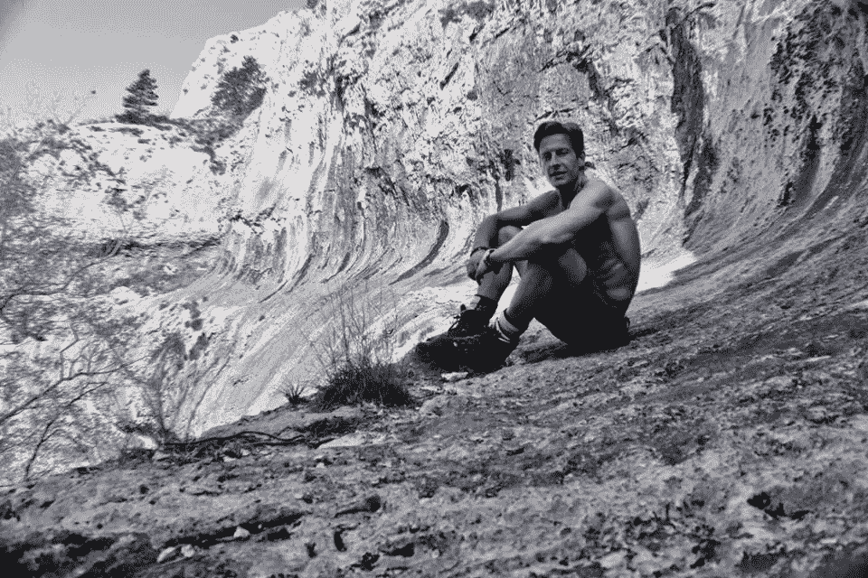

# 我为什么攀登:微妙，冥想和令人遗憾的悬浮的不确定性

> 原文：<https://medium.com/swlh/why-i-climb-subtlety-meditation-and-the-regrettable-elusiveness-of-levitation-3deece31a463>

星期一。我漫步到我的手指很好，真正从周日爬山赛撕碎了我的早课。又来了。我曾经告诉一个前女友，她是我最喜欢的伤疤。我撒谎了:这是我最喜欢的伤疤。在整个工作周中，每一封邮件都提醒着我，我最近已经享受到了并将很快再次享受到的善意安慰。

“我只是不明白你为什么要这么做，”我的一个学生说，带着关切的表情盯着我轻微受伤的手指，“你冒着受伤、死亡的风险，把自己吓傻了，每个星期都把你的手变成血糊糊的。大多数人会想要一些补偿。这很有梵高的风格。我的意思是，这不是必须的。”

让我们谈谈赔偿和义务。

我大约在五岁或六岁开始攀岩。我父亲过去是，现在仍然是一个爱好者。你可以说是恋物癖。他对摇滚的热情让那个为妻子建造泰姬陵的家伙自惭形秽。我老爸不是那种爱出风头的人，一点也不是。他对儿子在 El Cap 或 Cerro Torre 上堆积奖杯或铺设新路线没有太大的愿景，而是将其视为一种责任，一种将自己的热情和祝福传递给自己的义务，就像他曾经做过的任何工作一样，也是一种生计。我知道，对他来说，攀岩既提供了生活的压舱物，也平衡了谋生的烦恼和束缚。

这一课，这种对攀岩效用的理解，在我青少年时期的黑暗时代里，对我来说已经失去了。我一到 13 岁，体育就退居为坦能啤酒，女孩优先。如果你那时问我，大约在 13、15 或 18 岁时，我是否还会爬，我可能会说“不会”。毕竟，这有什么意义呢？有太多值得期待的东西——凉爽的胡须、更具异国情调的啤酒、随意的性爱、举世闻名的名声，也许……—我只是想象不出在一块岩石上悬着绳子的空间。

随着大学的到来，我不情愿地进入了一个虚假宣传的世界，这个世界缺乏娱乐和冒险的所有要素，还包含更多令人讨厌的艰难困苦。不全是淡啤酒。我越深入其中，生存乐趣的减少似乎就越明显。生活似乎是一场收益递减的游戏。很快，我就亲身经历了压力、真实的关系、真正的心碎、贫困，甚至还有一两次精神崩溃。哪里出了问题？

此时，我住在意大利的里雅斯特，虽然我偶尔会重访岩石，在这里或那里短暂地即兴涉猎，但正是在里雅斯特，我需要从日常事务和日常琐事的束缚中释放出来，这种需要达到了临界质量，迫使我做点什么，否则就有可能变得比我所喜欢的更熟悉疯人院的日常事务。我独自骑着自行车，徒步进入临近斯洛文尼亚边境的森林和山区，寻求孤独、安静，以及对刚刚离开的工作周的一些补偿。周末被用来护理一周留给我的宿醉。

就在那时，我发现了 Val Rosandra，这是一个华丽的峡谷，就像一个迷你大峡谷，穿过坚硬的喀斯特岩石，伊斯特拉与弗留利威尼斯朱利亚、斯洛文尼亚与意大利相遇，城市商业区的噪音和汽油味与那些不太容易适应的地理现象——山脉——相遇，谢天谢地，人口变化和人类的“发展”狂热迄今为止相对未受影响。我花了整整一个周末骑自行车走在拿破仑路上，被那个人自己(或者更可能是他的一些部队)炸到了 Carso Triestino 的侧翼。我会把自行车停在土路的顶端，从那里进入不久后成为我的梦幻岛，我每周都沉浸在惊奇和敬畏中，我很快发现，这更像是生活。

Val Rosandra, Trieste

从谷底，岩石以巨大的露头、墙壁、马刺和巨石向上升起，所有这些都由谨慎的羊肠小道连接起来，我发现，羊肠小道的制造者往往是我在离开穿过谷底的主要步行道时唯一可能遇到的生命形式。

天亮后不久我就到了，黄昏时才依依不舍地离开。有时候，我会带上帐篷睡在一个斜坡上，吓得那些野山羊屁滚尿流。在一个早晨，当我煮咖啡或在他们的通道上撒尿时，这些野山羊睡眼惺忪地走进我的营地。

我来到意大利，得到的承诺是一份工作、一个睡袋，除此之外别无其他。与其说是任何具体计划的一部分，不如说是事后的想法，我把我的攀岩鞋扔进了我的行李里，但是忘记带绳子或任何其他装备。

所以我开始自由独奏之前，我甚至没有听说过术语自由独奏。

我记得有一次，在一条更长、更开阔的路线的顶端附近，我找到了一个特别好的抓手，一个巨大的薄片，我可以抓住它来减轻我的腿和手指的压力。我稍微向前冲了一下，想爬上下一个落脚点，但就在我这么做的时候，我正从上面冲下来的那一个让道了——这在坚硬的喀斯特岩石上是不寻常的事情，但一旦我挣扎着爬到顶上，我就能清楚地看到我的小指和无名指的骨头，在淡白色的石灰石上留下了一串红色的痕迹。

Val Rosandra

我骑着自行车回家，有点后悔了。在选择不去医院后，伤口不可避免地感染了。很快我就发烧了，严重到让我在床上躺了一周的大部分时间，并排除了在接下来的周末回到 Val Rosandra 的可能性。这不是我第一次受伤，也不会是最后一次。此外，就攀岩伤害而言，这是相当温和的。然而，我从 100 英尺高的岩壁上摔了下来，几乎加速了我自己的死亡，并认为最终缝了 14 针是为一天的经历付出的小小代价，这迫使我在家里舔伤口时进行了一次反省。是什么让我在中断了这么长时间后又如此热衷于登山运动？这种冒险的追求给了我什么，是我在日常生活中找不到的，如果不仅仅是风险的话？然后，同样的问题，我最终会听到我的学生多年后受伤:

*为什么*做*我爬？*

我的回答？老生常谈、老生常谈的回复很快就排好了队，但没过多久我就注意到只有我一个人在听…

我当时和后来都意识到，攀岩是我的冥想、我的艺术、我的音乐——集中体现了生活中所有非本质的东西，具有讽刺意味的是，这些东西可能是家庭和爱情之外唯一让生活有价值的东西。

> **“我当时和现在都意识到，攀岩是我的冥想、我的艺术、我的音乐——集中体现了生活中所有非本质的东西，讽刺的是，这些东西可能是家庭和爱情之外唯一让生命有价值的东西。”**

音乐方面也许是最容易解释的。我希望，当我死时，在我的葬礼上会有人站起来演奏“我的歌”。如果他们足够了解我——或者根本不了解我——他们会知道这首歌将会是*沉默*。这是一条我永远也看不够的赛道。它让我离开座位，在我需要的时候把我举起来，拨动我的心弦，让我微笑。我们最珍视最稀有、最短暂、最难得到的东西。没有什么比沉默更稀有、更短暂、更难得或更珍贵了。在我们的社会中，这是一种日益减少的商品，从那个社会向外向上走一小步，就会发现它很丰富。只是不要告诉广告商。

艺术的解释稍微有点棘手，但我或许可以通过与非艺术的东西进行比较来做到这一点。作为一名文学极客，我对过于精心制作的小说感到厌恶，这些小说遵循书中的每一条规则，在出版商、评论家和潜在读者设定的每一个参数内构建，所有这些都是为了增加可销售性。“畏缩”也许不是最佳的词汇选择，因为真正的情感是一种对创造性精神的怜悯，这种精神如此受习俗和期望的约束，以至于真正的声音，重要的故事，不能蓬勃发展。艺术许可为许可的艺术让路，这完全是另一回事。这种令人遗憾的束缚和环境的宏观类比是生活本身，其中我们大多数人受到微观管理，并永远受到社会习俗、老板、政府、同事和礼貌的约束，成为我们真正可能成为的标准化、淡化的人。

在攀岩中，这些限制并不明显:每一次在岩石上的新尝试都是在空白的画布上进行的。当然，路线就在那里，但我们不需要遵循它们，内心的旅程充满了细微差别和变幻莫测。攀登者不受任何人为规则的约束；他唯一的限制是重力，能力和气象。这一次，也没有目标。是的，我们可能都想在渴望已久的交易路线上清理我们的第一个 7a 或封顶，但本质上这是为了活动而活动。为艺术而艺术。或者，我们可以说，为生活而生活。正如我的学生告诉我的那样——没有义务。当生活不再没有某种不可告人的动机、某种目标，不再是达到某种目的的手段时，那就是自由。没有完全自由创作的艺术不是艺术，是默许。功能性和可销售性有它们的位置，但它们都不是给灵魂提供特别好的食物。

> “没有完全自由创作的艺术不是艺术，是默许。功能性和可销售性各有其位置，但它们都不是给灵魂提供特别好的食粮。”

登山时，我登顶的最大乐趣不是令人怦然心动的男子气概，而是视角允许的更微妙的对比。从那里，城市和城镇上空数公里处，站在几百万年前形成的事物之上，很容易俯视白天，工作周在社会领域中的斗争，具有一定程度的清晰性，讽刺性，并完全无视我们经常夸大其重要性的非事件和争论。

我们经常被灌输“不后悔”的哲学，这个概念并没有很快得到我的喜爱。我认为，后悔是一种有价值的、实际的情感。从山顶上看，我对让自己迷失在人为的游戏、社会的限制和无用的阴谋中感到后悔，这是我带回到山谷的一种经验教训，每次在下次访问之前都抵制这样做。向前支付:现在后悔是为了避免以后再这样做，连本带利。后悔是一支蜡烛——你可以吹灭它，也可以扔掉它，或者当你回到错误滋生的黑暗地方时，你可以挥舞它。

出于同样的原因，当我们去山区时，我们必须作为朝圣者而不是征服者去:自然、孤独和荒野可以教给我们的东西是绝对必要的，对于任何希望有意识地生活并注意到导致他们以违背其最深切愿望的方式生活的错误的人来说是至关重要的。他们一起是伟大的地球上的“他者”,反映了现状，是一个参照点，通过它我们可以看到和知道我们的愚蠢和弱点，并获得不受社会阻碍的观点，这可能让我们剔除多余的东西，发掘真正重要的东西。我们可能会发现这一点，但以我的经验来看，高山和孤独从未告诉我，我应该花更多的时间和精力在社交网络上闲逛，工作超过我需要的时间，不真实地生活，或者通过简单地在日子流逝中打勾来让时钟停止，所有这些我在生命的不同时期都陷入过，但我现在可以说我远没有那么内疚。

> “……当我们去山区时，我们必须以朝圣者的身份去，而不是征服者:自然、孤独和荒野能够教给我们的东西是绝对必要的，对于任何人来说都是至关重要的，这些人可能希望有意识地生活，并注意到导致他们以违背他们最深切愿望的方式生活的错误。”

对于那些不攀岩的人来说，攀岩的冥想方面也许是最难解释的，或者至少是最难解释的。我认为，这源于对什么是冥想的误解，而不是对什么是攀登的误解。作为一个相当老练的冥想者——我和我的计算器发现，我一生冥想的时间接近 5000 小时——我遇到过许多关于冥想到底是什么的错觉，其中许多是我自己创造的。其中最重要的是相信冥想是某种神奇的解决方案或灵丹妙药，旨在让你成为一个更快乐、更好的人，偶尔会或不会漂浮起来。时间、经验和无数次的斥责告诉我，事实并非如此。我已经认识到，幸福只是我们一生中投入或反对我们的许多硬币的一面，追求“改善”相对于更有用的追求接受什么是“T1”，而悬浮，唉，令人讨厌地难以捉摸。

Meditation: not, alas, conducive to levitation

冥想是修行最基本的表达方式，它是一种更真实地生活的方式，是一种清晰地观察和行动的方式，是一种摆脱情感障碍和条件反射的方式，是一种在吸引、厌恶和冷漠之间无休止地跳跃的方式。与意识的内容有关，没有设计或议程。它是一个工具包，用来一点一点地去除我们随着时间的推移而获得的自私，这是我们对刺激反复出现的习惯性反应的结果，这些反应已经结晶并硬化成固定的位置，并过滤成我们称之为“个性”的经验，我们的自我。把自我留在身后，哪怕只是一会儿，也能让我们自由探索，沉浸在对我们所生活的世界、我们所居住的身体的绝对惊奇和敬畏中——我们习惯于认为理所当然的普通、日常的存在奇迹。

在我们记录发生在我们身上的微妙的、细微的和简单的现象时，我们看到的是什么，并且总是如此明显。梅实际上是不可思议的，平凡的不平凡的，沉闷的令人愉快的。我们越是这样做，事实就越给我们留下深刻印象。这是一个收益递增的游戏。

> “发现自己在最近着陆点上方几百英尺的一条细绳上——或者甚至没有绳子——是一种非常有效的手段，可以在不必要的地方实现这样的差距，打破这种令人讨厌的习惯，并将顶部空间的资源优先分配给最值得的东西。”

那么，这和攀登有什么关系呢？首先，为了获得这种清晰，有必要打破我们头脑中思想和个人叙事的永久喋喋不休，打破我们大脑皮层执行的精神体操，以构建我们内部和外部世界提供给它们的无限碎片数据的感知。发现自己在最近的着陆点上方几百英尺的一条细绳上——或者甚至没有绳子——是一种非常有效的方法，可以在不必要的地方实现这种差距，打破这种令人讨厌的习惯，并将顶部空间的资源优先分配给最值得的东西。

走错一步，你就完了。

同样，在登山运动中，任何 4000 米以上的探险都会很快让你意识到，尽管思想仅仅是“形而上的”、抽象的，但也是有重量的。试图在这样的高度携带一个同时通过冰川，裂缝，悬崖，悬崖，或者只是在雪中缓慢行走是不可能的，除非危及登山者安全和以适当的速度前进的能力。当所有的精力都集中在下一步，抓手或立足点上，做得不好的后果可能是严重的，头脑进入了当下的时刻，因为它在我们的日常生活中从未有过。我们的经历终于引起了我们的充分关注。

我们生活在一个我们被麻醉到微妙的世界里。每一天，我们都被迫接受奢侈的、夸张的、花哨的东西:每一种感官都受到各种形式的噪音、气味和视觉刺激的攻击，这是一种不断繁殖和强化的主动和被动攻击。我们的注意力被专横的销售人员、老板、邻居、熟人、同事、广告、电视节目、艺术、音乐、应用程序甚至我们说的语言这样那样地抓住，所有这些都在呼喊“看着我”。资本主义非常狡猾地利用了达尔文主义和认识论所描述的生存本能，来利用我们的致命弱点和最大的渴望——被看到和听到，从而使我们的存在得到确认和延续——其影响是毁灭性的，原始的，在很大程度上是不可避免的。这是不可避免的，除非我们愿意否定遗传、迷因和经验编程，做一些明显反达尔文主义的事情，比如攀爬。毕竟，谁仅仅关心自己基因的延续，或者减轻自己对不存在或被社会排斥的恐惧，会愿意分享如此明显危险的东西呢？

然而，对于非攀岩者来说，对于这项娱乐活动的价值，最大的困惑可能不仅仅在于其中的危险，而是在于一块岩石怎么会如此有趣。答案在于提问者的心态。就像冥想一样，提问者看不到任何“没有意义”的事物的价值。我们已经习惯于期待更大、更精彩、更震撼的展示来娱乐我们，吸引我们的注意力。我们都是被囚禁的，季节性的雌孔雀，每一次相遇都会带来一只长着羽毛的孔雀，漫步穿过我们的思维牢笼，咕咕地叫着“来抓我吧”。孔雀的大小、颜色和叫声成指数增长，与我们的注意力持续时间以及我们愿意成为注意力对象的严重程度或古怪程度成反比。

为了理解攀岩的价值不仅仅是为了打发时间(即“消遣”)，我们需要坐下来反思过去几百年的历史，在这些历史中，到达我们感官的刺激的数量和质量远远超过了这些感官的进化发展，以及它们与遭遇和发现相关的超负荷大脑的进化发展。在西方世界，我们一直被越来越多的娱乐、消遣和娱乐所困扰，这些娱乐、消遣和娱乐在很大程度上是不可避免的，我们被训练成在屈尊转头之前等待下一件大事。唉，无聊和不感兴趣不是缺乏值得注意的事物的症状，而是注意力错位的症状。吸引注意力的人一定会想出越来越多吸引注意力的建议来引诱我们进入商场、合同和糖果店，所有这些都损害了微妙者的利益，我们唯一的反应是停止满足他们。

在攀登中，与上述原理相同的原理也在起作用，只是它们很高兴地以相反的方式工作——以一种要求不断减少、不断微调的感知尺度的方式。作为新手，我们的注意力会寻找那些我们可能会把胳膊或膝盖甩进去的巨大支点，你可以在上面举行晚宴的杯子大小的裂缝和桌面壁架，或者我们站在离提议的摊位几步远的地方，凝视着我们面前麻木不仁、表情严肃的提议，认为这项任务是徒劳的。也许我们是对的，因为只有随着时间的推移和我们意识的逐渐调整，我们的精神视野，我们的平衡和我们对内部天气的意识，往往比外部天气更能决定我们的进步，我们才能欣赏和意识到越来越微妙的微妙之处。我们曾经看到一个光滑的银色贴面，不比一片玻璃更难爬，我们看到微小的手指抓着，粗糙的凹痕，我们可以踩住脚，一个微小的裂缝，我们可以扭动脚趾，一个细长的裂缝，可以容纳一两个手指。曾经只是一块无生命的待征服的岩石变成了朋友，充满了对我们努力的帮助——永远愿意，永远给予。它在我们皮肤下的感觉将我们的手从只适合挥舞钢笔和敲击键盘和触摸屏的笨拙装置变成了拥有数百万神经末梢的精致器官，能够感受纹理、温度和一致性的无数变化。我们眼前的岩石结构不再是千篇一律的灰色被子的一部分，而是一个由精致、复杂的山谷、山脊和地质细微差别装饰而成的世界；用粗糙的、含糖的花岗岩亮饰片、闪光的片岩漆、错综复杂的层状片麻岩装饰。远离这个城市的听觉动物园——食客、餐馆、咖啡馆、汽车尾气、空气中的工业碎屑——我们的鼻孔变得像一片天空，摆脱了长期存在的云层，以前未知的被遗弃的美食飞进了这片天空。

然后是声音。唉，要了解寂静，我们必须了解声音，只有在这里，声音是我们皮肤在岩石上的刮擦声、风声和一个身体的呼吸声，这个身体在几英尺的空间里从地面升起，从头脑的支配中具体化，从一个功能性的但在其他方面基本上被遗忘的同意的、从属的肉体转变成一个感官的发电机。声音和寂静一起工作，在和谐中形成互补的对比，低声说着“天哪，我还活着。”