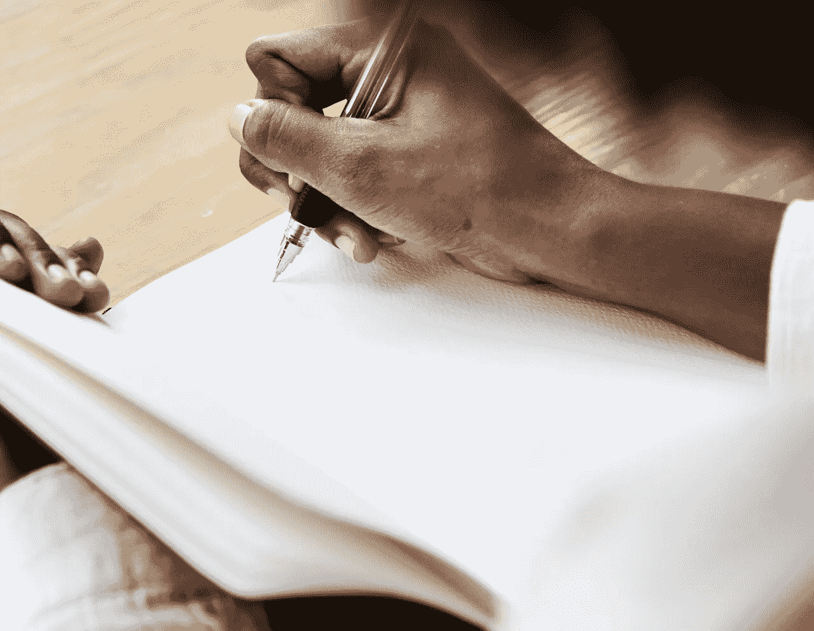

# 我没有文思枯竭

> 原文：<https://medium.com/swlh/why-i-dont-get-writer-s-block-9e2d5743f441>

## 你也不需要。

Photo by [rawpixel](https://pixabay.com/users/rawpixel-4283981/) on [Pixabay](https://pixabay.com/photos/address-african-african-american-3368238/)

你盯着一张白纸，不知所措。你会说，我当然有写作障碍。每个人都会这样。是吗？

为什么我们觉得我们想不出任何东西来写，即使有很多想法？

可能是你决定接受一个你不感兴趣的主题的任务。你可能累了或者…