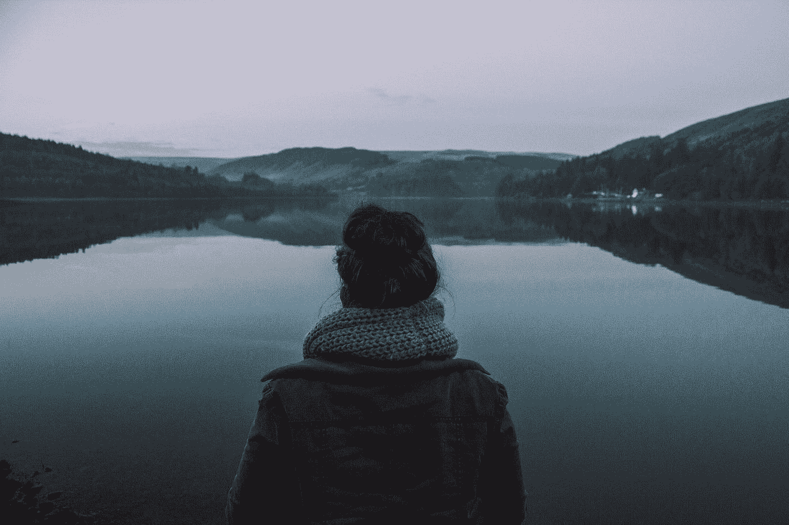

# 为什么我喜欢逃到我快乐的地方

> 原文：<https://medium.com/swlh/why-i-love-escaping-to-my-happy-place-46e3c4aed6bd>

## 以及这对我意味着什么。

Photo by [John Mark Arnold](https://unsplash.com/@johnmarkarnold?utm_source=medium&utm_medium=referral) on [Unsplash](https://unsplash.com?utm_source=medium&utm_medium=referral)

我认为我们都需要一个快乐的地方来逃避。一个让我们远离日常生活的地方。一个能让我们远离潜藏在我们生活中的混乱的地方。如果不是混乱，那就是压力。压力及其邪恶的帮凶压力，因为这两者似乎从来没有远离。