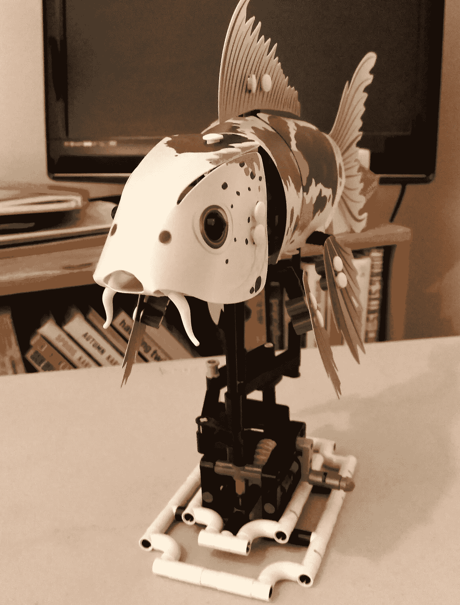

# 为什么我 32 岁还玩乐高

> 原文：<https://medium.com/swlh/why-i-play-with-lego-at-32-29cf1706f425>

## 从容格到塑料鲤鱼，我如何重新发现“无意义”快乐的创造力

小时候，我在祖父母家度过了很多时光。在吃成千上万层的冰淇淋和看电视之间——多年来，我像我祖母一样称它们为“小可爱”,忘记了它们的真实名字——我坐在我的……