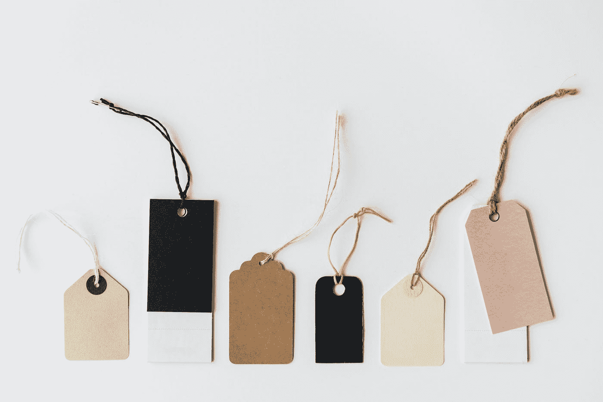

# 为什么我仍然拒绝承认自己是一个极简主义者

> 原文：<https://medium.com/swlh/why-i-still-refuse-to-identify-as-a-minimalist-2a1c5537045>

## “他们怎么称呼你并不重要，重要的是你要回答什么。”

Photo by [rawpixel](https://unsplash.com/@rawpixel?utm_source=medium&utm_medium=referral) on [Unsplash](https://unsplash.com?utm_source=medium&utm_medium=referral)

我成年后一直过着极简主义的生活方式。
然而，**我拒绝承认自己是极简主义者。**
这不是别人怎么想的问题，而是自我定义的问题。

# 原因很简单。

当你决定给自己贴上标签并采用一个头衔(任何头衔)时，你就把自己限制在了特定的范围内。这适用于做一个极简主义者、哥特人或共和党人。通过认同一个人，你决定属于一个使用同样标签的更大的群体。说“我是一个极简主义者”这样的话是一种陈述。这意味着我属于一个更大的极简主义者群体。这意味着我代表了这个团体的价值观和信仰。我遵循同样的原则。

以媒体上的作家为例。有成千上万有才华的人纯粹是因为热爱写作才开始写作的。其他人渴望表达自己，讲述自己的故事。但是对许多这样的人来说，一旦他们被贴上“作家”的标签，他们就认同了一个新的群体。就像现在大多数作家一样，他们开始完全专注于从自己的作品中赚钱。虽然从你的工作中赚钱没有错，但他们忘记了他们最初的愿望是表达自己或分享他们的故事。
最终，他们创造(他们认为)人们愿意阅读的内容，只是为了创造将成为收入来源的内容。
*(就像从一个摇滚乐队转向创作垃圾流行音乐。咳咳酷玩)*

Watch my video ‘***Why I Still Refuse To Identify As A Minimalist’*** *on my channel* ***—*** [***Sign of Life***](http://Why I Still Refuse To Identify As A Minimalist)

# 你的价值观≠你的定义

> "他们怎么称呼你并不重要，重要的是你要回答什么。"
> ―厕所区域

人类被设计来作为部落的一部分生活。我们被设计来认同一个群体。例如，这就是为什么我们会立即感到更有义务去帮助来自自己国家或村庄的人。但是，认同某人或某物是要付出巨大代价的。它把你限制在那个定义里。不一定与你的价值观一致的东西。

如果你说“我是共和党人”，但你实际上反对人们携带枪支，会发生什么？
还有一个例子——
我十几岁的时候，我的一个好朋友曾经很喜欢听金属音乐。他被认定为“金属头”然而，他有一个问题。他不喜欢穿黑色的衣服，他喜欢他的短发。但是为了归属，他留起了头发，买了皮夹克，穿了靴子。

同样的逻辑也适用于许多自称“极简主义者”的人。他们按照群体的规则生活，这限制了他们成为一个刻板的人，一个有特定特征和仪式的人。他们不得不反对另一种生活方式——消费主义驱动的生活方式。人们很擅长用一种瘾取代另一种瘾。他们认为他们的生活会随着极端的反面而改善，而不是极端的消费主义。但这不是极简主义的理念。

# 极简主义的概念非常简单。

> “什么给我贴标签，就否定我。”
> ——索伦·克尔凯郭尔

**这是关于量入为出的生活。找出你的需求会给你一种难以置信的永久自由状态。然后，你就有时间专注于你是谁，什么东西(有形的和无形的)值得你花费时间和金钱。它是关于追求对你的生活有益的事情。**

当你认为自己是一个极简主义者时，你寻找的是一个绝对的受益价值，这是你的极简主义者同伴们都认同的。当然，这是不可能的，因为那不存在。我不记得有多少次我浏览过不同的网站和论坛，读过那些自称“极简主义者”的人写的帖子，讨论他们是否应该清理并从生活中移除他们的吉他或两件夹克。

这正是它最初的问题所在。

极简主义不是从你的房子里移走特定数量的物品。
它不是你必须遵循的特定实践、步骤或衡量标准。
这不是一套特定的对与错。这不是一本清晰的指南。如此看待它就忽略了找到你的基本需求和定义什么对你来说是重要的这一点。

如果你相信量入为出的理念会改善你的生活，那么你必须找到一种方法让它靠你自己实现。这就是它的妙处。我们都是个体。我们有不同的需求。我们对不同的事物充满热情。我们在如此多样的东西中发现价值——从书籍和弹钢琴到视频游戏和电影。
这里没有对错。

# 伟大的定义意味着伟大的责任

有时候，当你认同某事时，随之而来的是一种不想要的责任。你觉得有义务实现自己的定义，并与团队的价值观保持一致。这就是为什么对我来说，说“我是一个极简主义者”似乎比贡献价值更具限制性。

只有你自己遵循了极简主义的真正本质，你才能获得随之而来的自由。首先，也许“最小”这个词会让人误解。也许这就是为什么有些人总是想着清理，而不是量入为出。
也许它应该被称为*“意义主义”对我来说，这似乎更准确一点。然后，我很确定我会被认为是一个意义主义者。*

> 你对标签和极简主义有什么想法？你是如何识别的？我很想在下面的评论中听到更多关于它的信息。👇

## 观看/阅读更多有趣的内容:

 [## 如何实现你所有的梦想

### 这是唯一被证实的方法！

medium.com](/swlh/how-to-accomplish-all-of-your-dreams-4e53132902cf)  [## 另一个似乎没人谈论的整理者

### 以及删除脸书朋友会如何改变你的生活

medium.com](/swlh/the-other-declutter-no-one-seems-to-be-talking-about-4c8e20757752) 

## 这篇文章发表在[《创业](https://medium.com/swlh)》上，这是 Medium 最大的创业刊物，有+423，678 人关注。

## 在这里订阅接收[我们的头条新闻](https://growthsupply.com/the-startup-newsletter/)。

