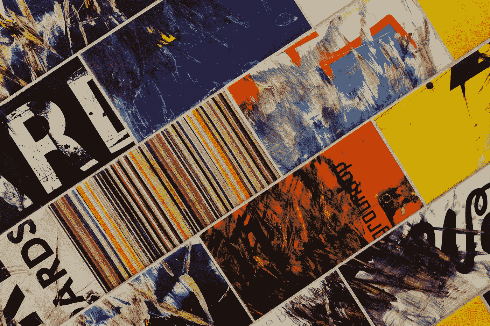

# 为什么我不再写“如何做”的文章

> 原文：<https://medium.com/swlh/why-i-stopped-writing-how-to-articles-5ae47a6302e8>

Photo by [John Jennings](https://unsplash.com/@john_jennings?utm_source=medium&utm_medium=referral) on [Unsplash](https://unsplash.com?utm_source=medium&utm_medium=referral)

几年前，我读过一篇关于如何在媒体上取得成功的文章。这是在合作项目启动之前很久的事了，当时我的社交网络中只有少数人在他们的个人资料照片周围画了绿色圆圈。在这个平台上获得中等成功的人争先恐后地想方设法教别人(为了钱)如何获得同样的成功。