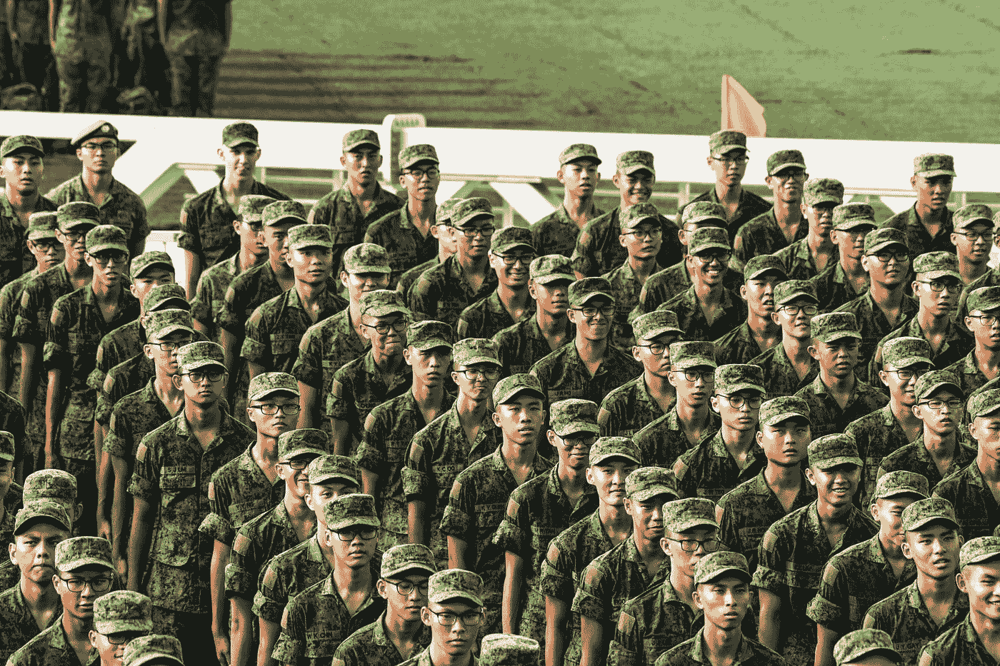

# 为什么我要争取自由(&我没有自由的两年)。

> 原文：<https://medium.com/swlh/why-i-strive-for-freedom-the-two-years-i-had-none-99e775c92f85>

Photo by [Menglong Bao](https://unsplash.com/@__menglong?utm_source=medium&utm_medium=referral) on [Unsplash](https://unsplash.com?utm_source=medium&utm_medium=referral)

“回到这里，排好队，6 分钟后出发”我的中士声嘶力竭地喊道。

*“Faaaaaaaal 完毕！”*

我们转过身，以完美的军事操练姿势走了三步，然后像一群鬣狗争夺新鲜的尸体一样奔向食堂。