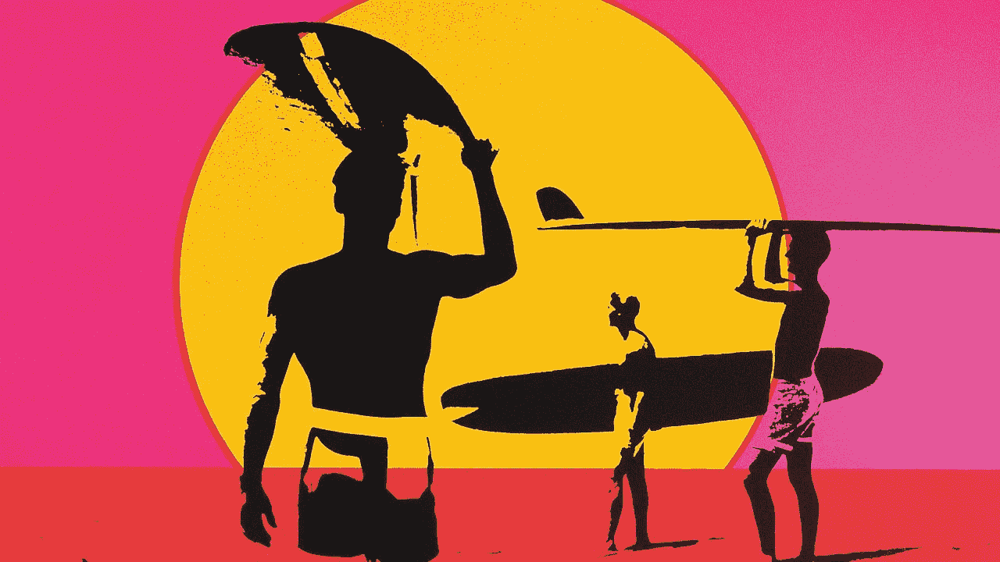

# 为什么我要中断职业生涯 3 个月

> 原文：<https://medium.com/swlh/why-i-took-a-3-month-career-break-612d7852fa6f>

## 休息一下有助于你重新发现什么对你来说是重要的。

Image Credit: Bruce Brow Films/ Original poster for The Endless Summer

> “有事业落差的人都是屎。”

这是硅谷一家著名标志性公司的招聘人员对我说的话。这让我质疑我中断职业生涯的决定。我是不是因为在我的职业生涯中插入了可怕的职业空白而浪费了我余下的职业生涯？