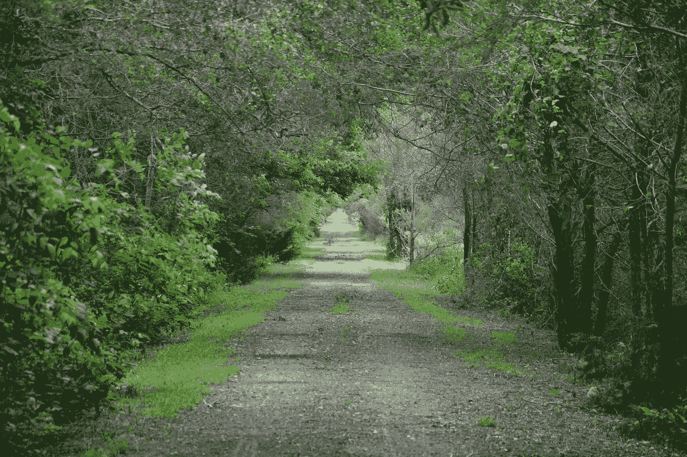

# 走在废弃的铁轨上，我学到了什么

> 原文：<https://medium.com/swlh/why-i-walked-12-miles-and-why-it-mattered-db0560d0be28>

This is what the trail looked like most of the way. All Photos By James jordan

## 将自己推向极限的经验教训

我在寻找孤独。大自然的宁静。唯一的声音是我踩在小径上的脚步声，树叶在风中沙沙作响。到处都是小动物，或是鸟儿在歌唱。大自然的声音是地球的呼吸。