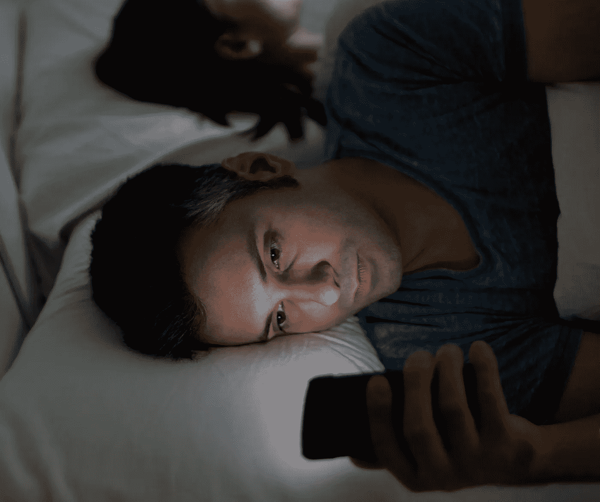

# 为什么我希望我们没有智能手机

> 原文：<https://medium.com/swlh/why-i-wish-we-didnt-have-smartphones-daa4395a7fe8>

## 它们已经成为我们生活的中心。

拥有一部智能手机很棒。

也就是说，直到它不是。

老实说，我希望大多数时候智能手机不存在。

一方面，拥有一部手机让生活变得无比简单。我几乎可以在任何地方打电话和发短信。我可以保持…