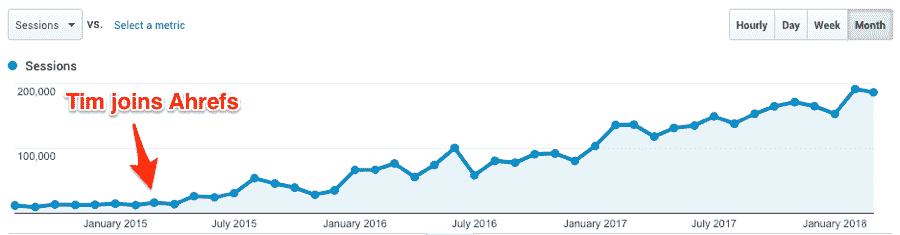
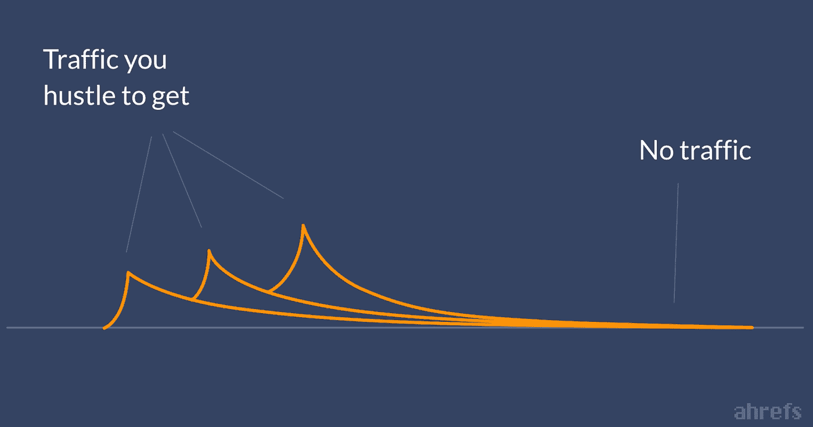
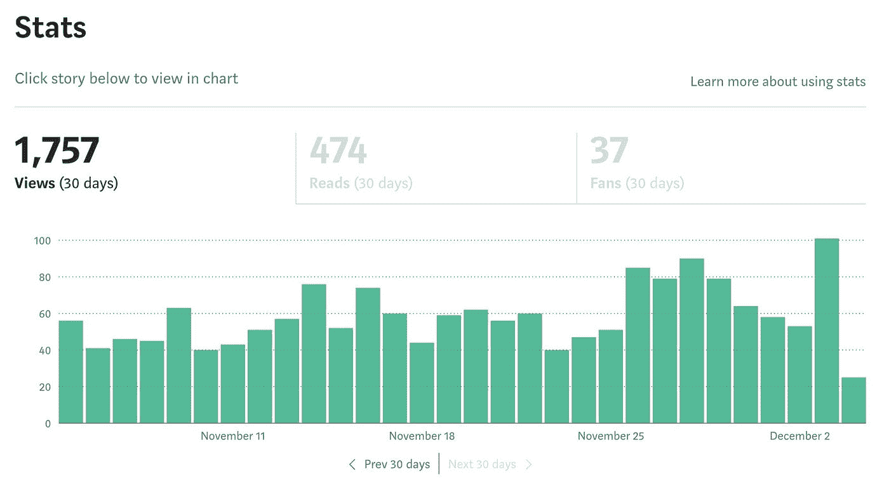
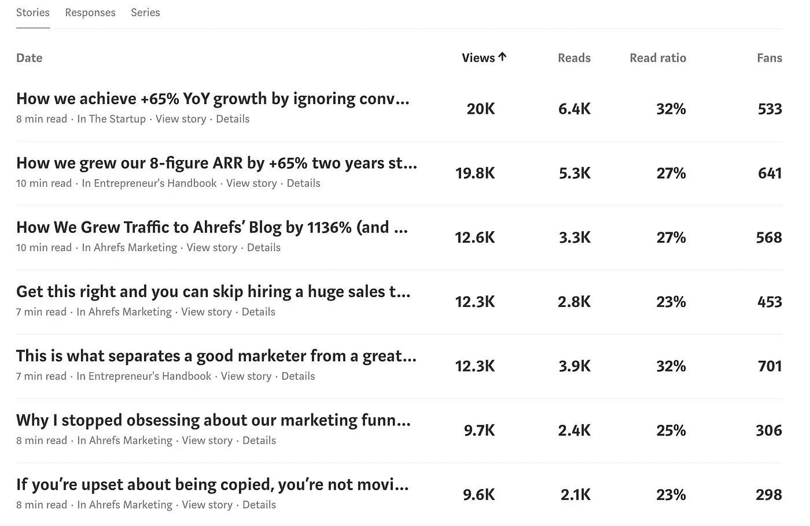
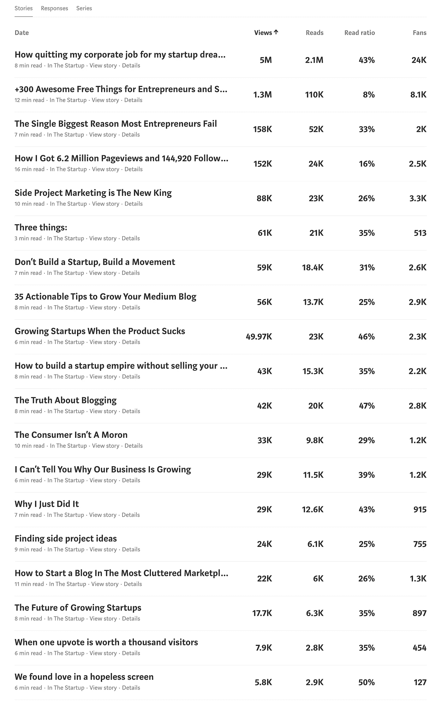
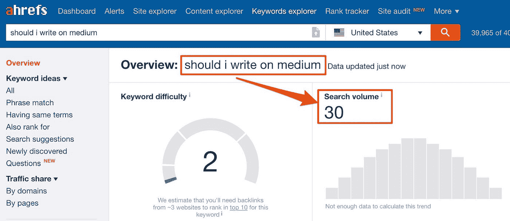

# 为什么我为 Medium 写作(其他 SEO 也应该)

> 原文：<https://medium.com/swlh/why-i-write-for-medium-and-other-seos-should-too-e31b521e052f>

> *玛格丽塔？*
> 
> *火腿？*
> 
> *丰吉？*

我正坐在一家意大利餐馆里。但是我不在意大利，我在新加坡。

第一次来[披萨艺术](https://www.tripadvisor.com/Restaurant_Review-g294265-d10760367-Reviews-Pizza_Art-Singapore.html)，不知道点什么。俯瞰河流的拥挤的桌子表明食物是好的。

在搬到岛上之前，我期待着吃受欢迎的亚洲菜肴，如肉骨茶、鸡肉饭和咖喱鱼头；肯定不是国际菜。

我猜这就是你在 Twitter 上给陌生人发 DM，让他们选择餐厅的结果。

几分钟后，比萨饼来了。我咬了一口，对在亚洲吃意大利食物的任何怀疑都完全消失了。

很明显，说到披萨，我的用餐伙伴是可以信任的。但是他真的了解内容营销吗？

事实证明，他有。

[Ali Mese](https://twitter.com/meseali) ，经营一家专注于内容的营销机构。最初的承诺是“只有当他有重要的事情要说时才写”，后来发展成了面向企业家的最大媒体出版物。

疯狂的部分？

阿里刚开始写作时，每两个月才发表一次，证明质量胜于数量。

这与我后来了解到的情况是一致的[Ahrefs 的博客](/ahrefs-marketing/how-we-grew-traffic-to-ahrefs-blog-by-1136-and-got-thousands-of-paying-customers-1fbd7e6b145a)每月访问量从 1.5 万增长到 20 万(ah refs 是一个帮助企业在谷歌中被发现的工具)。

接下来的一年，这家披萨店成了我们每月讨论生活、营销和生意的地方。在听到我的朋友不断地对 Medium 赞不绝口后，我的好奇心占了上风:

## 这个策略对我有用吗？

简而言之，我没有时间去执行在今年最热门的会议上推广的每一个营销策略。

我是白手起家的 SaaS 的 CMO，由 45 个团队成员组成，在 ARR 中做 8 位数。

不执行常见的营销建议——滴漏、门控内容、A/B 测试——实际上，有助于我们的团队专注于一些真正重要的事情。*补充说明:* [*这种营销方式帮助我们仅在过去 3 年就实现了+60%的同比增长*](/swlh/how-we-achieve-65-yoy-growth-by-ignoring-conventional-startup-advice-24a3eef619c1) *。*

但是阿里让《媒介》的写作听起来很有价值；所以，我决定尝试一下。以下是我在平台上发表七篇文章的过程中所学到的:

# **1。中发送一致的流量**

作为一名内容营销人员，我的理想场景是我的每篇文章在发表多年后都能产生持续的流量。

我们营销部门的首选流量生成方法是 SEO，因为它有效地[构建复合的、被动的流量](/ahrefs-marketing/how-we-grew-traffic-to-ahrefs-blog-by-1136-and-got-thousands-of-paying-customers-1fbd7e6b145a)。为什么？

因为获取被动流量比获取付费流量更划算，更可靠，更可扩展。

然而，我致力于自行发布关键词丰富的文章，这往往意味着**抛弃其他伟大的内容创意**。

显然，这种无情的优先排序会令人沮丧。

你可能在想:*那些 SEO 潜力为零的文章难道还不能靠口碑获得牵引力吗？*

虽然 Ahrefs 的博客拥有忠实的读者，但这不太可能。让我们看看正常的内容推广流程，以了解原因:

*   通知您的电子邮件列表。
*   与您的关注者分享。
*   投资付费社交媒体推广。
*   让有影响力的人参与进来，进一步推广你的帖子。

按照上面的操作，你会立即体验到一个显著的流量高峰。然而，喧嚣一结束，这些观点就会消失。

连续创业家兰德·菲什金称这种营销过山车为“希望的尖峰”和“没有的平坦线”

这正是我之前的个人博客所发生的事情。营销大师告诉我每天发布。所以，我做到了。

当我还看不到结果时，我就为知名博客写专栏、综述和客座博文。

无论采用何种策略，我的流量在发布后的几天内都会保持稳定。更糟糕的是，我的销售一塌糊涂。不幸的是，不存在像[病毒式传播](https://www.forbes.com/sites/danschawbel/2017/02/07/derek-thompson-why-theres-no-such-thing-as-going-viral/)这样的事情。

问题是我的博客没有持续产生新的流量。直到切换到 SEO 思维模式，我才开始体验到持续的收益。

当阿里告诉我 Medium 的时候，我对拥有一个流量生成平台的潜力感到兴奋，这个平台可以用来发布我放弃的想法——谷歌认为不相关的观点。

在过去的 6 个月里，我在 Medium 上没有发表任何新文章。但是看看我的统计数据:

在过去的一个月里，我过去的文章总共获得了 1757 次浏览和 474 次阅读。这听起来可能不多，但它是一致的。最精彩的部分？

我不需要做任何事情来保持交通畅通。或者，我可以发表更多的文章来增加我每月的被动流量。这正是我选择要做的。

下面是迄今为止我在[我的媒体博客](/@timsoulo)上发表的文章的总体统计。

# **2。我想写什么就写什么**

考虑到我在 Ahrefs 工作，你可能会希望我拒绝搜索流量潜力低的文章主题。

但是我经常想写一些东西，因为它对我来说很有趣；搜索引擎见鬼去吧！

媒美是平台的推荐引擎，根据阅读习惯推荐文章。该算法允许搜索引擎优化潜力为零的感兴趣的主题被发现。

以[阿里的中博客](/@meseali)为例。他不是为 SEO 写作，而是专注于分享他对营销和创业的个人见解——观点文章、励志故事、有争议的论点。以下是他的中等数据:

他所做的就是说出自己的想法，然后点击“发布”

## 但是它实际上是如何工作的呢？

虽然 Medium algorithm 旨在让强大的故事浮出水面，但 Medium 的编辑人员也会花时间寻找他们可以精心挑选和特写的优秀内容。

任何浮出水面的内容都会通过通知(在 Medium app 上)、Medium 的(每日或每周)摘要电子邮件和其他分发方式暴露给相关[标签](/tag/cryptocurrency)、[主题](/topic/startups)、[出版物](https://medium.com/swlh)和作者的追随者。

你的内容甚至会出现在网站的主页上，被数百万人访问。

换句话说，Medium 的人工(编辑)和自动(算法)引擎对你有利，只要你专注于写一个引人注目的故事，而不是试图增加你文章的分发量。

这就是为什么你写媒体文章的方法应该不同于写 SEO 文章的原因。

我用一个例子来解释一下。假设你想写一篇关于以下主题的文章:

> 我应该在介质上写吗？

根据 [Ahrefs 的关键词浏览器](https://ahrefs.com/keywords-explorer)工具，这个词每月吸引 30 次搜索——这相当可悲。

显然，你不能搜索你没有想到的东西。
然而，你*可能*对你尚未发现的话题感兴趣。

同样，这也是 Medium 的亮点。如果我在我们的自主博客上发表了这篇文章，你现在可能不会读到它。

大多数人在谷歌上搜索一些东西后找到 Ahrefs 的博客；我们的内容以指南、教程和操作方法的形式回答了他们的问题。

出于这些原因，我目前的博客策略是:

*   **在 Ahrefs 的博客上发布具有搜索流量潜力的帖子*:***我们的社区很强大，我们的文章在各自的主题上轻松排在 Google 的前列；和
*   **在没有搜索潜力的媒体上发布主题*的帖子:***我可以依靠他们的推荐算法在发布后几个月给我发送持续的流量。

考虑到这只是我在 Medium 上的第七篇文章，我很期待看到这个策略对增长的长期影响。

# **3。它拥有一群积极参与的观众**

不管你可能被告知什么，在线营销并不复杂。只有两种方法可以联系到网上的人:

1.  让你的目标受众在搜索引擎上找到你。
2.  用广告找到你的目标受众。

但是，让人找*你*更有效。Seth Godin 将这两种方法的区别描述为“许可营销”和“干扰营销”

当有人在谷歌上找到你的生意，他们是在给你*许可*用信息、教育或娱乐来占据他们的时间。停止出现，他们甚至会抱怨。

相反，在社交媒体上瞄准某人需要用你的广告打断他们的注意力。

翻译:他们宁愿看猫的视频，嘲笑迷因或者和朋友聊天。

像脸书、Instagram 和 YouTube 这样的平台会想尽一切办法向你的理想受众投放广告。

但有时这还不够——你不能强迫某人关注他们不关心的事情。

最终，我认为媒介介于许可营销和干扰营销之间:

> 人们不是带着特定的问题来到 Medium，也不是为了和朋友联系——他们来这里是为了学习一些很酷的东西

你的内容会和其他几百篇牛逼的文章竞争吗？是的，但是人们在这里是因为他们想读书。仅此一项就能让你被关注的几率增加十倍。

Medium 拥有大量重视个人发展、知识和创新的受众。我还怀疑他们中有很大一部分人以自己是潮流引领者而自豪。

这些人不仅是我想交的朋友；我知道，这些受众会将 Ahrefs 视为其营销堆栈中的核心工具之一。

**你呢……**

你写了《灵媒》吗？为什么或为什么不？

请在下面的评论中分享你的经历。

//

*感谢阅读。如果你喜欢这篇文章，请点击* ***👏按钮几次(👏👏👏👏)*** *帮别人找:)*

更多深入的营销文章，请访问 Ahrefs 博客。

//