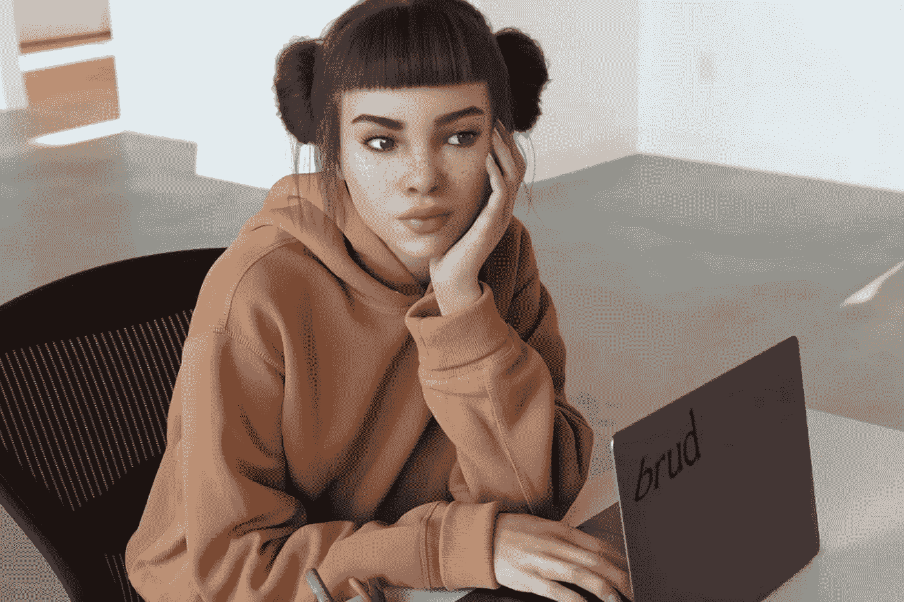
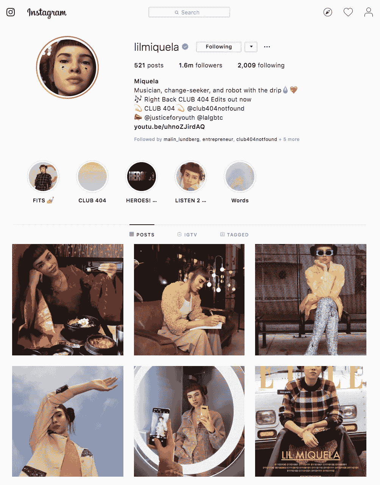

# 我为什么要投资一个机器人少年:一个投资者对 CGI 影响者的观点

> 原文：<https://medium.com/swlh/why-id-invest-in-a-robot-teenager-an-investor-s-perspective-on-cgi-influencers-6269455b695>

“For years, I’ve believed that the future of commerce is personality-led. I’ve now started questioning whether these personalities will be made up of flesh and bones or, rather, algorithms and pixels.”

昨天，我在影响者 Lil Miquela 上看到一双漂亮的亮黄色袜子后，花了 31 美元买了一双。这位 19 岁的巴西裔美国模特和 Instagram 名人不是真实的自己，而是对真实世界事件的评论(她是黑人的命也是命的倡导者)，为真实品牌(从普拉达到 Supreme)制作赞助内容，甚至制造真实的丑闻，冷落真实的社交名流(前几天与贝拉·哈迪德亲热)。最近，她推出了一个名为 Club 404 的直接面向消费者的生活方式品牌——第一批打着“数字迷幻”旗号的霓虹色圆领长袖 t 恤已经销售一空。

是什么迫使我买了这些袜子？多年来，我一直相信商业的未来是由个性主导的(看看凯莉·詹娜与凯莉化妆品公司的十亿美元成功传奇)。虽然我仍然相信是这样，但我已经开始质疑这些人格是否将由血肉和骨骼组成，或者更确切地说，是由算法和像素组成。

作为一个不断思考、写作和谈论商业和媒体未来的投资者，我并不是唯一一个看到 CGI 影响者潜力的人。以 Brud 为例，它是洛杉矶的跨媒体工作室，也是《Lil Miquela》的创作者。这家初创公司成立于 2016 年，据称已从红杉资本(Sequoia)和星火资本(Spark Capital)等基金获得 3000 万至 4000 万美元的融资，估值超过 1.25 亿美元。正如 Lil Miquela 已经带来的多样化收入流所表明的那样，我相信通过算法创造的个性将改变品牌内容、个性主导的 d2c 电子商务和互动媒体的游戏规则。对我来说，特定品牌的影响者和 Siri 等虚拟助手的身体表现也是令人兴奋的机会领域。

1.6m followers and counting @lilmiquela

其他投资者认为，虚拟影响者是一种时尚，这表明 Lil Miquela 的 160 万粉丝和她合作过的品牌因为新奇的因素而喜欢她。

反驳的观点是*我们是故意爱她的*。如果你将社会预测的概念与虚拟影响者可以做什么和做什么的无限本质结合起来，CGI 影响者对于他们被创造出来不喜欢的目标市场来说将是固有的。毕竟，社交预测意味着使用消费者定义的类别数据集来分析与该数据集中所有其他主题相关的感兴趣的主题，以预测将引起共鸣的趋势。如果你让这种数据驱动的方法来决定你释放到野外的个性的特征，它们应该在理论上默认产生共鸣，并且总是神秘地领先于趋势。

不管市场是看涨还是看跌，投资者刚刚开始形成一个关于价值链将是什么样子以及哪里将释放最大价值的论点。一方面，有一系列公司正在完善合成媒体制作的不同技术组件，包括基于 GAN 的系统、CGI 和合成语音——一些投资者认为这些技术很快就会商品化。在更商业化的方面，初创公司开始将最先进的技术整合到引人注目的虚拟人物中，并将这些虚拟人物分发给其他初创公司、品牌和新的人才中介机构，我希望在这一领域看到更多可扩展的 b2b2c 产品。

正如 betaworks 的一位聪明的同事 Jared 所指出的那样，许多风投对内容工作室过敏，因此初创公司将他们的头像宣传为人工智能作品，尽管他们目前是通过人工过程来实现的。引用 Jared 的话，

> “当你获得真正由人工智能生成的角色时，机会就来了。还没有公司有这个。但是，如果你能够在没有人工参与的情况下，从零开始创造一个角色，那就是一大笔钱。”

展望未来，将影响市场的因素包括 I)混合影响者和其他真实名人的算法修改版本，以及 ii)合成媒体监管的引入。在后一点上，虚拟影响者显然只是一个巨大的合成媒体冰山的顶端，它将以潜在的可怕方式影响从政治到法律系统的各个行业。虽然监管是必要的，但它的引入也可能动摇无辜的商业应用。

然而，当我穿着我新的亮黄色袜子，播放 Lil Miquela 的最新[单曲](https://www.youtube.com/watch?v=IqlsVdO04Pw)(是的，她还有音乐事业)并滚动浏览她最新的 instagram 帖子，宣传堕胎安全合法时，很难感到害怕。

事实上，由于我对年轻、有活力、有使命感和逆向思维的企业家略有偏好，我想如果 Lil Miquela 下一轮来找我，我会给她一份投资意向书。将一线明星的星尘和品牌号召力与软件公司的可扩展性和不断增长的回报结合起来，对我来说无疑是一个成功的公式。

*(本文的简短版本已在《信使》杂志和《福布斯》上发表)*