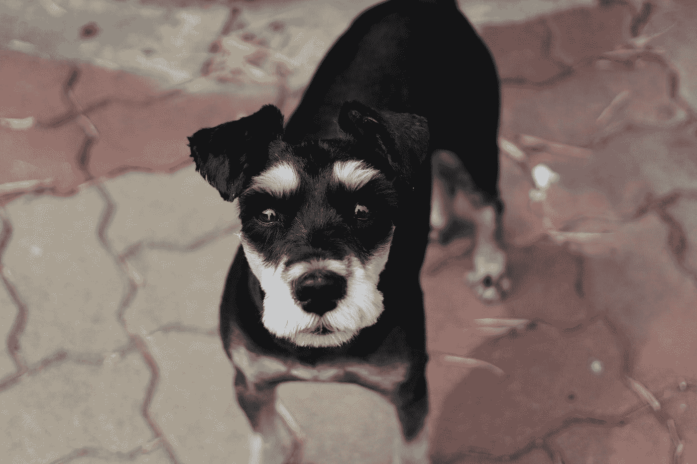

# 为什么我不为你最新的媒体杰作鼓掌

> 原文：<https://medium.com/swlh/why-im-not-clapping-for-your-latest-medium-masterpiece-ac88d7a1f1e1>

## 我不在乎它有多好

Photo by [jisu lee](https://unsplash.com/@code9112?utm_source=medium&utm_medium=referral) on [Unsplash](https://unsplash.com?utm_source=medium&utm_medium=referral)

掌声是媒体的货币，如何最好地使用它们并不总是很清楚。

大多数人都有一个系统，从只拍板一次的人，对任何事情，无论什么，总是拍板，到那些显然为他们所读的任何事情拍板 50 次的人，从最蹩脚的打油诗到…