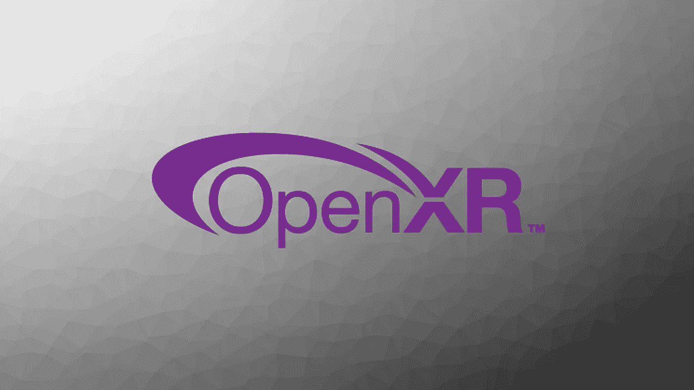

# 为什么我对 OpenXR 如此兴奋

> 原文：<https://medium.com/swlh/why-im-really-excited-about-openxr-6b6a26f50886>

OpenXR 是最近发布的标准，用于连接不同的 VR/AR 应用程序、平台和设备，使 VR/AR 内容大众化，无论它是使用哪个 SDK 开发的，也无论使用哪个终端消费设备。

这是解决目前困扰 XR 行业的可怕反馈循环问题的一个非常重要的里程碑:

没有足够的可用内容意味着没有足够的人消费，这意味着没有足够的内容被创造

如果有限的可用内容进一步受到消费者订阅的平台或消费者拥有的设备的限制，那么这不是好消息。有了 OpenXR，我们有可能在所有平台和设备上提供所有内容，而无需任何冗长、复杂和烦人的侧装、跨平台移植或第三方软件流程。这对于消费者和行业来说都是一件好事…只要企业支持它的全部潜力，而不是因为想要推动自制耳机的销售而限制内容的可移植性。

想象一下，如果我们让时间倒流，只制作只能在某些流媒体/下载平台上播放的音频，而同样的音频只能在拥有这些平台的同一家母公司生产的设备上播放，会怎么样？把我们的 timemachine 时钟再往回倒一点，想象一下你必须有一个不同品牌的黑胶唱机才能播放不同唱片公司发行的唱片，也就是说，索尼发行的唱片只能在索尼生产的唱机上播放。这对音乐创作者和他们的观众意味着什么？听起来是个愚蠢的主意？

好吧，我知道用这个类比，当谈到应用程序和硬件或 Xbox 与 Playstation 的游戏霸权之战时，我忽略了 iOS 与 Android/苹果与微软的范式。“竞争是好事”，我听到你们当中所有有商业头脑的人说，“通过设备进行隔离是可行的”。

即使我们在 XR 生态系统内保持现有的平台相对分布排他性的做法，在后端，OpenXR 将使开发人员的生活更容易，利润更高，因为他们将能够向最高出价者出售一种产品，而无需修改他们的代码。就像一个音乐家把他们的新唱片卖给最好的唱片公司，他们会付给他们佣金

如果我们坚持与音频娱乐世界和 XR 世界进行比较，并将 XR 开发者定位为类似于音乐制作人(让我们称他们为摇滚明星，因为他们很棒)，那么我们可以说应用/游戏平台是唱片标签，耳机是黑胶唱片播放器。基于这一点，我们可以看到，至少，如果不把唱机的品牌与唱片公司的品牌捆绑在一起，就能让音乐产业蓬勃发展，那么它也可以在其他地方发挥作用。快进到现在的真实世界，我们可以看到苹果音乐在 Android 上可用，而谷歌音乐在 iOS 上可用。这个系统运转良好，大量的音乐被创作和消费。想象一下，如果我们对 XR 也这样做，会有多大的发展潜力？

然而，如今游戏产业的价值超过了音乐和电影产业的总和，因此基于它的成功，确实存在反对平台和设备脱钩的观点。然而，我不认为 XR 行业会效仿游戏行业。去年，HTC 向 Oculus Rift 用户开放了 Viveport，Steam 长期以来一直支持 Vive 和 Rift 用户。尽管如此，这仍然是一个大杂烩。并非上述两个平台上的所有游戏都可以在 Vive 和 Rift 上使用或优化，Oculus store 软件也不支持 Vive。与商业动机相比，很难说这些限制中有多少是偶然的或功能性的。

较新的独立耳机，如 Oculus 的 Go 和即将推出的 Quest 以及 HTC 的 Focus，都没有对各自母公司的许多游戏和应用程序的原生支持，更不用说外部支持了——当然有硬件限制和旧内容正在被移植(也有不错的旧侧装和 VRidge 作为解决办法)，但该系统对最终用户来说远非完美或简单。OpenXR 可能会在未来结束这些模型和系统变体问题，消除移植的需要，并使最终用户的一切变得更简单，特别是入门级用户，他们最有可能用全新的独立耳机开始他们的 VR 之旅——最好是最便宜的，兼容内容最多的。

XR tech 包括游戏和娱乐内容，因此尽管我们可以从这两个行业的过去和现在吸取教训，但它是一种完全不同的动物，需要一种新的前进方式。我认为最近的 OpenXR 发布是解决如何将 XR 带入主流的难题的重要一步，我迫不及待地想知道接下来会发生什么！