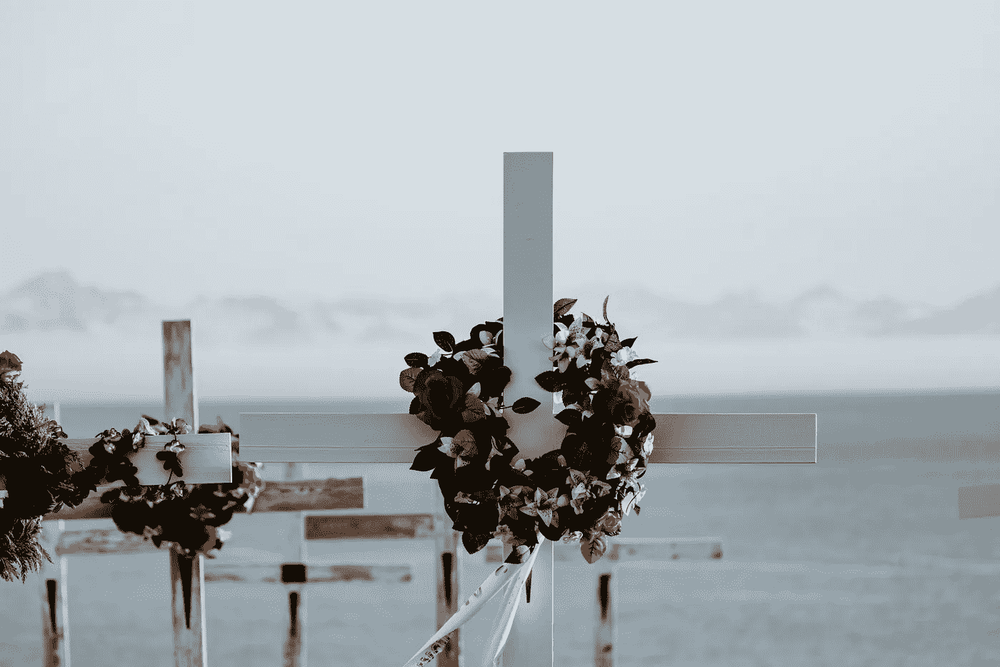

# 为什么我会在 30 多岁的最后一年想到死亡

> 原文：<https://medium.com/swlh/why-im-thinking-about-death-in-the-final-year-of-my-30s-84de7815d7bd>

## 为什么我不会后悔

No regrets. Photo by [Annie Spratt](https://unsplash.com/photos/0YVMWk1q5nA?utm_source=unsplash&utm_medium=referral&utm_content=creditCopyText) on [Unsplash](https://unsplash.com/?utm_source=unsplash&utm_medium=referral&utm_content=creditCopyText)

我最近一直在考虑我的死亡率。

部分原因是我将在今年晚些时候达到 4 比 0。也许这是一场中年危机。*颤抖*

部分是因为我有未实现的梦想和抱负。我讨厌被*但是，如果*所阻碍