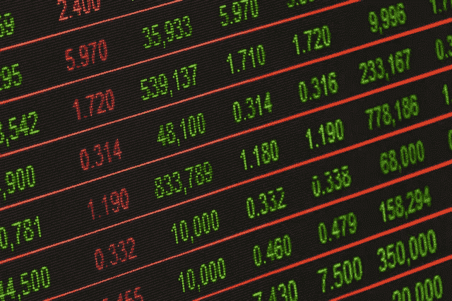

# 为什么要投资股票？—价值股票指南

> 原文：<https://medium.com/swlh/why-invest-in-stocks-value-stock-guide-db258a4cb9b6>

我直到 27 岁才投资第一只股票。我对股票市场了解不多。以至于在我的第一份工作中，我选择放弃股票期权，转而选择现金。如果我在职业生涯早期花一点时间自学，生活会有很大的不同。我发现许多年轻人都有类似的经历，并能从开始投资中真正受益…