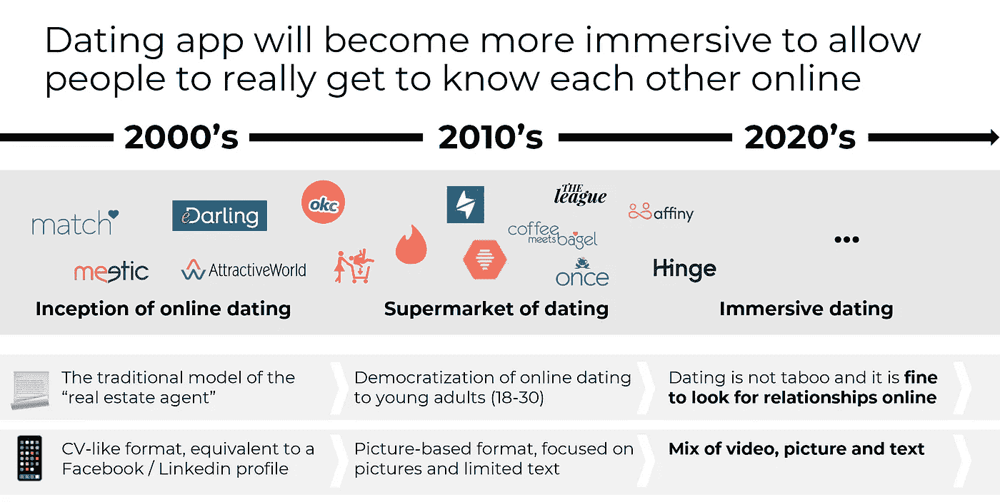

# 为什么投资者应该投资约会

> 原文：<https://medium.com/swlh/why-investors-should-fund-dating-4fb871abd21b>

…或者至少考虑一下👀

我在仔细阅读[陈楚翔](https://medium.com/u/8edc94d7a232?source=post_page-----4fb871abd21b--------------------------------)的文章[“为什么投资者不资助约会”](https://andrewchen.co/why-investors-dont-fund-dating/)的同时，筛选包括约会业务在内的不同行业，以创办自己的公司。

在过去的 6 年里，我一直在为位于奥地利维也纳的 [Arthur D. Little](http://www.adlittle.com) 公司做战略咨询，担任 [TMT](http://www.adlittle.com/en/industries/telecommunications-information-technology-media-electronics-time) 公司(电信、媒体、技术)的经理。我还负责全球交易能力中心。我陪同过 30 多家不同国家的电信运营商、媒体和科技公司，为他们制定了应对颠覆性商业模式的战略，或者将尽职调查作为更广泛交易流程的一部分。

文章中列举的投资者不投资相亲的六大理由是:

*   内置搅拌器
*   约会是小众的，有保质期
*   付费获取渠道价格昂贵
*   一个城市接一个城市的扩张糟透了
*   很难退出
*   与投资者的人口不匹配

许多投资者虔诚地重复着这些，甚至是那些专门研究市场的投资者(包括我妹妹)。当我大胆地将约会行业作为一种市场业务来介绍时，他们甚至皱起了眉头。

虽然我认为我不一定需要解释为什么这是一个市场业务，但在陈楚翔的文章的 6 点上更深入地了解细节是值得的。

# **内置搅动器*🏃‍♂️***

对任何 SaaS 公司或电信运营商来说，客户流失确实是最重要的 KPI 之一。这可以分为两个主要原因:

*   **自然**流失，你毫无办法。纽约的一个家庭要搬到洛杉矶，其当前的互联网服务提供商在洛杉矶不可用。你的客户需要搅动。这种变动对你的 NPS 来说通常是中立的。
*   流失是由其他因素引起的**，你没有向你的客户交付预期的资金价值。与网飞及其带来的价值相比，你目前的电视报价太贵了。你的客户会流失。这种变动会对你的 NPS 产生负面影响。**

是的，之前提到的客户流失很糟糕，在最好的情况下，它对你的 NPS 是中性的，对你的业务总是负面的。

这就是困惑发生的地方。对于这些公司来说，没有一家会让客户来找你，和你握手，对你出色的工作表示感谢，并告诉你现在是他离开你的时候了。

与其他行业不同，客户流失是约会行业的一项巨大资产:

(1)它可以是**积极的，从而吸引新的人:**一个将删除你的约会应用程序的客户(因为它已经完成了它的工作)会谈论它，并积极传播这个词，这增加了你的 NPS。

(2)高自然流失率(人们在建立长期关系之前断断续续地使用约会应用)**对新来者来说是一笔巨大的财富**。如果你的目标市场有 40%每月都在变动(这是约会应用程序实际变动的估计数字)，这仅仅意味着 40%的市场从第一天起你就可以达到。
当你试图向那些通常每 15 年续签一次合同的公司推销 SaaS 解决方案时，我祝你好运，并要有足够的毅力。

# **约会是小众的，有保质期*⏱***

是的，约会是有保质期的，没有人会永远单身(或者至少一直在寻找)🤷‍♀️)，这只意味着你的市场潜力不是 100%的人，而只是那些在特定时间点单身的人。在美国，45%的成年人是单身，这代表着超过 1 亿人。

诚然，网上约会开始作为一个利基业务。早在本世纪初，网上约会服务是令人毛骨悚然的，并与性服务密切相关。这被认为是找到伴侣的最后选择。但是，随着不同产品的出现，人们的心态已经发生了变化，这使得人们更容易接受这一点。想想 2020 年，当第一波年轻人从网上相识的情侣中诞生时，他们自己将试图在网上寻找爱情。

更一般地说，如果约会市场有两个以上的主流细分市场(18-35 岁和 35 岁以上)，这甚至是有问题的，因为 IAC(拥有多个其他品牌的 Tinder)的市值可能与 Tinder 单独处于相同的范围。许多小应用程序/网站专注于特定的种族、宗教和社会群体，但它们的市场份额非常有限，只能补充市场领导者的不足。

Credit: feels

约会已经经历了两个主要时代，以下是我对它将如何演变的看法:

**(1) 2000 年:** **网上交友业务开始**。随着互联网的民主化，网上约会已经开始数字化的传统模式的“房地产经纪人”的经验和专业。人们会把自己的简历放在网上，互相联系，主要吸引成年人(35 岁以上)。

**(2) 2010 年:约会超市**。当网上约会对年轻一代来说还是一个禁忌的时候，Tinder 通过引入游戏化的方面，成功地将其应用民主化。7 年后，市场上有很多类似的竞争对手，这是整整一代人，他们现在习惯于在单身时下载约会应用程序。我们询问了 500 名年龄在 18 岁至 25 岁之间的人，他们如何看待他们在现有约会应用程序(其中 Tinder 拥有 90%的市场份额)上的体验，像“超市”、“肉”、“超表面”、“不尊重”、“非人化”、“对象”、“非个人”这样的词出现得最多。

***(3)2020 年将见证这个行业进入一个新时代*** 。新一代人习惯于网上约会，这并不被视为最后的选择，他们不需要再躲在游戏化的背后。这意味着人们将愿意分享更多的内容(Tinder 的成功主要是因为用单一图片档案登录的简单性，这已经不够了)。人们将在网上比在现实生活中更好地了解彼此。整体体验会更社会化，“结果压力”更小。

总体而言，所有基本宏观经济指标都是积极的(法国的数字):

*   在过去的 40 年里，单身人数逐年增加(人们结婚越来越晚，学习时间越来越长，离婚越来越频繁)
*   一个巨大的市场仍有待开发，根据 Xerfi 关于法国在线约会的研究，40%的法国人还没有使用在线约会服务(这个数字一直在下降)
*   付费订阅的普及率仍有待提高，因为支付这些服务的心理障碍仍然很大

# **付费采集渠道贵*💸***

如果我是陈楚翔，我会从这里开始。是的——付费获取渠道仍然很贵，(比 Tinder 推出时还要贵)，但与陈楚翔建议的其他行业相比，它们也几乎是唯一产生的成本(你不需要任何内容或销售团队)。但是没错，把钱花在付费获取上而不是内容上是很伤人的，无论是在你的思想上还是在你的资产负债表上。

最终要想成功，一个新来者需要要么(两种选择并不相互排斥)拥有(1) **真正与众不同的产品**，这种产品可以从概念、UX、服务价格(在脸书约会的情况下是免费的……)，使用新技术，或者(2)**成本优势**，这使得获得客户的成本大大降低。

**(1)用户在不断寻找一种新的差异化产品**:约会 app 用户并不以忠诚度著称，这使得所谓的内置流失对于新来者来说是一个相当好的消息。用户对这些服务不满意，总是在寻找新的选择(法国消费者协会的一项研究显示，61%的用户对现有服务不满意，比法国国有铁路公司在一项类似研究中的情况还要糟糕)。在美国，约会应用程序用户平均同时在手机上安装了大约 4 个不同的约会应用程序。下一件大事就在某个地方…

关于成本问题，网上约会到目前为止只被视为找到你的另一半的最后选择，这并不值得骄傲，因此更个人化，更不“可分享”。任何社交网络效应或者口碑都已经非常有限了。如果在线约会在人们的心目中变得更加被接受，社交网络效应可能最终会成为一个真正的差异化因素，因为它将从根本上改变在线约会业务的成本结构。

对于现有的竞争对手来说，Tinder 或 Match(以 Tinder 为例，竞争对手有 Happn、Bumble、Once 等。付费获取渠道将变得越来越昂贵，因为他们的产品最终不一定有很好的差异化(都使用 Tinder 引入的相同的 UX 创新，即著名的“刷卡匹配”)，用户最终往往会回到 Tinder。

# **城市间的扩张糟透了*🏙***

我最近有机会接受 Arthur D. Little 的一项任务，为一家私募股权基金审查一些市场。当时打动我的是，在欧洲看线上电商平台，一些本土玩家在自己的市场上强大到连亚马逊都动不了一根针(波兰的 Allegro 或者罗马尼亚的 eMag)。

这些网站的共同点是，它们都是从市场起步的，它们通过平衡供求关系来建立自己的网络，并根据当地的具体情况调整自己的报价(如罗马尼亚的货到付款)。

这时我明白了，无论是在城市还是在国家层面，建立小型网络都是任何市场扩张战略的核心。

优步、Airbnb、Spotify 等也是如此。，甚至在某种程度上是网飞。他们需要针对每个市场的内容策略。

# 很难离开✔

通常有三种潜在的退出选择:( 1)出售给行业参与者,( 2)出售给投资基金，或(3)通过 IPO 上市。

(1) AIC 是该市场的主要收购者/投资者，因为他们拥有涵盖不同细分市场的多个品牌。然而，与他们可能宣传的有机和无机增长战略不同，他们目前主要是试图保护 Tinder 及其显著的客户和收入增长。除了 AIC 之外，到目前为止还没有活跃的行业参与者定期投资该行业，这使得 AIC 占据了主导地位，并限制了市场的流动性。
然而，许多竞争对手正在变得越来越强大，市场环境肯定会在下一个投资周期内发生变化，(1) [Spark Networks](https://medium.com/u/d7250596e3de?source=post_page-----4fb871abd21b--------------------------------) 于 2019 年以约 2.58 亿美元收购 Zoosk，成为 AIC 的第二大上市竞争对手，(2) [Badoo Inc](https://medium.com/u/cb3d30a3272e?source=post_page-----4fb871abd21b--------------------------------) 于 2019 年 6 月刚刚推出“魔法实验室”，控股实体整合了 Badoo 和 Bumble 等不同的强势品牌，并计划利用分配的 1 亿美元基金建立多个新品牌。最后,( 3)脸书约会服务的推出肯定会为这个行业提供更多的发展机会，因为这个社交网络巨头正在许多不同的国家推出它的约会服务。

(2)由于目前潜在收购者有限，因此市场上的流动性有限，投资基金对该行业存在疑虑。一般来说，约会吸引的兴趣是有限的，但是考虑到市场动态的演变，除了比赛组，其他玩家在这一领域的进一步无机移动肯定会引发更多的兴趣。

(3)虽然除了 IAC 以外，该行业的首次公开募股并不十分成功，但其他上市公司包括 Spark Networks 和 Meet Group。我们最近看到人们对这种退出战略更感兴趣。在星火网络收购之前，Zoosk 撤回了 IPO 计划。Bumble 宣布了寻求 IPO 的计划，但似乎已经放弃了这一计划。正如脸书可以提供许多新的机会一样，成功的首次公开募股肯定会激发整个生态系统的兴趣。对曾经支持过 Happn、The League 或 Once 的投资基金的现有策略打问号。

真正的问题是:未来几年，什么事件会打开闸门，提供流动性来重组市场，并结束火柴集团的主导地位？这是早期投资者发挥作用的地方。

# 与投资者的人口不匹配👴👦

作为一个乐观主义的首次创始人，我最初的假设是，投资者会关注两件不同的事情:(1)团队，(2)你的产品的吸引力。

实际上，在消费者环境中，这要复杂得多，你需要在冒险一开始就让一些人相信你的产品(当你是第一次创业者时，这甚至更难)。

事实上，老一代投资者之间存在明显的人口统计学不匹配，他们仍然认为约会是一个“令人毛骨悚然”的行业，可能会给他们自己的投资者品牌带来不好的形象。

然而，两个关键趋势将改变这一点

1.  投资者将开始承认，他们的孩子实际上正在使用这些应用程序，投资于更尊重人们身份的更好的产品，实际上可以使整个社会(和他们的孩子)受益
2.  年轻投资者正在扮演更多的决策角色，当他们看到 Tinder 的使用时正在学习的那些人将投资于他们一直在使用的服务

# **期末笔记🕊**

脸书进入约会业务，加上 Match Group (Magic Lab，Spark Networks)的更强竞争对手，肯定会为该行业提供更多发展机会(包括新的潜在出口)。

脸书是否会引入一种全新的体验，给这个行业带来革命性的变化？部分答案是[这里](https://techcrunch.com/2018/09/20/how-facebook-dating-works/)，它看起来不像一场革命。通过他们现有的用户群，脸书会有竞争优势吗？这当然是一项资产。为 35 岁以上的人提供一个免费约会的选择本身肯定是破坏性的，因为现有的定期约会订阅每月大约需要 30 美元。

关于约会，唯一可以确定的是，这个市场仍然有增长的空间，也有引入新的创新产品的空间。

*我正在更新这篇文章，因为我正在从我目前的行业经验中学习*

## 这篇文章发表在 [The Startup](https://medium.com/swlh) 上，这是 Medium 最大的创业刊物，有+411，714 人关注。

## 订阅接收[我们的头条新闻](http://growthsupply.com/the-startup-newsletter/)。

